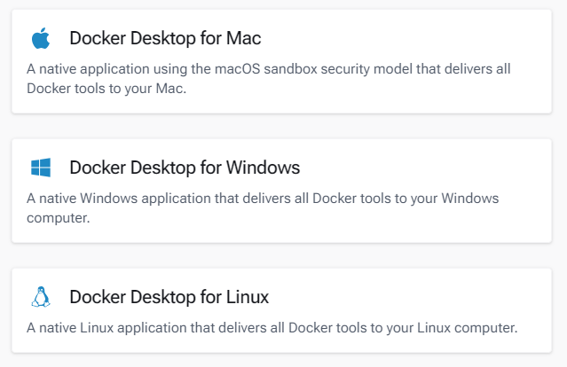

# Lab 🐳 Docker — Guia de Comandos Essenciais
Este documento reúne os principais comandos Docker utilizados no curso, com explicações objetivas sobre o que cada um faz.

---

# Instalação do Docker

Este documento fornece instruções sobre como instalar o Docker em diferentes sistemas operacionais, incluindo Windows, macOS e Linux Ubuntu.


https://docs.docker.com/get-docker/





---

## 📦 Verificando a Instalação

```bash
docker --version
```

Exibe a versão do Docker instalada na máquina. Útil para confirmar que a instalação foi bem-sucedida.

---

## 🚀 Executando Containers

### Hello World
```bash
docker container run hello-world
```
Baixa e executa a imagem `hello-world`. É o teste básico para verificar se o Docker está funcionando corretamente.

---

### Executar um comando dentro de um container
```bash
docker container run debian bash --version
```
Cria um container baseado na imagem `debian` e executa o comando `bash --version` dentro dele. O container é encerrado logo após a execução.

---

### Executar e remover automaticamente após uso
```bash
docker container run --rm debian bash --version
```
A flag `--rm` instrui o Docker a **remover o container automaticamente** após ele encerrar sua execução. Ideal para tarefas pontuais, sem deixar containers parados acumulando.

---

### Modo interativo (terminal)
```bash
docker container run -it debian bash
```
Inicia um container em modo **interativo** (`-i`) com um **pseudo-terminal** (`-t`), abrindo o shell `bash` dentro do container. Você pode digitar comandos diretamente dentro do ambiente.

```bash
touch curso-docker.txt
```
Exemplo de comando executado dentro do container: cria um arquivo chamado `curso-docker.txt`.

---

### Nomear um container
```bash
docker run --name mydeb -it debian bash
```
A flag `--name` permite atribuir um **nome personalizado** ao container (neste caso, `mydeb`), facilitando referenciá-lo em outros comandos.

---

## 🌐 Mapeando Portas

```bash
docker container run -p 8080:80 nginx
```

Mapeia uma porta do **host** para uma porta do **container**.

| Parâmetro | Significado |
|-----------|-------------|
| `8080`    | Porta exposta no host (sua máquina) |
| `80`      | Porta interna do container (onde o nginx escuta) |

> A lógica é **"de" → "para"**: `-p <porta-host>:<porta-container>`

Após executar, acesse `http://localhost:8080` no navegador para ver o nginx em funcionamento.

---

## 🔁 Rodando em Background (modo detached)

```bash
docker container run -d --name demo-fia -p 8080:80 nginx
```

| Flag | Significado |
|------|-------------|
| `-d` | Executa o container em **background** (detached mode) |
| `--name demo-fia` | Nomeia o container como `demo-fia` |
| `-p 8080:80` | Mapeia a porta 8080 do host para a porta 80 do container |

Após a execução, o terminal retorna um **hash único de 256 bits** — o ID do container criado.

---

## 📋 Gerenciando Containers

### Listar containers em execução
```bash
docker container ls
```
ou
```bash
docker container ps -a
```
A flag `-a` exibe **todos os containers**, incluindo os que estão parados.

---

### Ver logs de um container
```bash
docker container logs <nome-do-container>
```
Exibe os logs gerados pelo container. Substitua `<nome-do-container>` pelo nome ou ID do container desejado.

---

### Remover um container
```bash
docker container rm <nome-do-container> -f
```
Remove o container especificado. A flag `-f` força a remoção mesmo que o container esteja em execução.

---

### Remover todos os containers
```bash
docker container rm $(docker ps -a -q) -f
```
Remove **todos os containers** de uma vez.

- `docker ps -a -q` lista apenas os IDs de todos os containers
- O resultado é passado como argumento para o `docker container rm`
- `-f` força a remoção de containers que ainda estejam rodando

> ⚠️ Use com cuidado! Este comando remove todos os containers sem confirmação.

---

## 💾 Commit — Criando uma Imagem a partir de um Container

```bash
docker commit demo-fia demo-fia-alterado
```

O comando `commit` cria uma **nova imagem Docker** baseada no estado atual de um container em execução (ou parado). É útil para salvar modificações feitas manualmente dentro de um container.

| Parâmetro | Descrição |
|-----------|-----------|
| `demo-fia` | Nome do container de origem |
| `demo-fia-alterado` | Nome da nova imagem gerada |

---

### Listar imagens disponíveis
```bash
docker image ls
```
Exibe todas as imagens Docker presentes localmente na máquina, incluindo a recém-criada via `commit`.

---

## 📌 Resumo das Flags Mais Usadas

| Flag | Significado |
|------|-------------|
| `--rm` | Remove o container automaticamente ao encerrar |
| `-it` | Modo interativo com terminal |
| `-d` | Executa em background (detached) |
| `--name` | Define um nome para o container |
| `-p host:container` | Mapeia portas do host para o container |
| `-f` | Força uma operação (ex: remoção) |
| `-a` | Mostra todos (ex: containers parados também) |
| `-q` | Exibe apenas IDs (modo quiet) |
