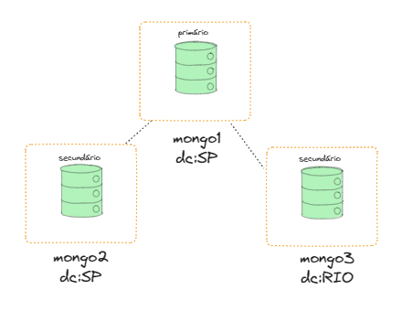

# LAB MONGODB

---
## Disclaimer
> **Esta configuração é puramente para fins de desenvolvimento local e estudos**
> 

---




O Arquivo `docker-compose` provisiona cluster de mongodb com replica set de 3 instâncias: 

- mongo1:27017
- mongo2:27017
- mongo3:27017

---

## Pré-requisitos?
* Docker
* Docker-Compose

---

## Executando réplica set Monogodb

```
docker compose up -d mongo1 mongo2 mongo3
```
Verificando se os containers foram criados com sucesso

```
 docker container ls
```
Verificando as imagens que foram feitas download do docker-hub
```
 docker image ls
```

## Configurando Replica-set

> Os nomes da replica-set foi definido dentro do arquivo docker-compose.yml

```JavaScript

docker exec -it mongo1 /bin/bash


mongo --port 27017

rs.initiate(
  {
    _id: "db-replica-set",
    members: [
      { _id: 0, host: "mongo1:27017",  priority: 2} ,
      { _id: 1, host: "mongo2:27017" , priority: 1} ,
      { _id: 2, host: "mongo3:27017" , priority: 1} 
    ]
  }
)

rs.config()

rs.status()

```
Vamos executar alguns comandos de dentro do cluster mongo1 para configurar as tags


Verificando os bancos de dados existentes

```JavaScript
show dbs
```

Apontando ou criando um banco no mongodb

```JavaScript
use dbcursofia
```

Criando um documento simples


```JavaScript
db.lab.insert({produto: "lapis", categoria: "papelaria"})
```

Lista as collections do banco local selecionado

```JavaScript
show collections
```


Outra forma de inserir um documento simples


```JavaScript
 db.getCollection("lab").insert({produto: "lapis", categoria: "papelaria"})
```

Criado as tags para organização das réplicas:

```JavaScript
conf = rs.conf()
conf.members[0].tags = { "dc": "SP"}
conf.members[1].tags = { "dc": "SP"}
conf.members[2].tags = { "dc": "RIO"}
rs.reconfig(conf)

rs.config().members;

```


Verificando status do server

```JavaScript
db.serverStatus()
```

## Inserindo documentos

```JavaScript
for (var i = 1; i <= 100; i++) db.lab.insert({produto: "produto-" + i , categoria: "papelaria"})
DBQuery.shellBatchSize = 300
db.lab.find()
db.lab.count()
```

Inserindo sem o ID
```JavaScript
db.produtos.insert( { Produto: "Celular", Preco: 10 } )
```

Inserindo com o ID (_id)
```JavaScript
db.produtos.insert( {_id: 1,  Produto: "Celular", Preco: 10 } )
db.produtos.find()
```

Inserindo multiplos documentos
```JavaScript
db.produtos.insert(
   [
     { _id: 10, Produto: "TV", preco: 1.99 },
     { Produto: "Geladeira", preco: 5000 },
     { Produto: "Geladeira", preco: 3400 },
     { Produto: "Computador", preco: 2500 },
     { Produto: "Computador Melhor", preco: 4500 },
     {_id: 500, Produto: "Cama", preco: 100 }
   ]
)

 db.produtos.find()

```


## Consultando documentos

Busca todos os documentos
```JavaScript
db.produtos.find()
```

Buscando com o operador `igual`
```JavaScript
db.produtos.find( { Produto: "Geladeira" } )
```
Buscando com o operador `igual` com mais de um campo

```JavaScript
db.produtos.find( { Produto: "Geladeira", preco:3400 } )
db.produtos.find( { Produto: "Geladeira", preco:3400 } ).pretty()

```

Buscando com o operador `Range`
```JavaScript
db.produtos.find( { preco: { $gt: 1000, $lt: 5000 } } );
```

Alguns operadores

* $gt maior que (greater-than)
* $gte igual ou maior que (greater-than or equal to)
* $lt menor que (less-than)
* $lte igual ou menor que (less-than or equal to)
* $ne não igual (not equal)
* $in existe em uma lista
* $nin não existe em uma lista
* $all existe em todos elementos
* $not traz o oposto da condição


Buscando com o operador `Like`
```JavaScript
db.produtos.find({"Produto":/Computador/});
```

Tipos de `Likes`
```JavaScript
db.produtos.find({"Produto":/Computador/}); // Like '%Computador%'
db.produtos.find({Produto: /^Ge/}); // Like 'Ge%'
db.produtos.find({Produto: /Melhor$/}); // Like '%Melhor'
```


## Importando arquivos CSV 

O Arquivo `mongo-import.sh`  vai ler os arquivos csv e importar para o mongodb utilizando a ferramenta `mongoimport`

https://www.mongodb.com/docs/database-tools/mongoimport/


```JavaScript
//Para sair do cluster mongodb
exit

//Entrar na pastinha import
cd 06.NoSql-Mongodb/import

//Executar o arquivo ./mongo-import.sh para importar os dados dos arquivos csv para o Mongodb
./mongo-import.sh

//Entrar no cluster novamente
 mongosh

//Ver os banco de dados
show dbs

//Entrar no banco criado
use sample

//listar as collections
 show collections

 //Listando os documentos da collection orders

db.orders.find()
```


Usando o comando `explain` para extrair informações importantes de uma consulta.

```JavaScript
db.orders.find({"CustomerID" :"BONAP"}).explain();
```

Mais informações em: https://www.mongodb.com/docs/manual/reference/explain-results/

## Collection Capped

Verifiando se a collection é do tipo Capped
```JavaScript
use dbcursofia
db.produtosCa.insert( {_id: 1,  Produto: "Celular", Preco: 10 } )
db.produtosCa.isCapped()
```

Convertendo uma collection para Capped

```JavaScript
db.runCommand({"convertToCapped": "produtosCa", size: 100000});
db.produtosCa.isCapped()
```

Criando uma collection

```JavaScript
db.createCollection("colecaonova", { capped : true, size : 5242880, max : 5000 } )
db.colecaonova.isCapped()
```

## Criando índice

db.collection.ensureIndex(
{ <campo1> : <ordem>,
<campo2> : <ordem>,
...} );

```JavaScript
use sample
db.orders.ensureIndex({ CustomerID : 1});

db.orders.find({"CustomerID" :"BONAP"}).explain("executionStats");
```

Listar os índices criados
```JavaScript
db.orders.getIndexes();
```

Remover um índice criado
```JavaScript
db.orders.dropIndex("<<nome do indice>");
```

## Alterando documentos

Atualizando o documento todo
```JavaScript
use dbcursofia
db.produtos.update( { _id: 10} , {Produto: "TV 30 polegadas", preco: 10.99 })
```

Atualizando uma entidade do documento
```JavaScript
db.produtos.update({_id : 10}, {$set:{ "Produto": "TV 30 polegadas - Alterada" }})
```

Criando um atributo no documento

```JavaScript
db.produtos.update({_id : 10}, {$inc:{ "ranking": 10}})
db.produtos.find({_id:10})
```

Atualizando vários documentos

```JavaScript
db.produtos.find({ Produto: "Geladeira"})
db.produtos.update( { Produto: "Geladeira"} , { $set: { preco: 10000} })
db.produtos.find({ Produto: "Geladeira"})

```

## Foi possível ? O que acontenceu ?

Precisamos habilitar a atualização para multiplos documentos

```JavaScript
db.produtos.update( { Produto: "Geladeira"} , { $set: { preco: 10000}  }, { multi: true })
db.produtos.find({ Produto: "Geladeira"})
 
```

Se o documento não for encontrado ? 
Adiciona documento se update não tem o filtro existente

```JavaScript

db.produtos.update(
   {_id : 101},
   { Produto: "Geladeira Nova", preco: 5000 } ,
   { upsert: true }
)

db.produtos.find({ _id: 101})

```


## Excluindo documentos

```JavaScript
db.produtos.remove({_id: 101})
```

## Cluster

Verificando o status do cluster

```JavaScript
rs.status();
```

Criando um usuário

```JavaScript
db.createUser({user: 'admin', pwd: 'admin', roles: [ { role: 'root', db: 'admin' } ]});
```


Exibir operações rodando

```JavaScript
db.currentOp();

```

# Instalando um ferramenta gráfica para o Mongodb
https://studio3t.com/download-studio3t-free/


## Caso de Uso
A LoSil é uma empresa fictícia que atua no ramo de comércio eletrônico, oferecendo uma ampla variedade de produtos para seus clientes. Com o crescimento do negócio e a necessidade de gerenciar pedidos, ordens e informações dos clientes de forma eficiente, a LoSil decidiu adotar um banco de dados NoSQL, como o MongoDB.

Após uma análise detalhada das necessidades da empresa, a equipe de desenvolvimento definiu as seguintes entidades principais para a modelagem do banco de dados:


Clientes:

* ID do cliente
* Nome
* Endereço
* Informações de contato (e-mail, telefone, etc.)

Pedidos:

* ID do pedido
* Data do pedido
* Status do pedido (pendente, em processamento, concluído, cancelado, etc.)
* ID do cliente associado

Itens do pedido:

* ID do item do pedido
* ID do pedido associado
* ID do produto
* Quantidade

Produtos:

* ID do produto
* Nome do produto
* Descrição
* Preço
* Estoque disponível

Com base nessas entidades, a equipe de desenvolvimento projetou as seguintes coleções no MongoDB:

<{Documentos json}>

Com o banco de dados MongoDB, a equipe da LoSil terá uma solução escalável e flexível para lidar com o crescimento do e-commerce, fornecendo uma base sólida para o gerenciamento eficiente das operações relacionadas aos pedidos, ordens e clientes.

# Remover os containers

```
exit
exit
docker-compose down
```
