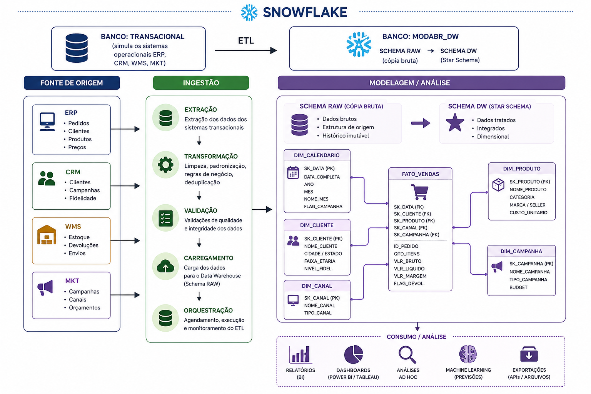
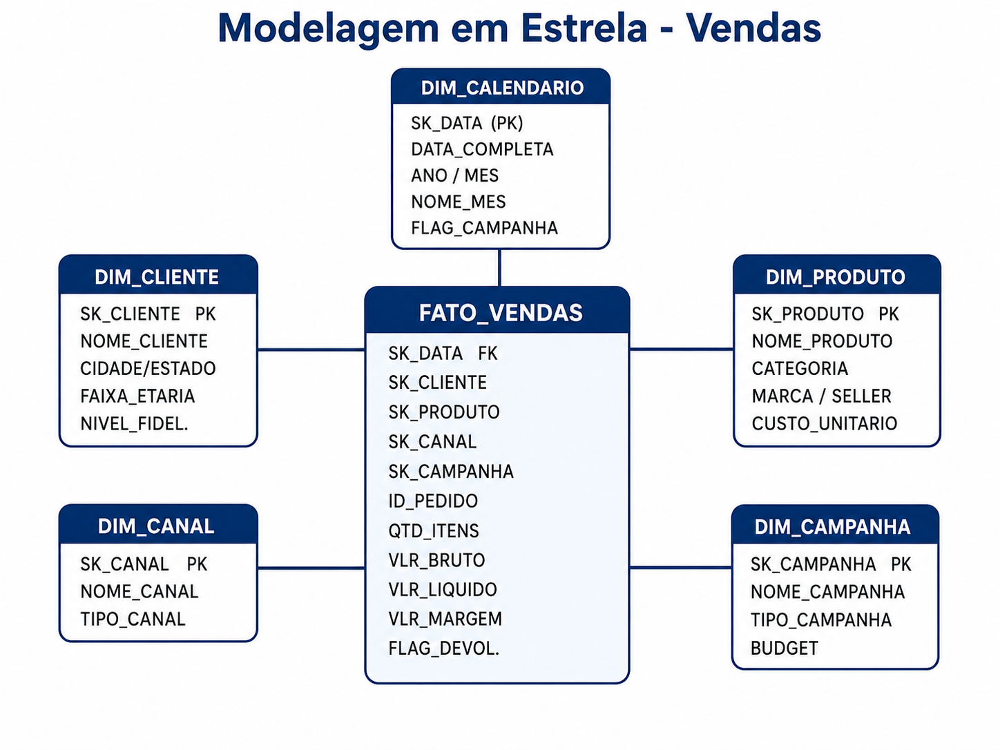

#  Laboratório: Sql - Data Warehouse ModaBR

---


| # | Seção | Tempo estimado |
|---|-------|---------------|
| 1 | [Contexto do Negócio](#1-contexto-do-negócio) | Leitura (5 min) |
| 2 | [Problema de Negócio](#2-problema-de-negócio) | Leitura (5 min) |
| 3 | [Arquitetura do Laboratório](#3-arquitetura-do-laboratório) | Leitura (5 min) |
| 4 | [Modelagem Dimensional — Teoria](#4-modelagem-dimensional--teoria) | Leitura (10 min) |
| 5 | [ETAPA 1 — Banco Transacional (Fonte)](#etapa-1--banco-transacional-fonte) | Prática (25 min) |
| 6 | [ETAPA 2 — Ambiente do Data Warehouse](#etapa-2--ambiente-do-data-warehouse) | Prática (15 min) |
| 7 | [ETAPA 3 — Camada RAW (Ingestão)](#etapa-3--camada-raw-ingestão) | Prática (20 min) |
| 8 | [ETAPA 4 — Camada DW (Modelagem)](#etapa-4--camada-dw-modelagem) | Prática (30 min) |
| 9 | [ETAPA 5 — ETL: Carga das Dimensões e Fato](#etapa-5--etl-carga-das-dimensões-e-fato) | Prática (25 min) |
| 10 | [ETAPA 6 — Análise: KPIs de Negócio](#etapa-6--análise-kpis-de-negócio) | Prática (30 min) |
| 11 | [Desafios Bônus](#desafios-bônus) | Extra |

---

## 1. Contexto do Negócio

A **ModaBR** é um e-commerce de moda fundado em 2018, com sede em São Paulo. Opera em todo o território nacional com roupas, calçados e acessórios de marcas próprias e parceiras.

| Indicador | Valor |
|-----------|-------|
| GMV anual | R$ 380 milhões |
| Pedidos por mês | ~95.000 |
| Clientes ativos | 1,2 milhão |
| Sellers no marketplace | 340 |
| Canais de venda | App · Site · WhatsApp |
| Programa de fidelidade | Bronze · Prata · Ouro · Diamante |

**Sistemas operacionais existentes — cada um em seu próprio banco de dados:**

| Sistema | O que guarda |
|---------|-------------|
| `ERP` | Pedidos, itens vendidos, pagamentos |
| `CRM` | Cadastro de clientes e nível de fidelidade |
| `WMS` | Produtos, estoque e custo unitário |
| `MKT` | Campanhas de marketing e cupons |

>  **Nosso papel:** construir o Data Warehouse analítico no Snowflake, unificando essas 4 fontes e entregando KPIs estratégicos ao C-Level.

---

## 2. Problema de Negócio

O CFO abriu a reunião de emergência com a seguinte fala:

> *"Gastamos R$ 8 milhões por mês em marketing e não sabemos quais campanhas geram receita. Não sabemos quais categorias têm maior margem. Não conseguimos identificar clientes em churn antes de perdê-los. Cada área traz um número diferente — chegamos à reunião com 5 versões do mesmo relatório."*

**Perguntas que o negócio precisa responder:**

| # | Pergunta | Área |
|---|----------|------|
| Q1 | Qual o ticket médio por canal de venda? | CFO |
| Q2 | Quais categorias têm maior margem bruta? | Produto |
| Q3 | Quais clientes Ouro/Diamante estão em risco de churn? | CRM |
| Q4 | A Black Friday trouxe novos clientes ou apenas recorrentes? | Marketing |
| Q5 | Qual seller tem maior taxa de devolução? | Marketplace |

---

## 3. Arquitetura do Laboratório

A arquitetura que vamos construir simula um cenário real de empresa:




**O fluxo de dados tem 3 etapas:**

- **TRANSACIONAL:** banco separado que simula os sistemas legados (ERP, CRM, WMS, MKT). Os dados aqui estão fragmentados, como na realidade.
- **RAW:** cópia exata dos dados de origem, sem nenhuma transformação. É o "pouso" dos dados no DW.
- **DW:** dados modelados em Star Schema, limpos, integrados e prontos para análise.

---

## 4. Modelagem Dimensional

>  Leia esta seção antes de digitar qualquer SQL. Ela explica o *porquê* de cada decisão.

### 4.1 OLTP vs OLAP

Os sistemas operacionais da ModaBR (ERP, CRM, WMS, MKT) são **OLTP** — otimizados para gravar transações rapidamente. O DW que vamos construir é **OLAP** — otimizado para ler e agregar grandes volumes de dados.

```
OLTP (sistemas de origem)              OLAP (nosso DW)
──────────────────────────             ────────────────────────────
Muitas tabelas pequenas (3FN)          Poucas tabelas largas
Evita redundância                      Aceita redundância
Ótimo para INSERT / UPDATE             Ótimo para SELECT / GROUP BY
Péssimo para relatórios                Ideal para KPIs e análises
```

**Por que não consultar direto o OLTP?**
Uma query de ticket médio por canal nos 12 meses anteriores pode envolver 6+ JOINs e travar o sistema em produção. Além disso, os 4 sistemas da ModaBR não se comunicam entre si.

### 4.2 Star Schema: Fato e Dimensões

O modelo que vamos construir se chama **Star Schema** (Esquema Estrela).

- **Tabela Fato** → o evento de negócio que queremos medir (uma venda)
  - Contém métricas numéricas: valor, quantidade, desconto, margem
  - Contém chaves estrangeiras (FK) que apontam para as dimensões
  
- **Tabelas Dimensão** → o contexto do evento (quem, o quê, quando, onde)
  - Contém atributos descritivos: nome do cliente, categoria do produto, nome do mês
  - Têm muito menos linhas que a fato

**Modelo da ModaBR:**



### 4.3 Granularidade

> **A decisão mais importante na modelagem de um DW.**

Granularidade define: **o que representa UMA LINHA na tabela fato?**

Nossa escolha: **um item de um pedido** → cada produto comprado em um pedido é uma linha separada.

Exemplo: pedido com 3 produtos = **3 linhas** na `FATO_VENDAS`.

Por quê? Porque precisamos analisar margem por produto, devoluções por item e performance por categoria — isso só é possível com granularidade no nível do item.

### 4.4 Surrogate Key vs Natural Key

| Tipo | O que é | Exemplo |
|------|---------|---------|
| **Natural Key (NK)** | ID do sistema de origem | `"CLI-001"` vindo do CRM |
| **Surrogate Key (SK)** | ID inteiro gerado pelo DW | `1, 2, 3...` criado por nós |

Usamos Surrogate Keys porque:
1. Protegem o DW de mudanças de formato nos sistemas de origem
2. São mais rápidos em JOINs (inteiro vs string)
3. Permitem versionamento de registros (SCD Tipo 2)

---

## ETAPA 1 — Banco Transacional (Fonte)

>  **Tempo estimado: 25 minutos**
>
> Aqui criamos o banco que simula os sistemas operacionais da ModaBR. Em um projeto real, esses dados já existiriam em Oracle, SQL Server ou PostgreSQL — aqui estamos recriando-os no Snowflake para o exercício.

---

### 1.1 — Criar o banco transacional

Abra uma **nova Worksheet** no Snowflake e execute:

```sql
-- ================================================================
-- BANCO TRANSACIONAL: simula os sistemas legados da ModaBR
-- Imagine que este é um banco Oracle/SQL Server de produção
-- ================================================================

CREATE DATABASE IF NOT EXISTS MODABR_TRANSACIONAL
    COMMENT = 'Simula os sistemas operacionais legados da ModaBR';

USE DATABASE MODABR_TRANSACIONAL;

-- Cada sistema em seu próprio schema, como seria na realidade
CREATE SCHEMA IF NOT EXISTS ERP    COMMENT = 'Sistema de Pedidos e Pagamentos';
CREATE SCHEMA IF NOT EXISTS CRM    COMMENT = 'Cadastro e Histórico de Clientes';
CREATE SCHEMA IF NOT EXISTS WMS    COMMENT = 'Estoque e Fulfillment';
CREATE SCHEMA IF NOT EXISTS MKT    COMMENT = 'Campanhas e Cupons';
```

---

### 1.2 — Tabelas do ERP (Pedidos)

```sql
-- ================================================================
-- ERP: sistema de pedidos — estrutura OLTP (3ª forma normal)
-- Nota: aqui os dados estão fragmentados em várias tabelas,
-- como acontece em qualquer sistema transacional real.
-- ================================================================

USE DATABASE MODABR_TRANSACIONAL;

USE SCHEMA ERP;

-- Tabela de cabeçalho do pedido (um registro por pedido)
CREATE OR REPLACE TABLE ERP.PEDIDOS (
    ID_PEDIDO       VARCHAR(20)    NOT NULL,
    ID_CLIENTE      VARCHAR(20)    NOT NULL,
    ID_CANAL        VARCHAR(10)    NOT NULL,   -- APP, SITE, WHATS
    ID_CAMPANHA     VARCHAR(20),               -- NULL se orgânico
    DATA_PEDIDO     DATE           NOT NULL,
    DATA_ENTREGA    DATE,
    STATUS_PEDIDO   VARCHAR(20)    NOT NULL,   -- APROVADO, DEVOLVIDO, CANCELADO
    VLR_FRETE       DECIMAL(8,2)   DEFAULT 0,
    PRIMARY KEY (ID_PEDIDO)
);

-- Tabela de itens do pedido (um registro por produto dentro do pedido)
-- Esta separação é a normalização clássica de OLTP
CREATE OR REPLACE TABLE ERP.ITENS_PEDIDO (
    ID_PEDIDO       VARCHAR(20)    NOT NULL,
    ID_ITEM         INTEGER        NOT NULL,   -- Número sequencial do item
    ID_PRODUTO      VARCHAR(20)    NOT NULL,
    QTD_ITENS       INTEGER        NOT NULL DEFAULT 1,
    VLR_UNITARIO    DECIMAL(10,2)  NOT NULL,   -- Preço de venda no momento
    VLR_DESCONTO    DECIMAL(10,2)  DEFAULT 0,
    PRIMARY KEY (ID_PEDIDO, ID_ITEM),
    FOREIGN KEY (ID_PEDIDO) REFERENCES ERP.PEDIDOS(ID_PEDIDO)
);
```

---

### 1.3 — Tabelas do CRM (Clientes)

```sql
-- ================================================================
-- CRM: sistema de clientes
-- ================================================================

USE DATABASE MODABR_TRANSACIONAL;

USE SCHEMA CRM;

CREATE OR REPLACE TABLE CRM.CLIENTES (
    ID_CLIENTE        VARCHAR(20)   NOT NULL,
    NOME_CLIENTE      VARCHAR(100)  NOT NULL,
    EMAIL             VARCHAR(100),
    DATA_NASCIMENTO   DATE,
    CIDADE            VARCHAR(80),
    ESTADO            CHAR(2),
    DATA_CADASTRO     DATE          NOT NULL,
    NIVEL_FIDELIDADE  VARCHAR(10)   NOT NULL,  -- BRONZE, PRATA, OURO, DIAMANTE
    FLAG_ATIVO        CHAR(1)       DEFAULT 'S',
    PRIMARY KEY (ID_CLIENTE)
);
```

---

### 1.4 — Tabelas do WMS (Produtos e Estoque)

```sql
-- ================================================================
-- WMS: catálogo de produtos e custos
-- ================================================================
USE DATABASE MODABR_TRANSACIONAL;

USE SCHEMA WMS;

CREATE OR REPLACE TABLE WMS.PRODUTOS (
    ID_PRODUTO        VARCHAR(20)   NOT NULL,
    NOME_PRODUTO      VARCHAR(150)  NOT NULL,
    CATEGORIA         VARCHAR(50)   NOT NULL,
    SUBCATEGORIA      VARCHAR(50),
    MARCA             VARCHAR(80),
    ID_SELLER         VARCHAR(20),             -- NULL = produto próprio
    NOME_SELLER       VARCHAR(100),
    FLAG_MARKETPLACE  CHAR(1)       DEFAULT 'N',
    PRECO_LISTA       DECIMAL(10,2) NOT NULL,
    CUSTO_UNITARIO    DECIMAL(10,2) NOT NULL,
    PRIMARY KEY (ID_PRODUTO)
);
```

---

### 1.5 — Tabelas do MKT (Campanhas)

```sql
-- ================================================================
-- MKT: campanhas de marketing
-- ================================================================

USE DATABASE MODABR_TRANSACIONAL;

USE SCHEMA MKT;

CREATE OR REPLACE TABLE MKT.CAMPANHAS (
    ID_CAMPANHA          VARCHAR(20)   NOT NULL,
    NOME_CAMPANHA        VARCHAR(100)  NOT NULL,
    TIPO_CAMPANHA        VARCHAR(30)   NOT NULL,  -- BLACK_FRIDAY, NATAL, DIA_MAES...
    DATA_INICIO          DATE          NOT NULL,
    DATA_FIM             DATE          NOT NULL,
    PERCENTUAL_DESCONTO  DECIMAL(5,2)  NOT NULL,
    BUDGET_INVESTIDO     DECIMAL(12,2) DEFAULT 0,
    PRIMARY KEY (ID_CAMPANHA)
);
```

---

### 1.6 — Inserir dados nos sistemas de origem

Agora vamos popular os sistemas transacionais com dados realistas.

```sql
-- ================================================================
-- CARGA DE DADOS — Sistema CRM
-- ================================================================
USE DATABASE MODABR_TRANSACIONAL;

USE SCHEMA CRM;

INSERT INTO CRM.CLIENTES VALUES
('CLI-001', 'Ana Souza',        'ana@email.com',      '1990-03-15', 'São Paulo',      'SP', '2020-01-10', 'OURO',     'S'),
('CLI-002', 'Bruno Lima',       'bruno@email.com',    '1985-07-22', 'Rio de Janeiro', 'RJ', '2019-06-15', 'DIAMANTE', 'S'),
('CLI-003', 'Carla Mendes',     'carla@email.com',    '1995-11-08', 'Belo Horizonte', 'MG', '2021-03-20', 'PRATA',    'S'),
('CLI-004', 'Diego Ferreira',   'diego@email.com',    '1988-04-30', 'Curitiba',       'PR', '2020-08-05', 'BRONZE',   'S'),
('CLI-005', 'Elena Costa',      'elena@email.com',    '1992-09-12', 'Salvador',       'BA', '2022-01-18', 'OURO',     'S'),
('CLI-006', 'Felipe Rocha',     'felipe@email.com',   '1978-02-28', 'Fortaleza',      'CE', '2019-11-30', 'DIAMANTE', 'S'),
('CLI-007', 'Gabriela Nunes',   'gabi@email.com',     '1998-06-05', 'Recife',         'PE', '2023-02-14', 'BRONZE',   'S'),
('CLI-008', 'Henrique Dias',    'henrique@email.com', '1983-12-19', 'Porto Alegre',   'RS', '2020-05-22', 'PRATA',    'S'),
('CLI-009', 'Isabela Martins',  'isa@email.com',      '1994-08-25', 'Manaus',         'AM', '2021-09-10', 'OURO',     'S'),
('CLI-010', 'João Santos',      'joao@email.com',     '1975-01-14', 'Brasília',       'DF', '2018-12-01', 'DIAMANTE', 'N'),
('CLI-011', 'Karen Oliveira',   'karen@email.com',    '2000-05-20', 'São Paulo',      'SP', '2022-07-08', 'BRONZE',   'S'),
('CLI-012', 'Lucas Pereira',    'lucas@email.com',    '1991-10-03', 'Campinas',       'SP', '2020-03-17', 'PRATA',    'S'),
('CLI-013', 'Marina Silva',     'marina@email.com',   '1987-07-16', 'Santos',         'SP', '2019-04-25', 'OURO',     'S'),
('CLI-014', 'Nicolas Alves',    'nico@email.com',     '1996-03-09', 'Goiânia',        'GO', '2023-05-30', 'BRONZE',   'S'),
('CLI-015', 'Olivia Campos',    'olivia@email.com',   '1982-11-27', 'Florianópolis',  'SC', '2020-10-12', 'PRATA',    'S'),
('CLI-016', 'Paulo Teixeira',   'paulo@email.com',    '1979-08-04', 'São Paulo',      'SP', '2018-06-20', 'DIAMANTE', 'S'),
('CLI-017', 'Quezia Barbosa',   'quezia@email.com',   '1993-04-18', 'Natal',          'RN', '2021-12-05', 'BRONZE',   'S'),
('CLI-018', 'Rafael Gomes',     'rafael@email.com',   '1986-06-11', 'Belém',          'PA', '2022-04-22', 'PRATA',    'S'),
('CLI-019', 'Sandra Lima',      'sandra@email.com',   '1970-09-29', 'São Paulo',      'SP', '2019-02-08', 'OURO',     'S'),
('CLI-020', 'Thiago Moura',     'thiago@email.com',   '2001-12-22', 'Joinville',      'SC', '2023-08-15', 'BRONZE',   'S');
```

```sql
-- ================================================================
-- CARGA DE DADOS — Sistema WMS (Produtos)
-- ================================================================

USE DATABASE MODABR_TRANSACIONAL;

USE SCHEMA WMS;

INSERT INTO WMS.PRODUTOS VALUES
('PROD-001', 'Jaqueta Couro Premium',    'ROUPAS',      'JAQUETAS',  'MODABR',     NULL,      NULL,               'N', 599.90, 280.00),
('PROD-002', 'Calça Jeans Slim',         'ROUPAS',      'CALCAS',    'MODABR',     NULL,      NULL,               'N', 249.90,  95.00),
('PROD-003', 'Tênis Running Pro',        'CALCADOS',    'TENIS',     'NIKEZONE',   'SEL-001', 'NikeZone Store',   'S', 449.90, 220.00),
('PROD-004', 'Bolsa Couro Italiana',     'ACESSORIOS',  'BOLSAS',    'LUXO_BR',    'SEL-002', 'Luxo Brasil',      'S', 899.90, 420.00),
('PROD-005', 'Vestido Floral Verão',     'ROUPAS',      'VESTIDOS',  'MODABR',     NULL,      NULL,               'N', 189.90,  75.00),
('PROD-006', 'Chinelo Slide Comfort',    'CALCADOS',    'SANDALIA',  'CONFORTO',   'SEL-003', 'Conforto Plus',    'S',  89.90,  32.00),
('PROD-007', 'Cinto Legítimo Couro',     'ACESSORIOS',  'CINTOS',    'MODABR',     NULL,      NULL,               'N', 129.90,  48.00),
('PROD-008', 'Moletom Oversized',        'ROUPAS',      'MOLETONS',  'STREETWEAR', 'SEL-004', 'StreetCo',         'S', 319.90, 130.00),
('PROD-009', 'Óculos de Sol UV400',      'ACESSORIOS',  'OCULOS',    'MODABR',     NULL,      NULL,               'N', 219.90,  85.00),
('PROD-010', 'Bota Cano Curto',          'CALCADOS',    'BOTAS',     'BOTAS_SUL',  'SEL-005', 'Botas do Sul',     'S', 379.90, 160.00),
('PROD-011', 'Camisa Social Slim',       'ROUPAS',      'CAMISAS',   'MODABR',     NULL,      NULL,               'N', 199.90,  72.00),
('PROD-012', 'Mochila Couro Vegano',     'ACESSORIOS',  'MOCHILAS',  'ECOMODE',    'SEL-006', 'EcoMode',          'S', 289.90, 110.00),
('PROD-013', 'Shortinho Jeans Desfiado', 'ROUPAS',      'SHORTS',    'MODABR',     NULL,      NULL,               'N', 139.90,  52.00),
('PROD-014', 'Sapato Social Oxford',     'CALCADOS',    'SAPATOS',   'CLASSICO',   'SEL-007', 'Clássico Calçados','S', 529.90, 220.00),
('PROD-015', 'Relógio Minimalista',      'ACESSORIOS',  'RELOGIOS',  'TEMPUS',     'SEL-008', 'Tempus Watch',     'S', 699.90, 280.00);
```

```sql
-- ================================================================
-- CARGA DE DADOS — Sistema MKT (Campanhas)
-- ================================================================

USE DATABASE MODABR_TRANSACIONAL;

USE SCHEMA MKT;

INSERT INTO MKT.CAMPANHAS VALUES
('CAMP-VER24',  'Queima Verão 2024',  'QUEIMA',       '2024-01-15', '2024-01-31', 40.00, 300000.00),
('CAMP-MAE24',  'Dia das Mães 2024',  'DIA_MAES',     '2024-05-06', '2024-05-12', 15.00, 450000.00),
('CAMP-BF24',   'Black Friday 2024',  'BLACK_FRIDAY',  '2024-11-29', '2024-12-02', 30.00, 850000.00),
('CAMP-NAT24',  'Natal 2024',         'NATAL',        '2024-12-10', '2024-12-24', 20.00, 600000.00);
```

```sql
-- ================================================================
-- CARGA DE DADOS — Sistema ERP (Pedidos e Itens)
-- Cobrimos: Black Friday, Natal, Dia das Mães, Queima e orgânicos
-- Incluímos devoluções para a análise de seller
-- ================================================================
USE DATABASE MODABR_TRANSACIONAL;

USE SCHEMA ERP;

-- Cabeçalhos dos pedidos
INSERT INTO ERP.PEDIDOS VALUES
-- Black Friday 2024
('PED-001', 'CLI-001', 'APP',   'CAMP-BF24', '2024-11-29', '2024-12-03', 'APROVADO',  0.00),
('PED-002', 'CLI-002', 'SITE',  'CAMP-BF24', '2024-11-29', '2024-12-04', 'APROVADO',  0.00),
('PED-003', 'CLI-007', 'APP',   'CAMP-BF24', '2024-11-30', '2024-12-05', 'APROVADO',  0.00),
('PED-004', 'CLI-011', 'SITE',  'CAMP-BF24', '2024-11-30', '2024-12-05', 'APROVADO',  0.00),
('PED-005', 'CLI-014', 'APP',   'CAMP-BF24', '2024-11-30', '2024-12-05', 'APROVADO',  0.00),
('PED-006', 'CLI-017', 'WHATS', 'CAMP-BF24', '2024-12-01', '2024-12-06', 'APROVADO',  0.00),
('PED-007', 'CLI-020', 'SITE',  'CAMP-BF24', '2024-12-01', '2024-12-07', 'APROVADO',  0.00),
-- Natal 2024
('PED-008', 'CLI-003', 'SITE',  'CAMP-NAT24','2024-12-15', '2024-12-20', 'APROVADO',  0.00),
('PED-009', 'CLI-006', 'APP',   'CAMP-NAT24','2024-12-16', '2024-12-21', 'APROVADO',  0.00),
('PED-010', 'CLI-013', 'SITE',  'CAMP-NAT24','2024-12-18', '2024-12-23', 'APROVADO',  0.00),
('PED-011', 'CLI-016', 'APP',   'CAMP-NAT24','2024-12-20', '2024-12-24', 'APROVADO',  0.00),
-- Dia das Mães 2024
('PED-012', 'CLI-004', 'SITE',  'CAMP-MAE24','2024-05-08', '2024-05-12', 'APROVADO',  0.00),
('PED-013', 'CLI-008', 'APP',   'CAMP-MAE24','2024-05-09', '2024-05-13', 'APROVADO',  0.00),
('PED-014', 'CLI-012', 'WHATS', 'CAMP-MAE24','2024-05-10', '2024-05-14', 'APROVADO',  0.00),
-- Queima de Verão 2024
('PED-015', 'CLI-005', 'APP',   'CAMP-VER24','2024-01-20', '2024-01-25', 'APROVADO',  0.00),
('PED-016', 'CLI-009', 'SITE',  'CAMP-VER24','2024-01-22', '2024-01-27', 'APROVADO',  0.00),
('PED-017', 'CLI-015', 'APP',   'CAMP-VER24','2024-01-25', '2024-01-30', 'APROVADO',  0.00),
-- Pedidos orgânicos (sem campanha)
('PED-018', 'CLI-001', 'SITE',  NULL,        '2024-02-14', '2024-02-18', 'APROVADO',  0.00),
('PED-019', 'CLI-002', 'APP',   NULL,        '2024-03-10', '2024-03-14', 'APROVADO',  0.00),
('PED-020', 'CLI-006', 'SITE',  NULL,        '2024-04-05', '2024-04-09', 'APROVADO',  0.00),
('PED-021', 'CLI-013', 'SITE',  NULL,        '2024-07-15', '2024-07-19', 'APROVADO',  0.00),
('PED-022', 'CLI-016', 'APP',   NULL,        '2024-08-01', '2024-08-05', 'APROVADO',  0.00),
('PED-023', 'CLI-019', 'WHATS', NULL,        '2024-09-10', '2024-09-14', 'APROVADO',  0.00),
('PED-024', 'CLI-002', 'APP',   NULL,        '2024-10-05', '2024-10-09', 'APROVADO',  0.00),
-- Pedidos devolvidos (para análise de seller/marketplace)
('PED-025', 'CLI-003', 'SITE',  NULL,        '2024-08-20', '2024-08-24', 'DEVOLVIDO', 0.00),
('PED-026', 'CLI-007', 'APP',   NULL,        '2024-09-05', '2024-09-09', 'DEVOLVIDO', 0.00),
('PED-027', 'CLI-011', 'SITE',  NULL,        '2024-07-01', '2024-07-05', 'DEVOLVIDO', 0.00),
('PED-028', 'CLI-014', 'APP',   NULL,        '2024-10-15', '2024-10-19', 'DEVOLVIDO', 0.00),
-- Clientes inativos há mais de 45 dias (candidatos a churn)
('PED-029', 'CLI-010', 'SITE',  NULL,        '2024-06-01', '2024-06-05', 'APROVADO',  0.00),
('PED-030', 'CLI-018', 'APP',   NULL,        '2024-05-01', '2024-05-05', 'APROVADO',  0.00);
```

```sql
-- Itens dos pedidos
USE DATABASE MODABR_TRANSACIONAL;

INSERT INTO ERP.ITENS_PEDIDO VALUES
-- PED-001: Ana comprou jaqueta + cinto na BF (30% off)
('PED-001', 1, 'PROD-001', 1, 599.90, 179.97),
('PED-001', 2, 'PROD-007', 1, 129.90,  38.97),
-- PED-002: Bruno comprou 2 tênis na BF
('PED-002', 1, 'PROD-003', 2, 449.90, 269.94),
-- PED-003: Gabriela comprou vestido na BF
('PED-003', 1, 'PROD-005', 1, 189.90,  56.97),
-- PED-004: Karen comprou 2 calças na BF
('PED-004', 1, 'PROD-002', 2, 249.90, 149.94),
-- PED-005: Nicolas comprou moletom na BF
('PED-005', 1, 'PROD-008', 1, 319.90,  95.97),
-- PED-006: Quezia comprou 3 chinelos na BF via WhatsApp
('PED-006', 1, 'PROD-006', 3,  89.90,  80.91),
-- PED-007: Thiago comprou shortinho na BF
('PED-007', 1, 'PROD-013', 1, 139.90,  41.97),
-- PED-008: Carla comprou relógio no Natal (20% off)
('PED-008', 1, 'PROD-015', 1, 699.90, 139.98),
-- PED-009: Felipe comprou bolsa no Natal
('PED-009', 1, 'PROD-004', 1, 899.90, 179.98),
-- PED-010: Marina comprou 2 camisas no Natal
('PED-010', 1, 'PROD-011', 2, 199.90,  79.96),
-- PED-011: Paulo comprou óculos no Natal
('PED-011', 1, 'PROD-009', 1, 219.90,  43.98),
-- PED-012: Diego comprou mochila no Dia das Mães (15% off)
('PED-012', 1, 'PROD-012', 1, 289.90,  43.49),
-- PED-013: Henrique comprou 2 óculos no Dia das Mães
('PED-013', 1, 'PROD-009', 2, 219.90,  65.97),
-- PED-014: Lucas comprou bolsa no Dia das Mães via WhatsApp
('PED-014', 1, 'PROD-004', 1, 899.90, 134.99),
-- PED-015: Elena comprou 3 vestidos na Queima (40% off)
('PED-015', 1, 'PROD-005', 3, 189.90, 228.18),
-- PED-016: Isabela comprou 2 calças na Queima
('PED-016', 1, 'PROD-002', 2, 249.90, 199.92),
-- PED-017: Olivia comprou 2 shortinhos na Queima
('PED-017', 1, 'PROD-013', 2, 139.90, 111.92),
-- Pedidos orgânicos (sem desconto)
('PED-018', 1, 'PROD-010', 1, 379.90,   0.00),
('PED-019', 1, 'PROD-015', 1, 699.90,   0.00),
('PED-020', 1, 'PROD-001', 1, 599.90,   0.00),
('PED-021', 1, 'PROD-014', 1, 529.90,   0.00),
('PED-022', 1, 'PROD-007', 2, 129.90,   0.00),
('PED-023', 1, 'PROD-011', 1, 199.90,   0.00),
('PED-024', 1, 'PROD-008', 1, 319.90,   0.00),
-- Devolvidos (produtos de marketplace para inflar taxa de devolução)
('PED-025', 1, 'PROD-003', 1, 449.90,   0.00),  -- NikeZone devolução
('PED-026', 1, 'PROD-003', 2, 449.90,   0.00),  -- NikeZone devolução
('PED-027', 1, 'PROD-004', 1, 899.90,   0.00),  -- Luxo Brasil devolução
('PED-028', 1, 'PROD-006', 3,  89.90,   0.00),  -- Conforto Plus devolução
-- Clientes inativos
('PED-029', 1, 'PROD-011', 1, 199.90,   0.00),
('PED-030', 1, 'PROD-002', 1, 249.90,   0.00);
```

** Verificação — execute para confirmar os dados:**

```sql
-- Quantos registros temos em cada tabela?
SELECT 'CRM.CLIENTES'       AS TABELA, COUNT(*) AS REGISTROS FROM MODABR_TRANSACIONAL.CRM.CLIENTES
UNION ALL
SELECT 'WMS.PRODUTOS',       COUNT(*) FROM MODABR_TRANSACIONAL.WMS.PRODUTOS
UNION ALL
SELECT 'MKT.CAMPANHAS',      COUNT(*) FROM MODABR_TRANSACIONAL.MKT.CAMPANHAS
UNION ALL
SELECT 'ERP.PEDIDOS',        COUNT(*) FROM MODABR_TRANSACIONAL.ERP.PEDIDOS
UNION ALL
SELECT 'ERP.ITENS_PEDIDO',   COUNT(*) FROM MODABR_TRANSACIONAL.ERP.ITENS_PEDIDO;
```

Resultado esperado: `20 | 15 | 4 | 30 | 31`

---

## ETAPA 2 — Ambiente do Data Warehouse

>  **Tempo estimado: 15 minutos**
>
> Agora criamos o banco de dados do DW — separado do transacional, com as 3 camadas de dados.

---

### 2.1 — Criar o banco e os schemas em camadas

Abra uma **nova Worksheet** 

```sql
-- ================================================================
-- BANCO DO DATA WAREHOUSE: separado do transacional
-- ================================================================

CREATE DATABASE IF NOT EXISTS MODABR_DW
    COMMENT = 'Data Warehouse analítico da ModaBR';

USE DATABASE MODABR_DW;

-- Camada 1: RAW — cópia exata dos dados de origem, sem transformação
-- "Zona de pouso" — não modificamos nada aqui
CREATE SCHEMA IF NOT EXISTS RAW
    COMMENT = 'Cópia bruta dos sistemas de origem — sem transformações';

-- Camada 2: DW — dados modelados, limpos e integrados (Star Schema)
-- É a "fonte da verdade" para todos os relatórios
CREATE SCHEMA IF NOT EXISTS DW
    COMMENT = 'Star Schema dimensional — fonte da verdade analítica';
```

> **Por que 2 schemas?**
> - `RAW` protege o histórico: mesmo que a lógica de transformação mude no futuro, os dados brutos sempre estarão lá para reprocessamento.
> - `DW` é o que o analista usa — limpo, integrado e semântico.

---

### 2.2 — Criar as tabelas da camada RAW

A camada RAW espelha as tabelas do transacional, mas com uma coluna extra `DT_CARGA` para rastrear quando o dado chegou ao DW.

```sql

USE DATABASE MODABR_DW;

USE SCHEMA RAW;

-- Espelho do ERP.PEDIDOS
CREATE OR REPLACE TABLE RAW.ERP_PEDIDOS (
    ID_PEDIDO       VARCHAR(20),
    ID_CLIENTE      VARCHAR(20),
    ID_CANAL        VARCHAR(10),
    ID_CAMPANHA     VARCHAR(20),
    DATA_PEDIDO     DATE,
    DATA_ENTREGA    DATE,
    STATUS_PEDIDO   VARCHAR(20),
    VLR_FRETE       DECIMAL(8,2),
    DT_CARGA        TIMESTAMP DEFAULT CURRENT_TIMESTAMP()
);

-- Espelho do ERP.ITENS_PEDIDO
CREATE OR REPLACE TABLE RAW.ERP_ITENS_PEDIDO (
    ID_PEDIDO       VARCHAR(20),
    ID_ITEM         INTEGER,
    ID_PRODUTO      VARCHAR(20),
    QTD_ITENS       INTEGER,
    VLR_UNITARIO    DECIMAL(10,2),
    VLR_DESCONTO    DECIMAL(10,2),
    DT_CARGA        TIMESTAMP DEFAULT CURRENT_TIMESTAMP()
);

-- Espelho do CRM.CLIENTES
CREATE OR REPLACE TABLE RAW.CRM_CLIENTES (
    ID_CLIENTE        VARCHAR(20),
    NOME_CLIENTE      VARCHAR(100),
    EMAIL             VARCHAR(100),
    DATA_NASCIMENTO   DATE,
    CIDADE            VARCHAR(80),
    ESTADO            CHAR(2),
    DATA_CADASTRO     DATE,
    NIVEL_FIDELIDADE  VARCHAR(10),
    FLAG_ATIVO        CHAR(1),
    DT_CARGA          TIMESTAMP DEFAULT CURRENT_TIMESTAMP()
);

-- Espelho do WMS.PRODUTOS
CREATE OR REPLACE TABLE RAW.WMS_PRODUTOS (
    ID_PRODUTO        VARCHAR(20),
    NOME_PRODUTO      VARCHAR(150),
    CATEGORIA         VARCHAR(50),
    SUBCATEGORIA      VARCHAR(50),
    MARCA             VARCHAR(80),
    ID_SELLER         VARCHAR(20),
    NOME_SELLER       VARCHAR(100),
    FLAG_MARKETPLACE  CHAR(1),
    PRECO_LISTA       DECIMAL(10,2),
    CUSTO_UNITARIO    DECIMAL(10,2),
    DT_CARGA          TIMESTAMP DEFAULT CURRENT_TIMESTAMP()
);

-- Espelho do MKT.CAMPANHAS
CREATE OR REPLACE TABLE RAW.MKT_CAMPANHAS (
    ID_CAMPANHA          VARCHAR(20),
    NOME_CAMPANHA        VARCHAR(100),
    TIPO_CAMPANHA        VARCHAR(30),
    DATA_INICIO          DATE,
    DATA_FIM             DATE,
    PERCENTUAL_DESCONTO  DECIMAL(5,2),
    BUDGET_INVESTIDO     DECIMAL(12,2),
    DT_CARGA             TIMESTAMP DEFAULT CURRENT_TIMESTAMP()
);
```

---

### 2.3 — Criar as tabelas da camada DW (Star Schema)

```sql

USE DATABASE MODABR_DW;

USE SCHEMA DW;

-- Sequências para gerar Surrogate Keys automaticamente
-- NUNCA use MAX(SK)+1 em ambientes com múltiplos processos!
CREATE OR REPLACE SEQUENCE DW.SEQ_SK_CLIENTE  START 1 INCREMENT 1;
CREATE OR REPLACE SEQUENCE DW.SEQ_SK_PRODUTO  START 1 INCREMENT 1;
CREATE OR REPLACE SEQUENCE DW.SEQ_SK_CANAL    START 1 INCREMENT 1;
CREATE OR REPLACE SEQUENCE DW.SEQ_SK_CAMPANHA START 1 INCREMENT 1;

-- ── DIMENSÃO CALENDÁRIO ────────────────────────────────────────
-- SK_DATA usa o formato YYYYMMDD (ex: 20241129)
-- Isso permite comparações: SK_DATA > 20240101
CREATE OR REPLACE TABLE DW.DIM_CALENDARIO (
    SK_DATA          INTEGER       NOT NULL,
    DATA_COMPLETA    DATE          NOT NULL,
    ANO              SMALLINT      NOT NULL,
    TRIMESTRE        SMALLINT      NOT NULL,
    MES              SMALLINT      NOT NULL,
    NOME_MES         VARCHAR(20)   NOT NULL,
    DIA_MES          SMALLINT      NOT NULL,
    DIA_SEMANA       SMALLINT      NOT NULL,
    NOME_DIA_SEMANA  VARCHAR(20)   NOT NULL,
    FLAG_FIM_SEMANA  CHAR(1)       NOT NULL DEFAULT 'N',
    FLAG_FERIADO     CHAR(1)       NOT NULL DEFAULT 'N',
    NOME_FERIADO     VARCHAR(50),
    FLAG_CAMPANHA    CHAR(1)       NOT NULL DEFAULT 'N',
    NOME_CAMPANHA    VARCHAR(100),
    CONSTRAINT PK_DIM_CALENDARIO PRIMARY KEY (SK_DATA)
);

-- ── DIMENSÃO CLIENTE ───────────────────────────────────────────
CREATE OR REPLACE TABLE DW.DIM_CLIENTE (
    SK_CLIENTE          INTEGER       NOT NULL,
    ID_CLIENTE_SRC      VARCHAR(20)   NOT NULL,  -- Natural Key do CRM
    NOME_CLIENTE        VARCHAR(100),
    CIDADE              VARCHAR(80),
    ESTADO              CHAR(2),
    FAIXA_ETARIA        VARCHAR(20),             -- Derivada da data de nascimento
    DATA_CADASTRO       DATE,
    NIVEL_FIDELIDADE    VARCHAR(10),
    FLAG_ATIVO          CHAR(1)       DEFAULT 'S',
    -- Campos SCD Tipo 2: para guardar histórico de mudanças
    DT_INICIO_VIGENCIA  DATE          NOT NULL,
    DT_FIM_VIGENCIA     DATE,                    -- NULL = registro atual
    FLAG_REGISTRO_ATUAL CHAR(1)       DEFAULT 'S',
    CONSTRAINT PK_DIM_CLIENTE PRIMARY KEY (SK_CLIENTE)
);

-- ── DIMENSÃO PRODUTO ───────────────────────────────────────────
CREATE OR REPLACE TABLE DW.DIM_PRODUTO (
    SK_PRODUTO       INTEGER       NOT NULL,
    ID_PRODUTO_SRC   VARCHAR(20)   NOT NULL,
    NOME_PRODUTO     VARCHAR(150),
    CATEGORIA        VARCHAR(50),
    SUBCATEGORIA     VARCHAR(50),
    MARCA            VARCHAR(80),
    ID_SELLER        VARCHAR(20),
    NOME_SELLER      VARCHAR(100),
    FLAG_MARKETPLACE CHAR(1)       DEFAULT 'N',
    PRECO_LISTA      DECIMAL(10,2),
    CUSTO_UNITARIO   DECIMAL(10,2),
    CONSTRAINT PK_DIM_PRODUTO PRIMARY KEY (SK_PRODUTO)
);

-- ── DIMENSÃO CANAL ─────────────────────────────────────────────
CREATE OR REPLACE TABLE DW.DIM_CANAL (
    SK_CANAL     INTEGER      NOT NULL,
    CODIGO_CANAL VARCHAR(10)  NOT NULL,
    NOME_CANAL   VARCHAR(50)  NOT NULL,
    TIPO_CANAL   VARCHAR(30),
    FLAG_MOBILE  CHAR(1)      DEFAULT 'N',
    CONSTRAINT PK_DIM_CANAL PRIMARY KEY (SK_CANAL)
);

-- ── DIMENSÃO CAMPANHA ──────────────────────────────────────────
-- SK_CAMPANHA = -1 é o registro especial para pedidos sem campanha
CREATE OR REPLACE TABLE DW.DIM_CAMPANHA (
    SK_CAMPANHA         INTEGER       NOT NULL,
    ID_CAMPANHA_SRC     VARCHAR(20),
    NOME_CAMPANHA       VARCHAR(100)  NOT NULL,
    TIPO_CAMPANHA       VARCHAR(30),
    DATA_INICIO         DATE,
    DATA_FIM            DATE,
    PERCENTUAL_DESCONTO DECIMAL(5,2)  DEFAULT 0,
    BUDGET_INVESTIDO    DECIMAL(12,2) DEFAULT 0,
    CONSTRAINT PK_DIM_CAMPANHA PRIMARY KEY (SK_CAMPANHA)
);

-- ── TABELA FATO ────────────────────────────────────────────────
-- Granularidade: UM ITEM DE UM PEDIDO
CREATE OR REPLACE TABLE DW.FATO_VENDAS (
    -- Chaves das Dimensões (FKs)
    SK_DATA           INTEGER       NOT NULL,
    SK_CLIENTE        INTEGER       NOT NULL,
    SK_PRODUTO        INTEGER       NOT NULL,
    SK_CANAL          INTEGER       NOT NULL,
    SK_CAMPANHA       INTEGER       NOT NULL DEFAULT -1,
    -- Chaves de negócio (para rastrear até a origem)
    ID_PEDIDO         VARCHAR(20)   NOT NULL,
    ID_ITEM           INTEGER       NOT NULL,
    -- Métricas (fatos aditivos — podem ser somados em qualquer dimensão)
    QTD_ITENS         INTEGER       NOT NULL DEFAULT 1,
    VLR_BRUTO         DECIMAL(10,2) NOT NULL,   -- Preço original x Qtd
    VLR_DESCONTO      DECIMAL(10,2) DEFAULT 0,
    VLR_LIQUIDO       DECIMAL(10,2) NOT NULL,   -- VLR_BRUTO - VLR_DESCONTO
    VLR_CUSTO         DECIMAL(10,2),            -- Custo total do item
    VLR_MARGEM_BRUTA  DECIMAL(10,2),            -- VLR_LIQUIDO - VLR_CUSTO
    -- Flags analíticas
    FLAG_DEVOLUCAO    CHAR(1)       DEFAULT 'N',
    FLAG_NOVO_CLIENTE CHAR(1)       DEFAULT 'N', -- Era o 1º pedido?
    -- Metadado
    DT_CARGA          TIMESTAMP     DEFAULT CURRENT_TIMESTAMP(),
    CONSTRAINT PK_FATO_VENDAS PRIMARY KEY (ID_PEDIDO, ID_ITEM),
    CONSTRAINT FK_FATO_DATA      FOREIGN KEY (SK_DATA)     REFERENCES DW.DIM_CALENDARIO(SK_DATA),
    CONSTRAINT FK_FATO_CLIENTE   FOREIGN KEY (SK_CLIENTE)  REFERENCES DW.DIM_CLIENTE(SK_CLIENTE),
    CONSTRAINT FK_FATO_PRODUTO   FOREIGN KEY (SK_PRODUTO)  REFERENCES DW.DIM_PRODUTO(SK_PRODUTO),
    CONSTRAINT FK_FATO_CANAL     FOREIGN KEY (SK_CANAL)    REFERENCES DW.DIM_CANAL(SK_CANAL),
    CONSTRAINT FK_FATO_CAMPANHA  FOREIGN KEY (SK_CAMPANHA) REFERENCES DW.DIM_CAMPANHA(SK_CAMPANHA)
);
```

>  **Nota:** O Snowflake aceita FOREIGN KEY como documentação do modelo, mas não as valida na escrita. Ferramentas de BI usam essas declarações para detectar relacionamentos automaticamente.

---

## ETAPA 3 — Camada RAW (Ingestão)

>  **Tempo estimado: 20 minutos**
>
> Copiamos os dados do banco transacional para o RAW. Em projetos reais, essa etapa é feita por ferramentas como Fivetran, Airbyte ou dbt. Aqui faremos com `INSERT ... SELECT` para entender o conceito.

---

### 3.1 — Copiar dados do TRANSACIONAL → RAW

```sql
-- ================================================================
-- ETL PASSO 1: TRANSACIONAL → RAW (ingestão bruta)
-- Sem transformações — apenas cópia fiel dos dados
-- ================================================================

USE DATABASE MODABR_DW;
USE SCHEMA RAW;

-- Copiar pedidos do ERP
INSERT INTO RAW.ERP_PEDIDOS (ID_PEDIDO, ID_CLIENTE, ID_CANAL, ID_CAMPANHA,
    DATA_PEDIDO, DATA_ENTREGA, STATUS_PEDIDO, VLR_FRETE)
SELECT ID_PEDIDO, ID_CLIENTE, ID_CANAL, ID_CAMPANHA,
    DATA_PEDIDO, DATA_ENTREGA, STATUS_PEDIDO, VLR_FRETE
FROM MODABR_TRANSACIONAL.ERP.PEDIDOS;

-- Copiar itens dos pedidos do ERP
INSERT INTO RAW.ERP_ITENS_PEDIDO (ID_PEDIDO, ID_ITEM, ID_PRODUTO,
    QTD_ITENS, VLR_UNITARIO, VLR_DESCONTO)
SELECT ID_PEDIDO, ID_ITEM, ID_PRODUTO,
    QTD_ITENS, VLR_UNITARIO, VLR_DESCONTO
FROM MODABR_TRANSACIONAL.ERP.ITENS_PEDIDO;

-- Copiar clientes do CRM
INSERT INTO RAW.CRM_CLIENTES (ID_CLIENTE, NOME_CLIENTE, EMAIL,
    DATA_NASCIMENTO, CIDADE, ESTADO, DATA_CADASTRO, NIVEL_FIDELIDADE, FLAG_ATIVO)
SELECT ID_CLIENTE, NOME_CLIENTE, EMAIL,
    DATA_NASCIMENTO, CIDADE, ESTADO, DATA_CADASTRO, NIVEL_FIDELIDADE, FLAG_ATIVO
FROM MODABR_TRANSACIONAL.CRM.CLIENTES;

-- Copiar produtos do WMS
INSERT INTO RAW.WMS_PRODUTOS (ID_PRODUTO, NOME_PRODUTO, CATEGORIA, SUBCATEGORIA,
    MARCA, ID_SELLER, NOME_SELLER, FLAG_MARKETPLACE, PRECO_LISTA, CUSTO_UNITARIO)
SELECT ID_PRODUTO, NOME_PRODUTO, CATEGORIA, SUBCATEGORIA,
    MARCA, ID_SELLER, NOME_SELLER, FLAG_MARKETPLACE, PRECO_LISTA, CUSTO_UNITARIO
FROM MODABR_TRANSACIONAL.WMS.PRODUTOS;

-- Copiar campanhas do MKT
INSERT INTO RAW.MKT_CAMPANHAS (ID_CAMPANHA, NOME_CAMPANHA, TIPO_CAMPANHA,
    DATA_INICIO, DATA_FIM, PERCENTUAL_DESCONTO, BUDGET_INVESTIDO)
SELECT ID_CAMPANHA, NOME_CAMPANHA, TIPO_CAMPANHA,
    DATA_INICIO, DATA_FIM, PERCENTUAL_DESCONTO, BUDGET_INVESTIDO
FROM MODABR_TRANSACIONAL.MKT.CAMPANHAS;
```

** Verificação da ingestão:**

```sql
USE DATABASE MODABR_DW;

SELECT 'ERP_PEDIDOS'      AS TABELA, COUNT(*) AS LINHAS FROM RAW.ERP_PEDIDOS
UNION ALL SELECT 'ERP_ITENS_PEDIDO', COUNT(*) FROM RAW.ERP_ITENS_PEDIDO
UNION ALL SELECT 'CRM_CLIENTES',     COUNT(*) FROM RAW.CRM_CLIENTES
UNION ALL SELECT 'WMS_PRODUTOS',     COUNT(*) FROM RAW.WMS_PRODUTOS
UNION ALL SELECT 'MKT_CAMPANHAS',    COUNT(*) FROM RAW.MKT_CAMPANHAS;
```

---

## ETAPA 4 — Camada DW (Modelagem)

>  **Tempo estimado: 30 minutos**
>
> Transformamos os dados da camada RAW em um Star Schema. Aqui entram as regras de negócio, cálculos derivados e resolução das Surrogate Keys.

---

### 4.1 — Popular DIM_CALENDARIO

A dimensão de tempo é especial: ela é gerada por SQL, não vem de nenhum sistema de origem. Usamos a função `GENERATOR()` do Snowflake para criar uma linha por dia.

```sql

USE DATABASE MODABR_DW;

USE SCHEMA DW;

INSERT INTO DW.DIM_CALENDARIO
WITH
-- GENERATOR(ROWCOUNT => 366) cria 366 linhas em branco
-- SEQ4() numera essas linhas de 0 a 365
-- DATEADD soma cada número a 01/01/2024 — gerando todos os dias do ano
DATAS AS (
    SELECT DATEADD('day', SEQ4(), '2024-01-01') AS DATA_COMPLETA
    FROM TABLE(GENERATOR(ROWCOUNT => 366))
    WHERE DATEADD('day', SEQ4(), '2024-01-01') <= '2024-12-31'
)
SELECT
    -- SK no formato YYYYMMDD — facilita comparações: SK_DATA BETWEEN 20241129 AND 20241202
    TO_NUMBER(TO_CHAR(DATA_COMPLETA, 'YYYYMMDD'))       AS SK_DATA,
    DATA_COMPLETA,
    YEAR(DATA_COMPLETA)                                  AS ANO,
    QUARTER(DATA_COMPLETA)                               AS TRIMESTRE,
    MONTH(DATA_COMPLETA)                                 AS MES,
    CASE MONTH(DATA_COMPLETA)
        WHEN 1 THEN 'Janeiro'   WHEN 2 THEN 'Fevereiro' WHEN 3  THEN 'Março'
        WHEN 4 THEN 'Abril'     WHEN 5 THEN 'Maio'      WHEN 6  THEN 'Junho'
        WHEN 7 THEN 'Julho'     WHEN 8 THEN 'Agosto'    WHEN 9  THEN 'Setembro'
        WHEN 10 THEN 'Outubro'  WHEN 11 THEN 'Novembro' WHEN 12 THEN 'Dezembro'
    END                                                  AS NOME_MES,
    DAY(DATA_COMPLETA)                                   AS DIA_MES,
    DAYOFWEEK(DATA_COMPLETA)                             AS DIA_SEMANA,
    CASE DAYOFWEEK(DATA_COMPLETA)
        WHEN 0 THEN 'Domingo' WHEN 1 THEN 'Segunda' WHEN 2 THEN 'Terça'
        WHEN 3 THEN 'Quarta'  WHEN 4 THEN 'Quinta'  WHEN 5 THEN 'Sexta'
        WHEN 6 THEN 'Sábado'
    END                                                  AS NOME_DIA_SEMANA,
    -- Final de semana: 0 = Domingo, 6 = Sábado
    CASE WHEN DAYOFWEEK(DATA_COMPLETA) IN (0, 6) THEN 'S' ELSE 'N' END AS FLAG_FIM_SEMANA,
    -- Feriados nacionais 2024
    CASE
        WHEN DATA_COMPLETA IN ('2024-01-01','2024-02-12','2024-02-13',
                               '2024-03-29','2024-04-21','2024-05-01',
                               '2024-09-07','2024-10-12','2024-11-02',
                               '2024-11-15','2024-12-25') THEN 'S'
        ELSE 'N'
    END                                                  AS FLAG_FERIADO,
    CASE DATA_COMPLETA
        WHEN '2024-01-01' THEN 'Confraternização Universal'
        WHEN '2024-02-12' THEN 'Carnaval'
        WHEN '2024-02-13' THEN 'Carnaval'
        WHEN '2024-03-29' THEN 'Sexta-feira Santa'
        WHEN '2024-04-21' THEN 'Tiradentes'
        WHEN '2024-05-01' THEN 'Dia do Trabalho'
        WHEN '2024-09-07' THEN 'Independência do Brasil'
        WHEN '2024-10-12' THEN 'N. Sra. Aparecida'
        WHEN '2024-11-02' THEN 'Finados'
        WHEN '2024-11-15' THEN 'Proclamação da República'
        WHEN '2024-12-25' THEN 'Natal'
        ELSE NULL
    END                                                  AS NOME_FERIADO,
    -- Períodos de campanha
    CASE
        WHEN DATA_COMPLETA BETWEEN '2024-01-15' AND '2024-01-31' THEN 'S'
        WHEN DATA_COMPLETA BETWEEN '2024-05-06' AND '2024-05-12' THEN 'S'
        WHEN DATA_COMPLETA BETWEEN '2024-11-29' AND '2024-12-02' THEN 'S'
        WHEN DATA_COMPLETA BETWEEN '2024-12-10' AND '2024-12-24' THEN 'S'
        ELSE 'N'
    END                                                  AS FLAG_CAMPANHA,
    CASE
        WHEN DATA_COMPLETA BETWEEN '2024-01-15' AND '2024-01-31' THEN 'Queima Verão 2024'
        WHEN DATA_COMPLETA BETWEEN '2024-05-06' AND '2024-05-12' THEN 'Dia das Mães 2024'
        WHEN DATA_COMPLETA BETWEEN '2024-11-29' AND '2024-12-02' THEN 'Black Friday 2024'
        WHEN DATA_COMPLETA BETWEEN '2024-12-10' AND '2024-12-24' THEN 'Natal 2024'
        ELSE NULL
    END                                                  AS NOME_CAMPANHA
FROM DATAS;

-- Verificar: deve retornar 366 (2024 é ano bissexto)
SELECT COUNT(*) AS TOTAL_DIAS FROM DW.DIM_CALENDARIO;
```

---

### 4.2 — Popular DIM_CANAL

```sql
-- DIM_CANAL: dados estáticos — não vêm de nenhum sistema de origem
-- O registro SK_CANAL = -1 captura canais desconhecidos (boa prática de DW)

USE DATABASE MODABR_DW;

INSERT INTO DW.DIM_CANAL VALUES
(-1, 'N/A',   'Não Identificado',  'DESCONHECIDO', 'N'),
( 1, 'APP',   'Aplicativo Mobile', 'PROPRIO',      'S'),
( 2, 'SITE',  'Website',           'PROPRIO',      'N'),
( 3, 'WHATS', 'WhatsApp Commerce', 'PROPRIO',      'S');
```

---

### 4.3 — Popular DIM_CAMPANHA

```sql

USE DATABASE MODABR_DW;

-- Registro especial: SK = -1 para pedidos sem campanha
-- Isso evita NULLs na FATO_VENDAS e simplifica as análises
INSERT INTO DW.DIM_CAMPANHA VALUES
(-1, NULL, 'Sem Campanha', 'ORGANICO', NULL, NULL, 0, 0);

-- Campanhas reais vindas do RAW
-- ROW_NUMBER gera SKs sequenciais
INSERT INTO DW.DIM_CAMPANHA
SELECT
    ROW_NUMBER() OVER (ORDER BY DATA_INICIO) AS SK_CAMPANHA,
    ID_CAMPANHA,
    NOME_CAMPANHA,
    TIPO_CAMPANHA,
    DATA_INICIO,
    DATA_FIM,
    PERCENTUAL_DESCONTO,
    BUDGET_INVESTIDO
FROM RAW.MKT_CAMPANHAS;

SELECT * FROM DW.DIM_CAMPANHA ORDER BY SK_CAMPANHA;
```

---

### 4.4 — Popular DIM_CLIENTE

Aqui aplicamos uma **regra de negócio**: derivamos a faixa etária a partir da data de nascimento.

```sql
USE DATABASE MODABR_DW;

INSERT INTO DW.DIM_CLIENTE
SELECT
    DW.SEQ_SK_CLIENTE.NEXTVAL       AS SK_CLIENTE,
    C.ID_CLIENTE                    AS ID_CLIENTE_SRC,
    C.NOME_CLIENTE,
    C.CIDADE,
    C.ESTADO,
    -- Faixa etária derivada — dado analítico que não existe no CRM
    CASE
        WHEN DATEDIFF('year', C.DATA_NASCIMENTO, '2024-12-31') < 25 THEN '18-24'
        WHEN DATEDIFF('year', C.DATA_NASCIMENTO, '2024-12-31') < 35 THEN '25-34'
        WHEN DATEDIFF('year', C.DATA_NASCIMENTO, '2024-12-31') < 45 THEN '35-44'
        WHEN DATEDIFF('year', C.DATA_NASCIMENTO, '2024-12-31') < 55 THEN '45-54'
        ELSE '55+'
    END                             AS FAIXA_ETARIA,
    C.DATA_CADASTRO,
    C.NIVEL_FIDELIDADE,
    C.FLAG_ATIVO,
    -- SCD Tipo 2: data de início = data de cadastro; fim = NULL (é o registro atual)
    C.DATA_CADASTRO                 AS DT_INICIO_VIGENCIA,
    NULL                            AS DT_FIM_VIGENCIA,
    'S'                             AS FLAG_REGISTRO_ATUAL
FROM RAW.CRM_CLIENTES C;

SELECT SK_CLIENTE, ID_CLIENTE_SRC, NOME_CLIENTE, NIVEL_FIDELIDADE, FAIXA_ETARIA
FROM DW.DIM_CLIENTE ORDER BY SK_CLIENTE;
```

---

### 4.5 — Popular DIM_PRODUTO

```sql
USE DATABASE MODABR_DW;

INSERT INTO DW.DIM_PRODUTO
SELECT
    DW.SEQ_SK_PRODUTO.NEXTVAL   AS SK_PRODUTO,
    P.ID_PRODUTO                AS ID_PRODUTO_SRC,
    P.NOME_PRODUTO,
    P.CATEGORIA,
    P.SUBCATEGORIA,
    P.MARCA,
    P.ID_SELLER,
    P.NOME_SELLER,
    P.FLAG_MARKETPLACE,
    P.PRECO_LISTA,
    P.CUSTO_UNITARIO
FROM RAW.WMS_PRODUTOS P;

SELECT SK_PRODUTO, ID_PRODUTO_SRC, NOME_PRODUTO, CATEGORIA, CUSTO_UNITARIO
FROM DW.DIM_PRODUTO ORDER BY SK_PRODUTO;
```

---

## ETAPA 5 — ETL: Carga das Dimensões e Fato

>  **Tempo estimado: 25 minutos**
>
> A carga da FATO_VENDAS é a etapa mais complexa. Precisamos unir dados de dois sistemas diferentes (ERP_PEDIDOS + ERP_ITENS_PEDIDO), resolver as Surrogate Keys de todas as dimensões e calcular métricas derivadas como margem bruta e flag de novo cliente.

---

### 5.1 — Popular FATO_VENDAS

```sql
USE DATABASE MODABR_DW;

USE SCHEMA DW;

INSERT INTO DW.FATO_VENDAS (
    SK_DATA, SK_CLIENTE, SK_PRODUTO, SK_CANAL, SK_CAMPANHA,
    ID_PEDIDO, ID_ITEM, QTD_ITENS, VLR_BRUTO, VLR_DESCONTO,
    VLR_LIQUIDO, VLR_CUSTO, VLR_MARGEM_BRUTA, FLAG_DEVOLUCAO, FLAG_NOVO_CLIENTE
)
WITH

-- ── CTE 1 ──────────────────────────────────────────────────────
-- Montar o "pedido completo" juntando cabeçalho e itens do ERP
-- Esta é a visão desnormalizada que precisamos para o DW
PEDIDO_COMPLETO AS (
    SELECT
        P.ID_PEDIDO,
        P.ID_CLIENTE,
        P.ID_CANAL,
        P.ID_CAMPANHA,
        P.DATA_PEDIDO,
        P.STATUS_PEDIDO,
        I.ID_ITEM,
        I.ID_PRODUTO,
        I.QTD_ITENS,
        I.VLR_UNITARIO,
        I.VLR_DESCONTO,
        -- VLR_BRUTO: preço cheio * quantidade
        I.VLR_UNITARIO * I.QTD_ITENS                AS VLR_BRUTO,
        -- VLR_LIQUIDO: o que o cliente efetivamente pagou
        (I.VLR_UNITARIO * I.QTD_ITENS) - I.VLR_DESCONTO AS VLR_LIQUIDO
    FROM RAW.ERP_PEDIDOS P
    JOIN RAW.ERP_ITENS_PEDIDO I ON P.ID_PEDIDO = I.ID_PEDIDO
),

-- ── CTE 2 ──────────────────────────────────────────────────────
-- Identificar a data do PRIMEIRO pedido de cada cliente
-- Usamos isso para marcar FLAG_NOVO_CLIENTE na fato
PRIMEIRO_PEDIDO AS (
    SELECT
        ID_CLIENTE,
        MIN(DATA_PEDIDO) AS DATA_PRIMEIRA_COMPRA
    FROM RAW.ERP_PEDIDOS
    GROUP BY ID_CLIENTE
),

-- ── CTE 3 ──────────────────────────────────────────────────────
-- Resolver o SK da campanha antecipadamente
-- COALESCE: se ID_CAMPANHA for NULL, usa -1 (registro "Sem Campanha")
CAMPANHA_RESOLVIDA AS (
    SELECT
        PC.*,
        COALESCE(DC.SK_CAMPANHA, -1) AS SK_CAMPANHA_RESOLVIDO
    FROM PEDIDO_COMPLETO PC
    LEFT JOIN DW.DIM_CAMPANHA DC
        ON DC.ID_CAMPANHA_SRC = PC.ID_CAMPANHA
)

-- ── SELECT FINAL ───────────────────────────────────────────────
-- Junta todas as CTEs e resolve as Surrogate Keys via JOIN
SELECT
    -- SK_DATA: converter data para formato YYYYMMDD
    TO_NUMBER(TO_CHAR(CR.DATA_PEDIDO, 'YYYYMMDD'))      AS SK_DATA,

    -- SK_CLIENTE: buscar na DIM_CLIENTE pelo Natural Key
    CLI.SK_CLIENTE,

    -- SK_PRODUTO: buscar na DIM_PRODUTO pelo Natural Key
    PRD.SK_PRODUTO,

    -- SK_CANAL: buscar na DIM_CANAL pelo código do canal
    CAN.SK_CANAL,

    -- SK_CAMPANHA: já resolvido na CTE 3
    CR.SK_CAMPANHA_RESOLVIDO                             AS SK_CAMPANHA,

    -- Chaves de negócio (para rastreabilidade à origem)
    CR.ID_PEDIDO,
    CR.ID_ITEM,

    -- Métricas
    CR.QTD_ITENS,
    CR.VLR_BRUTO,
    CR.VLR_DESCONTO,
    CR.VLR_LIQUIDO,
    PRD.CUSTO_UNITARIO * CR.QTD_ITENS                   AS VLR_CUSTO,
    CR.VLR_LIQUIDO - (PRD.CUSTO_UNITARIO * CR.QTD_ITENS) AS VLR_MARGEM_BRUTA,

    -- Flag de devolução (vem do status do pedido)
    CASE WHEN CR.STATUS_PEDIDO = 'DEVOLVIDO' THEN 'S' ELSE 'N' END AS FLAG_DEVOLUCAO,

    -- Flag de novo cliente: S se foi o primeiro pedido do cliente
    CASE WHEN CR.DATA_PEDIDO = PP.DATA_PRIMEIRA_COMPRA  THEN 'S' ELSE 'N' END AS FLAG_NOVO_CLIENTE

FROM CAMPANHA_RESOLVIDA CR

-- Resolver SK_CLIENTE (apenas o registro atual)
JOIN DW.DIM_CLIENTE CLI
    ON CR.ID_CLIENTE = CLI.ID_CLIENTE_SRC
    AND CLI.FLAG_REGISTRO_ATUAL = 'S'

-- Resolver SK_PRODUTO
JOIN DW.DIM_PRODUTO PRD
    ON CR.ID_PRODUTO = PRD.ID_PRODUTO_SRC

-- Resolver SK_CANAL
JOIN DW.DIM_CANAL CAN
    ON CR.ID_CANAL = CAN.CODIGO_CANAL

-- Resolver FLAG_NOVO_CLIENTE
JOIN PRIMEIRO_PEDIDO PP
    ON CR.ID_CLIENTE = PP.ID_CLIENTE;
```

---

### 5.2 — Validação final do DW

```sql
USE DATABASE MODABR_DW;

-- Panorama geral da FATO_VENDAS
SELECT
    COUNT(*)                                                    AS TOTAL_LINHAS,
    COUNT(DISTINCT ID_PEDIDO)                                   AS TOTAL_PEDIDOS,
    COUNT(DISTINCT SK_CLIENTE)                                  AS CLIENTES_DISTINTOS,
    SUM(VLR_LIQUIDO)                                            AS RECEITA_TOTAL,
    ROUND(AVG(VLR_LIQUIDO), 2)                                  AS TICKET_MEDIO,
    SUM(CASE WHEN FLAG_DEVOLUCAO  = 'S' THEN 1 ELSE 0 END)     AS DEVOLUCOES,
    SUM(CASE WHEN FLAG_NOVO_CLIENTE = 'S' THEN 1 ELSE 0 END)   AS PEDIDOS_NOVOS_CLIENTES
FROM DW.FATO_VENDAS;

-- Distribuição por canal
SELECT
    CAN.NOME_CANAL,
    COUNT(DISTINCT F.ID_PEDIDO) AS PEDIDOS,
    ROUND(SUM(F.VLR_LIQUIDO), 2) AS RECEITA
FROM DW.FATO_VENDAS F
JOIN DW.DIM_CANAL CAN ON F.SK_CANAL = CAN.SK_CANAL
GROUP BY CAN.NOME_CANAL
ORDER BY RECEITA DESC;
```

---

## ETAPA 6 — Análise: KPIs de Negócio

>  **Tempo estimado: 30 minutos**
>
> Chegou a hora de responder as perguntas do C-Level. Cada query usa o Star Schema que construímos. Leia os comentários — eles explicam cada decisão de SQL.

---

### Conceitos rápidos antes de começar

**O que é uma CTE?**

```sql
-- CTE = Common Table Expression = uma "tabela temporária" dentro de uma query
-- Torna o SQL mais legível e permite reutilizar sub-resultados

WITH MINHA_CTE AS (
    SELECT coluna FROM tabela WHERE condicao
)
SELECT * FROM MINHA_CTE;
-- A CTE existe apenas durante a execução dessa query
```

**O que é uma Window Function?**

```sql
-- Window Functions calculam agregações SEM colapsar as linhas
-- GROUP BY: 10 linhas → 1 linha por grupo
-- WINDOW:   10 linhas → continua com 10 linhas, mas com a agregação ao lado

-- Exemplo: total geral na mesma linha de cada pedido
SELECT
    ID_PEDIDO,
    VLR_LIQUIDO,
    SUM(VLR_LIQUIDO) OVER ()                    AS TOTAL_GERAL,
    SUM(VLR_LIQUIDO) OVER (PARTITION BY SK_CANAL) AS TOTAL_POR_CANAL
FROM DW.FATO_VENDAS;
```

---

### KPI 1 — Ticket Médio por Canal

**Pergunta do CFO:** *"Qual é o ticket médio por canal de venda?"*

```sql
-- ================================================================
-- Q1: Ticket médio por canal com participação percentual
-- ================================================================
USE DATABASE MODABR_DW;

WITH VENDAS_CANAL AS (
    SELECT
        CAN.NOME_CANAL,
        COUNT(DISTINCT F.ID_PEDIDO)     AS QTD_PEDIDOS,
        SUM(F.VLR_LIQUIDO)              AS RECEITA_TOTAL,
        AVG(F.VLR_LIQUIDO)              AS TICKET_MEDIO,
        SUM(F.VLR_DESCONTO)             AS TOTAL_DESCONTO
    FROM DW.FATO_VENDAS F
    JOIN DW.DIM_CANAL CAN ON F.SK_CANAL = CAN.SK_CANAL
    WHERE F.FLAG_DEVOLUCAO = 'N'           -- Excluir devoluções da análise
      AND CAN.CODIGO_CANAL != 'N/A'
    GROUP BY CAN.NOME_CANAL
)
SELECT
    NOME_CANAL,
    QTD_PEDIDOS,
    ROUND(RECEITA_TOTAL, 2)                                     AS RECEITA_TOTAL,
    ROUND(TICKET_MEDIO, 2)                                      AS TICKET_MEDIO,
    ROUND(TOTAL_DESCONTO, 2)                                    AS DESCONTO_TOTAL,
    -- Window Function: participação % de cada canal no total
    ROUND(RECEITA_TOTAL / SUM(RECEITA_TOTAL) OVER () * 100, 1) AS SHARE_RECEITA_PERC,
    -- Ranking do canal por ticket médio
    RANK() OVER (ORDER BY TICKET_MEDIO DESC)                    AS RANK_TICKET
FROM VENDAS_CANAL
ORDER BY RECEITA_TOTAL DESC;
```

---

### KPI 2 — Margem Bruta por Categoria

**Pergunta do Head de Produto:** *"Quais categorias têm maior margem bruta?"*

```sql
-- ================================================================
-- Q2: Margem bruta por categoria com semáforo de saúde
-- ================================================================

USE DATABASE MODABR_DW;

WITH MARGEM_CAT AS (
    SELECT
        PRD.CATEGORIA,
        COUNT(DISTINCT F.ID_PEDIDO)      AS QTD_PEDIDOS,
        SUM(F.VLR_LIQUIDO)               AS RECEITA_LIQUIDA,
        SUM(F.VLR_CUSTO)                 AS CUSTO_TOTAL,
        SUM(F.VLR_MARGEM_BRUTA)          AS MARGEM_ABSOLUTA,
        -- Margem %: quanto sobra da receita após pagar o custo do produto
        ROUND(
            SUM(F.VLR_MARGEM_BRUTA) / NULLIF(SUM(F.VLR_LIQUIDO), 0) * 100
        , 1)                             AS MARGEM_PERC
    FROM DW.FATO_VENDAS F
    JOIN DW.DIM_PRODUTO PRD ON F.SK_PRODUTO = PRD.SK_PRODUTO
    WHERE F.FLAG_DEVOLUCAO = 'N'
      AND F.VLR_CUSTO IS NOT NULL
    GROUP BY PRD.CATEGORIA
)
SELECT
    RANK() OVER (ORDER BY MARGEM_ABSOLUTA DESC)  AS POSICAO,
    CATEGORIA,
    QTD_PEDIDOS,
    ROUND(RECEITA_LIQUIDA, 2)                    AS RECEITA_LIQUIDA,
    ROUND(MARGEM_ABSOLUTA, 2)                    AS MARGEM_ABSOLUTA,
    MARGEM_PERC                                  AS MARGEM_PERC,
    -- Semáforo de saúde da margem
    CASE
        WHEN MARGEM_PERC >= 50 THEN '🟢 Excelente'
        WHEN MARGEM_PERC >= 35 THEN '🟡 Boa'
        WHEN MARGEM_PERC >= 20 THEN '🟠 Atenção'
        ELSE                        '🔴 Crítica'
    END                                          AS STATUS_MARGEM
FROM MARGEM_CAT
ORDER BY MARGEM_ABSOLUTA DESC;
```

---

### KPI 3 — Clientes em Risco de Churn

**Pergunta do CRM:** *"Quais clientes Ouro/Diamante estão sem comprar há mais de 45 dias?"*

```sql
-- ================================================================
-- Q3: Mapa de risco de churn para clientes premium
-- ================================================================
USE DATABASE MODABR_DW;

WITH ULTIMA_COMPRA AS (
    -- Para cada cliente, encontrar a data da compra mais recente
    SELECT
        F.SK_CLIENTE,
        MAX(CAL.DATA_COMPLETA)           AS DATA_ULTIMA_COMPRA,
        COUNT(DISTINCT F.ID_PEDIDO)      AS TOTAL_PEDIDOS_HISTORICO,
        SUM(F.VLR_LIQUIDO)               AS LTV_TOTAL
    FROM DW.FATO_VENDAS F
    JOIN DW.DIM_CALENDARIO CAL ON F.SK_DATA = CAL.SK_DATA
    WHERE F.FLAG_DEVOLUCAO = 'N'
    GROUP BY F.SK_CLIENTE
)
SELECT
    CLI.ID_CLIENTE_SRC                                          AS ID_CLIENTE,
    CLI.NOME_CLIENTE,
    CLI.NIVEL_FIDELIDADE,
    CLI.CIDADE || ' - ' || CLI.ESTADO                          AS LOCALIZACAO,
    UC.DATA_ULTIMA_COMPRA,
    -- Dias sem comprar até hoje
    DATEDIFF('day', UC.DATA_ULTIMA_COMPRA, CURRENT_DATE())     AS DIAS_INATIVO,
    UC.TOTAL_PEDIDOS_HISTORICO,
    ROUND(UC.LTV_TOTAL, 2)                                     AS LTV_TOTAL,
    -- Nível de risco baseado nos dias inativos
    CASE
        WHEN DATEDIFF('day', UC.DATA_ULTIMA_COMPRA, CURRENT_DATE()) > 180 THEN '🔴 CRÍTICO'
        WHEN DATEDIFF('day', UC.DATA_ULTIMA_COMPRA, CURRENT_DATE()) > 90  THEN '🟠 ALTO'
        WHEN DATEDIFF('day', UC.DATA_ULTIMA_COMPRA, CURRENT_DATE()) > 45  THEN '🟡 MÉDIO'
        ELSE '🟢 BAIXO'
    END                                                        AS RISCO_CHURN,
    -- Ação de CRM recomendada
    CASE
        WHEN DATEDIFF('day', UC.DATA_ULTIMA_COMPRA, CURRENT_DATE()) > 180 THEN 'Contato pessoal + cupom 25%'
        WHEN DATEDIFF('day', UC.DATA_ULTIMA_COMPRA, CURRENT_DATE()) > 90  THEN 'E-mail VIP + cupom 15%'
        ELSE 'Push notification com oferta exclusiva'
    END                                                        AS ACAO_RECOMENDADA
FROM DW.DIM_CLIENTE CLI
JOIN ULTIMA_COMPRA UC ON CLI.SK_CLIENTE = UC.SK_CLIENTE
WHERE CLI.NIVEL_FIDELIDADE IN ('OURO', 'DIAMANTE')
  AND CLI.FLAG_REGISTRO_ATUAL = 'S'
  AND CLI.FLAG_ATIVO = 'S'
  -- Filtro: apenas os que estão inativos há mais de 45 dias
  AND DATEDIFF('day', UC.DATA_ULTIMA_COMPRA, CURRENT_DATE()) > 45
ORDER BY DATEDIFF('day', UC.DATA_ULTIMA_COMPRA, CURRENT_DATE()) DESC;
```

---

### KPI 4 — Impacto da Black Friday

**Pergunta do Marketing:** *"A Black Friday trouxe novos clientes ou apenas recorrentes?"*

```sql
-- ================================================================
-- Q4: Black Friday — Novos vs. Clientes Recorrentes
-- ================================================================
USE DATABASE MODABR_DW;

WITH BF_PEDIDOS AS (
    SELECT
        F.FLAG_NOVO_CLIENTE,
        F.VLR_BRUTO,
        F.VLR_DESCONTO,
        F.VLR_LIQUIDO,
        F.SK_CLIENTE
    FROM DW.FATO_VENDAS F
    JOIN DW.DIM_CAMPANHA CAMP ON F.SK_CAMPANHA = CAMP.SK_CAMPANHA
    WHERE CAMP.TIPO_CAMPANHA = 'BLACK_FRIDAY'
      AND F.FLAG_DEVOLUCAO = 'N'
)
SELECT
    CASE FLAG_NOVO_CLIENTE
        WHEN 'S' THEN '🆕 Novo Cliente'
        ELSE          '🔄 Recorrente'
    END                                                    AS TIPO_CLIENTE,
    COUNT(*)                                               AS QTD_ITENS,
    COUNT(DISTINCT SK_CLIENTE)                             AS CLIENTES_UNICOS,
    ROUND(SUM(VLR_BRUTO), 2)                               AS RECEITA_BRUTA,
    ROUND(SUM(VLR_DESCONTO), 2)                            AS DESCONTO_CONCEDIDO,
    ROUND(SUM(VLR_LIQUIDO), 2)                             AS RECEITA_LIQUIDA,
    ROUND(AVG(VLR_LIQUIDO), 2)                             AS TICKET_MEDIO,
    -- Percentual do desconto sobre o bruto
    ROUND(SUM(VLR_DESCONTO) / SUM(VLR_BRUTO) * 100, 1)    AS PERC_DESCONTO,
    -- Window Function: share da receita dentro da BF
    ROUND(SUM(VLR_LIQUIDO) / SUM(SUM(VLR_LIQUIDO)) OVER () * 100, 1) AS SHARE_RECEITA_PERC
FROM BF_PEDIDOS
GROUP BY FLAG_NOVO_CLIENTE
ORDER BY FLAG_NOVO_CLIENTE DESC;
```

---

### KPI 5 — Taxa de Devolução por Seller

**Pergunta do Marketplace:** *"Qual seller tem maior taxa de devolução?"*

```sql
-- ================================================================
-- Q5: Taxa de devolução e impacto na margem por seller
-- ================================================================

USE DATABASE MODABR_DW;

WITH VENDAS_SELLER AS (
    SELECT
        PRD.ID_SELLER,
        PRD.NOME_SELLER,
        F.ID_PEDIDO,
        F.FLAG_DEVOLUCAO,
        F.VLR_LIQUIDO,
        F.VLR_MARGEM_BRUTA
    FROM DW.FATO_VENDAS F
    JOIN DW.DIM_PRODUTO PRD ON F.SK_PRODUTO = PRD.SK_PRODUTO
    -- Apenas produtos de sellers parceiros (marketplace)
    WHERE PRD.FLAG_MARKETPLACE = 'S'
),
METRICAS AS (
    SELECT
        NOME_SELLER                                             AS SELLER,
        COUNT(*)                                               AS TOTAL_ITENS,
        SUM(CASE WHEN FLAG_DEVOLUCAO = 'S' THEN 1 ELSE 0 END) AS ITENS_DEVOLVIDOS,
        ROUND(
            SUM(CASE WHEN FLAG_DEVOLUCAO = 'S' THEN 1.0 ELSE 0 END)
            / COUNT(*) * 100
        , 1)                                                   AS TAXA_DEVOLUCAO_PERC,
        ROUND(SUM(CASE WHEN FLAG_DEVOLUCAO = 'N' THEN VLR_LIQUIDO ELSE 0 END), 2) AS RECEITA_EFETIVA,
        ROUND(SUM(CASE WHEN FLAG_DEVOLUCAO = 'S' THEN VLR_LIQUIDO ELSE 0 END), 2) AS RECEITA_PERDIDA,
        ROUND(SUM(CASE WHEN FLAG_DEVOLUCAO = 'N' THEN VLR_MARGEM_BRUTA ELSE 0 END), 2) AS MARGEM_REALIZADA
    FROM VENDAS_SELLER
    GROUP BY NOME_SELLER
)
SELECT
    RANK() OVER (ORDER BY TAXA_DEVOLUCAO_PERC DESC)  AS RANK_RISCO,
    SELLER,
    TOTAL_ITENS,
    ITENS_DEVOLVIDOS,
    TAXA_DEVOLUCAO_PERC                               AS TAXA_DEVOLUCAO,
    RECEITA_EFETIVA,
    RECEITA_PERDIDA,
    MARGEM_REALIZADA,
    CASE
        WHEN TAXA_DEVOLUCAO_PERC > 30 THEN '🔴 Crítico — revisão de contrato'
        WHEN TAXA_DEVOLUCAO_PERC > 15 THEN '🟠 Atenção — plano de melhoria'
        WHEN TAXA_DEVOLUCAO_PERC > 5  THEN '🟡 Monitorar'
        ELSE                               '🟢 Normal'
    END                                               AS STATUS
FROM METRICAS
ORDER BY TAXA_DEVOLUCAO_PERC DESC;
```

---

## Pontos de Discussão em Aula

**1. Por que não consultar direto o transacional?**
Peça ao aluno para rodar a query do KPI 1 consultando `MODABR_TRANSACIONAL` em vez do DW. Quantos JOINs são necessários? Quanto mais complexa ficou?

**2. Por que o registro SK = -1 nas dimensões?**
```sql
-- O que aconteceria se não tivéssemos o registro "Sem Campanha"?
-- Teste: delete o registro SK_CAMPANHA = -1 e tente popular a FATO novamente
DELETE FROM DW.DIM_CAMPANHA WHERE SK_CAMPANHA = -1;
```

**3. O perigo do NULL em métricas:**
```sql
-- Demonstre na tela:
SELECT 100 + NULL;           -- NULL  ← perde o dado silenciosamente
SELECT 100 + COALESCE(NULL, 0); -- 100 ← correto
```

**4. SCD Tipo 2 na prática:**
O cliente CLI-004 (Diego, BRONZE) acabou de subir para PRATA.
Como atualizamos sem perder o histórico de que ele era BRONZE quando fez as compras anteriores?

---

## Desafios Bônus

### Desafio - Gerar um Schedule fazendo a ingestão do banco de dados transacional para o DW usando Task

### Bônus 1 — Simular SCD Tipo 2

Diego Ferreira (CLI-004) subiu de BRONZE para PRATA. Implemente a atualização preservando o histórico:

```sql
-- PASSO 1: Fechar o registro atual
UPDATE DW.DIM_CLIENTE
SET DT_FIM_VIGENCIA     = CURRENT_DATE() - 1,
    FLAG_REGISTRO_ATUAL = 'N'
WHERE ID_CLIENTE_SRC = 'CLI-004'
  AND FLAG_REGISTRO_ATUAL = 'S';

-- PASSO 2: Inserir o novo registro (você escreve este!)
-- Dica: use SELECT para pegar os dados do registro fechado e troque apenas
-- NIVEL_FIDELIDADE, DT_INICIO_VIGENCIA e FLAG_REGISTRO_ATUAL
INSERT INTO DW.DIM_CLIENTE (...)
SELECT ...;

-- PASSO 3: Verificar — deve retornar 2 linhas para CLI-004
SELECT * FROM DW.DIM_CLIENTE WHERE ID_CLIENTE_SRC = 'CLI-004' ORDER BY DT_INICIO_VIGENCIA;
```

---

### Bônus 2 — Acumulado Mensal com Window Function

Calcule a receita acumulada mês a mês ao longo de 2024:

```sql
-- Dica: use SUM() OVER (ORDER BY MES ROWS BETWEEN UNBOUNDED PRECEDING AND CURRENT ROW)
-- Resultado esperado: coluna "RECEITA_MES" e coluna "RECEITA_ACUMULADA_ANO"
```

---

###  Bônus 3 — View para o Time de BI

Crie uma VIEW na camada DW que facilite o consumo pelos analistas de BI, já com todos os JOINs prontos e nomes amigáveis:

```sql
CREATE OR REPLACE VIEW DW.VW_VENDAS_COMPLETA AS
SELECT
    -- Data
    CAL.DATA_COMPLETA,
    CAL.NOME_MES,
    CAL.ANO,
    CAL.TRIMESTRE,
    CAL.FLAG_CAMPANHA,
    -- Cliente
    CLI.NOME_CLIENTE,
    CLI.NIVEL_FIDELIDADE,
    CLI.CIDADE,
    CLI.ESTADO,
    CLI.FAIXA_ETARIA,
    -- Produto
    PRD.NOME_PRODUTO,
    PRD.CATEGORIA,
    PRD.NOME_SELLER,
    PRD.FLAG_MARKETPLACE,
    -- Canal
    CAN.NOME_CANAL,
    -- Campanha
    CAMP.NOME_CAMPANHA,
    -- Métricas
    F.QTD_ITENS,
    F.VLR_BRUTO,
    F.VLR_DESCONTO,
    F.VLR_LIQUIDO,
    F.VLR_MARGEM_BRUTA,
    F.FLAG_DEVOLUCAO,
    F.FLAG_NOVO_CLIENTE
FROM DW.FATO_VENDAS F
JOIN DW.DIM_CALENDARIO CAL  ON F.SK_DATA     = CAL.SK_DATA
JOIN DW.DIM_CLIENTE    CLI  ON F.SK_CLIENTE  = CLI.SK_CLIENTE AND CLI.FLAG_REGISTRO_ATUAL = 'S'
JOIN DW.DIM_PRODUTO    PRD  ON F.SK_PRODUTO  = PRD.SK_PRODUTO
JOIN DW.DIM_CANAL      CAN  ON F.SK_CANAL    = CAN.SK_CANAL
JOIN DW.DIM_CAMPANHA   CAMP ON F.SK_CAMPANHA = CAMP.SK_CAMPANHA;

-- Teste: reescreva o KPI 1 usando apenas a VIEW (sem nenhum JOIN!)
SELECT NOME_CANAL, COUNT(*) AS PEDIDOS, ROUND(AVG(VLR_LIQUIDO),2) AS TICKET_MEDIO
FROM DW.VW_VENDAS_COMPLETA
WHERE FLAG_DEVOLUCAO = 'N'
GROUP BY NOME_CANAL ORDER BY TICKET_MEDIO DESC;
```

---

## Referências

| Recurso | Link |
|---------|------|
| Snowflake Trial | [signup.snowflake.com](https://signup.snowflake.com) |
| Documentação Snowflake | [docs.snowflake.com](https://docs.snowflake.com) |
| Window Functions | [docs.snowflake.com/sql-reference/functions-analytic](https://docs.snowflake.com/en/sql-reference/functions-analytic) |
| The Data Warehouse Toolkit (Kimball) | Livro de referência para modelagem dimensional |
| dbt | [getdbt.com](https://www.getdbt.com) — automação de ETL, próximo passo natural após este lab |

---

>  **Em projetos reais:** o banco transacional seria em Oracle, SQL Server ou PostgreSQL. A ingestão para o RAW seria feita por ferramentas como Fivetran, Airbyte ou dbt. As cargas do RAW para o DW seriam automatizadas com Snowflake Tasks ou Apache Airflow. Este laboratório replica toda essa lógica manualmente para que você entenda cada etapa.

---
