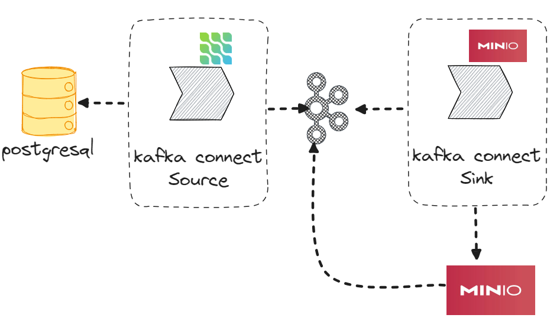
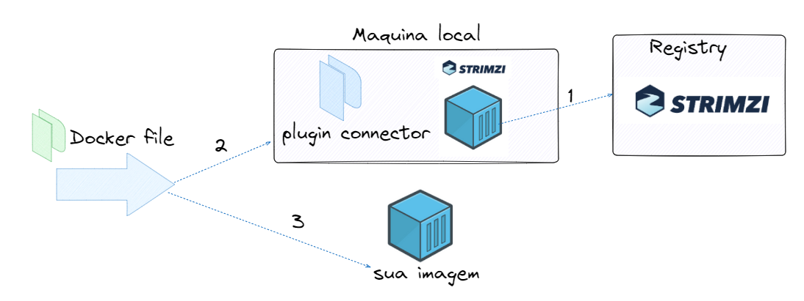
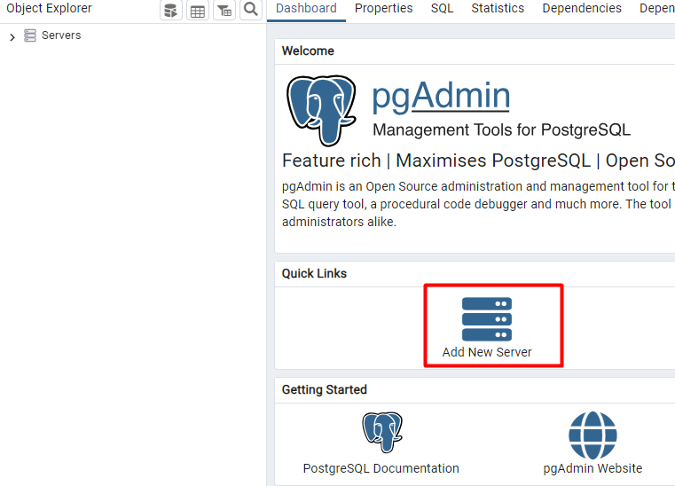
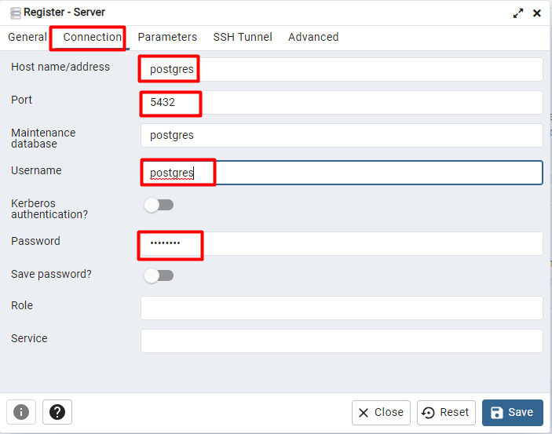
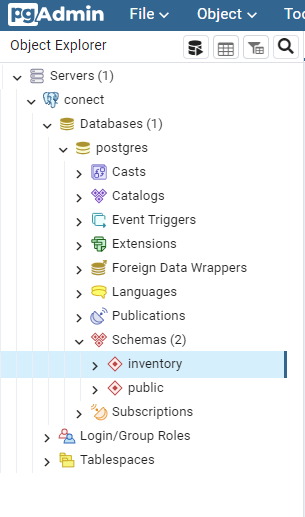
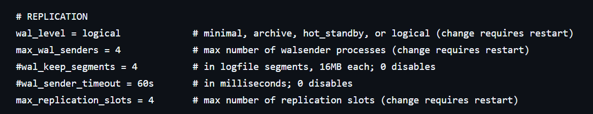
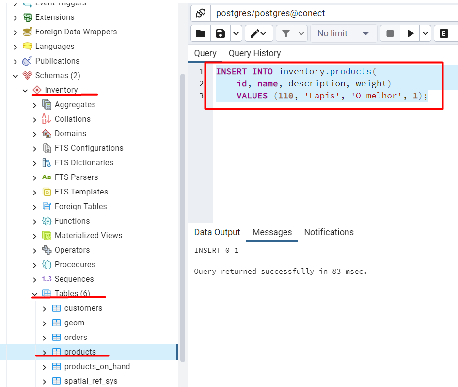
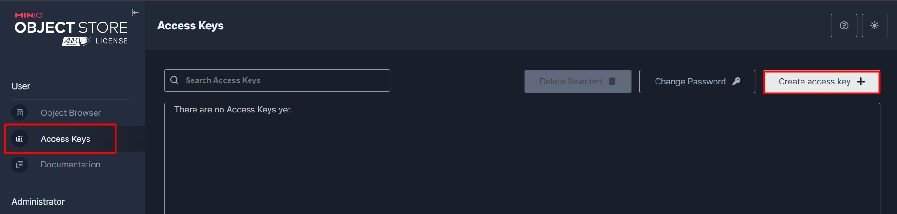
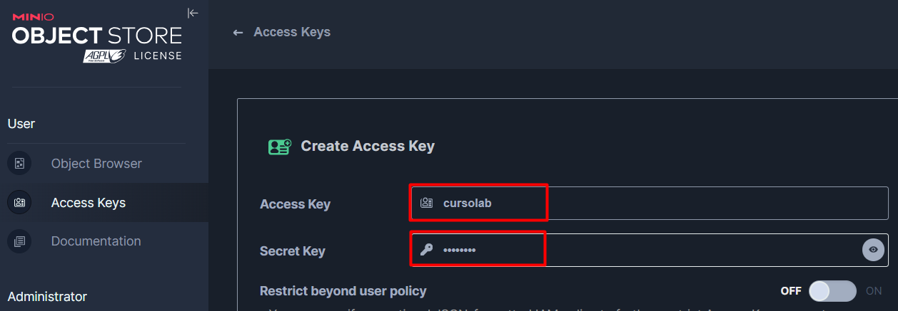
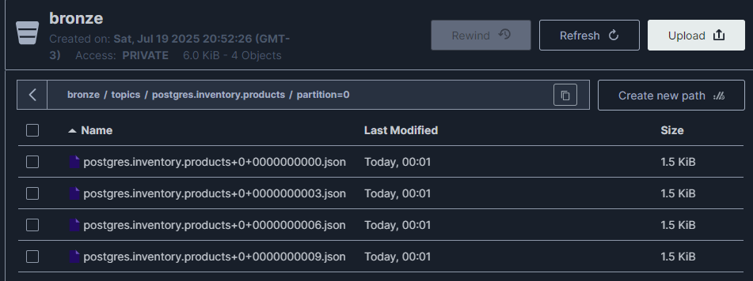

# Lab EDA - Kafka Connect

## Disclaimer
> **As configurações dos Laboratórios é puramente para fins de desenvolvimento local e estudos**

## Pré-requisitos
* Docker
* Docker Compose
* Ter feito o [LAB KAFKA](../21.Ingestao-Dados-Kafka/README.md) (tópicos, producers e consumers)

---

## O que vamos construir

Um pipeline de dados **sem escrever uma linha de código de aplicação**: toda alteração feita em uma tabela do PostgreSQL vai parar no Kafka e, depois, em arquivos em um Data Lake (MinIO).



```
PostgreSQL ──(Source: Debezium)──► Kafka ──(Sink: S3)──► MinIO (bucket bronze)
                                     ▲                          │
                                     └──── evento "arquivo criado" (tópico sink-products)
```

## Conceitos antes de começar

| Conceito | O que é |
|---|---|
| **Kafka Connect** | Um serviço que move dados **para dentro** e **para fora** do Kafka apenas com configuração (JSON). Você não escreve producer nem consumer. |
| **Source Connector** | Lê de um sistema externo e **escreve no Kafka**. Aqui: Debezium lendo o PostgreSQL. |
| **Sink Connector** | Lê do Kafka e **escreve em um sistema externo**. Aqui: S3 Sink gravando no MinIO. |
| **Plugin** | O `.jar` que implementa um conector. Precisa estar instalado na imagem do Connect. |
| **Worker** | O processo do Kafka Connect (nosso container `kafkaConect`). Expõe uma **API REST** na porta `8083`. |
| **Task** | A "thread" que realmente copia os dados. Um conector pode ter várias (`tasks.max`). |
| **Converter** | Define como os dados são serializados no Kafka (aqui: JSON). |
| **CDC (Change Data Capture)** | Capturar cada `INSERT`, `UPDATE` e `DELETE` de um banco **no momento em que acontece**. |
| **Debezium** | Ferramenta de CDC. Lê o **log de transações** do banco (no PostgreSQL, o **WAL**), e não as tabelas — por isso não pesa no banco. |

> 💡 **Por que CDC e não um `SELECT` a cada 5 minutos?** Um `SELECT` periódico não enxerga registros **apagados**, perde alterações intermediárias (o registro mudou 3 vezes entre duas leituras) e sobrecarrega o banco. O CDC entrega **cada mudança, em ordem, quase em tempo real**.

## Arquivos desta pasta

| Arquivo | Para que serve |
|---|---|
| `Dockerfile` | Receita da imagem do Kafka Connect com os plugins Debezium e S3 Sink |
| `conectores/conector-postgres.json` | Configuração do **Source** (PostgreSQL → Kafka) |
| `conectores/conector-minio.json` | Configuração do **Sink** (Kafka → MinIO) |

> A pasta `conectores/` é montada dentro do container do Connect em `/conectores` (veja `volumes` do serviço `connect` no `docker-compose.yaml`). É por isso que conseguimos usar `@/conectores/...` nos comandos `curl`.
---

## Passo 1 — Subindo o ambiente

```sh
docker compose up -d zookeeper kafka-broker connect akhq postgres pgadmin minio mc

docker container ls
```

| Serviço | Função | Acesso |
|---|---|---|
| `zookeeper` / `kafka-broker` | Cluster Kafka | `localhost:9092` |
| `connect` (container `kafkaConect`) | Kafka Connect | API REST: http://localhost:8083 |
| `akhq` | Interface web do Kafka e do Connect | http://localhost:8080/ui |
| `postgres` | Banco de origem, já com o schema de exemplo `inventory` | `localhost:5432` |
| `pgadmin` | Interface web do PostgreSQL | http://localhost:5433 |
| `minio` | Data Lake compatível com S3 | http://localhost:9001 |
| `mc` | Cliente do MinIO que **cria o bucket `bronze`** e configura o aviso para o Kafka | — |

## Passo 2 — Conferindo os plugins instalados

```sh
docker exec -it kafkaConect curl http://localhost:8083/connector-plugins
```

Você deve encontrar, entre outros:

```
io.debezium.connector.postgresql.PostgresConnector   (source)
io.confluent.connect.s3.S3SinkConnector              (sink)
```

> Se a resposta for `Connection refused`, o Connect ainda está iniciando. Espere alguns segundos e tente de novo.

### De onde vieram esses plugins?

O Kafka Connect "puro" não sabe falar com PostgreSQL nem com S3. Os plugins que você acabou de listar foram **instalados na imagem** do Connect pelo `Dockerfile` desta pasta:



1. Parte da imagem do Kafka Connect do **Strimzi** (`quay.io/strimzi/kafka`)
2. Baixa os plugins **Debezium PostgreSQL** e **Debezium SQL Server** (Source)
3. Baixa o plugin **Confluent S3 Sink** (Sink) — usamos uma imagem Debian temporária só para descompactar o `.zip` (*multi-stage build*)
4. Coloca tudo na pasta de plugins `/tmp/connect-plugins/`

> 💡 Os nomes da lista (`io.debezium.connector.postgresql.PostgresConnector`, `io.confluent.connect.s3.S3SinkConnector`) são exatamente os que vamos usar no campo `connector.class` dos arquivos JSON. **Sem o plugin instalado, o conector não é criado.**

A imagem já está pronta e publicada (`fernandos/kafka-connet-debezium-lab:v215`) e é ela que o `docker-compose.yaml` usa. **Não é preciso construir.** Para usar outro conector (MongoDB, Elasticsearch, JDBC...), bastaria adicionar o plugin no `Dockerfile` e gerar uma nova imagem.

---

## Parte 1 — Source: PostgreSQL → Kafka

### Passo 3 — Conhecendo o banco de origem

Acesse o pgAdmin em http://localhost:5433

* Login: `lab-pgadmin4@pgadmin.org`
* Senha: `postgres`


Adicione um server (**Add New Server**):



| Campo | Valor |
|---|---|
| Name (aba General) | `postgres` |
| Host name/address (aba Connection) | `postgres` |
| Maintenance database | `postgres` |
| Username | `postgres` |
| Password | `postgres` |



> 💡 O host é `postgres` (nome do serviço no Docker) e não `localhost`, porque o pgAdmin roda **dentro** da rede do Docker.

Se tudo deu certo, você verá o schema `inventory` com as tabelas de exemplo:



### Passo 4 — O PostgreSQL está preparado para CDC?

O Debezium lê o **WAL** (Write-Ahead Log), o log onde o PostgreSQL registra toda alteração antes de gravá-la na tabela. Para isso o banco precisa estar configurado para **replicação lógica**.



Abra o **Query Tool** (botão direito no banco → `Query Tool`) e execute:

```sql
SHOW config_file;           -- onde fica o postgresql.conf
SHOW wal_level;             -- precisa ser "logical"
SHOW max_replication_slots; -- precisa ser > 0
```

| Configuração | Valor esperado | Por quê |
|---|---|---|
| `wal_level` | `logical` | Faz o WAL guardar informação suficiente para "reconstruir" cada linha alterada |
| `max_replication_slots` | `4` (≥ 1) | O Debezium cria um **replication slot**: um marcador de até onde ele já leu o WAL |

> 📌 A imagem `quay.io/debezium/example-postgres` já vem configurada. Em um PostgreSQL "comum" você precisaria alterar o `postgresql.conf` e reiniciar o banco. Em bancos gerenciados (RDS, Cloud SQL, Azure) isso é um parâmetro do serviço.

### Passo 5 — Criando o conector Source

Veja o conteúdo de `conectores/conector-postgres.json`:

```json
{
  "connector.class": "io.debezium.connector.postgresql.PostgresConnector",
  "tasks.max": "1",
  "database.hostname": "postgres",
  "database.port": "5432",
  "database.user": "postgres",
  "database.password": "postgres",
  "database.dbname": "postgres",
  "topic.prefix": "postgres",
  "schema.include.list": "inventory"
}
```

| Propriedade | Significado |
|---|---|
| `connector.class` | Qual plugin usar (o Debezium PostgreSQL) |
| `tasks.max` | Quantas tasks em paralelo. Para CDC de PostgreSQL é sempre **1** (o WAL é lido em ordem) |
| `database.hostname` / `database.port` | Endereço do banco dentro da rede Docker |
| `database.user` / `database.password` | Credenciais (o usuário precisa de permissão de replicação) |
| `database.dbname` | Banco que será monitorado |
| `topic.prefix` | Prefixo dos tópicos criados. Os tópicos seguem o padrão **`<prefixo>.<schema>.<tabela>`** |
| `schema.include.list` | Quais schemas monitorar. Também existe `table.include.list` para escolher tabelas |

Crie o conector pela **API REST** do Kafka Connect:

```sh
docker exec -it kafkaConect bash

curl -X PUT -d @/conectores/conector-postgres.json http://localhost:8083/connectors/connector-postgres/config -H 'Content-Type: application/json' -H 'Accept: application/json'
```

> 💡 Usamos `PUT .../connectors/<nome>/config` porque ele **cria ou atualiza** o conector. Pode rodar de novo sempre que mudar o JSON. (O `POST /connectors` só cria e dá erro se já existir.)

Listando os conectores e conferindo o status:

```sh
curl http://localhost:8083/connectors/

curl http://localhost:8083/connectors/connector-postgres/status
```

Resposta esperada — conector e task em `RUNNING`:

```json
{"name":"connector-postgres","connector":{"state":"RUNNING",...},"tasks":[{"id":0,"state":"RUNNING",...}],"type":"source"}
```

Saia do container:

```sh
exit
```

### Passo 6 — O snapshot: os tópicos foram criados

```sh
docker exec -it kafka-broker /bin/bash

kafka-topics --bootstrap-server localhost:9092 --list
```

Você deve ver **um tópico por tabela**:

```
postgres.inventory.customers
postgres.inventory.geom
postgres.inventory.orders
postgres.inventory.products
postgres.inventory.products_on_hand
```

E também os tópicos internos do Kafka Connect:

| Tópico | Guarda |
|---|---|
| `connect-configs` | A configuração dos conectores |
| `connect-offsets` | Até onde cada Source já leu (para o Debezium: a posição no WAL) |
| `connect-status` | O status de conectores e tasks |

> 💡 Ou seja: **o Kafka Connect guarda o próprio estado no Kafka**. Se o container do Connect for recriado, ele continua exatamente de onde parou.

Consuma o tópico de produtos desde o início:

```sh
kafka-console-consumer --bootstrap-server localhost:9092 --topic postgres.inventory.products --from-beginning --property print.key=true
```

Os registros que **já existiam** na tabela chegaram com `"op":"r"` (*read*). Esse é o **snapshot inicial**: na primeira execução o Debezium copia a tabela inteira e só depois passa a acompanhar o WAL.

Deixe esse consumer **aberto** para o próximo passo.

### Passo 7 — Vendo o CDC acontecer

No pgAdmin (Query Tool), execute um comando por vez e observe o terminal do consumer:



```sql
INSERT INTO inventory.products(id, name, description, weight)
VALUES (default, 'Lapis', 'O melhor', 1);
```

```sql
UPDATE inventory.products SET weight = 2 WHERE name = 'Lapis';
```

```sql
DELETE FROM inventory.products WHERE name = 'Lapis';
```

Cada mensagem tem uma **chave** (a primary key, ex.: `{"id":110}`) e um **valor** no formato de "envelope" do Debezium:

```json
{
  "before": { ... },   // como a linha era ANTES da alteração
  "after":  { ... },   // como a linha ficou DEPOIS
  "source": { ... },   // metadados: tabela, transação (txId), posição no WAL (lsn)
  "op": "c",           // tipo da operação
  "ts_ms": 1790128201656
}
```

| Operação SQL | `op` | `before` | `after` |
|---|---|---|---|
| Snapshot | `r` | `null` | linha |
| `INSERT` | `c` | `null` | linha nova |
| `UPDATE` | `u` | linha antiga | linha nova |
| `DELETE` | `d` | linha apagada | `null` |

> 💡 Repare que depois do `DELETE` chega uma mensagem extra com valor `null`: é o **tombstone**. Ele avisa o Kafka que aquela chave pode ser removida em tópicos com *log compaction*.

> 💡 A chave da mensagem é a primary key. Lembra do lab anterior? **Mesma chave → mesma partição → ordem garantida**. Todas as mudanças de um mesmo produto chegam na ordem certa.

Pare o consumer com `Ctrl + C` e saia do container:

```sh
exit
```

### Passo 8 — Gerenciando conectores pela API REST

Documentação completa: https://docs.confluent.io/platform/current/connect/references/restapi.html

```sh
docker exec -it kafkaConect bash

# Pausar o conector (para de ler o WAL)
curl -X PUT http://localhost:8083/connectors/connector-postgres/pause
curl http://localhost:8083/connectors/connector-postgres/status    # state: PAUSED

# Retomar
curl -X PUT http://localhost:8083/connectors/connector-postgres/resume
curl http://localhost:8083/connectors/connector-postgres/status    # state: RUNNING

exit
```

#### A mesma coisa pela interface: AKHQ

Tudo o que você fez com `curl` também pode ser feito visualmente. Acesse http://localhost:8080/ui

* **Connect** → `connector-postgres`: status do conector e das tasks, configuração, e botões para **pausar, retomar, reiniciar e excluir** — são as mesmas chamadas da API REST acima, só que por trás de uma interface
* **Topics** → `postgres.inventory.products`: navegue pelas mensagens do CDC e veja `key`, `before`, `after` e `op` formatados

> 💡 No dia a dia a interface é mais prática; em automação (scripts, pipelines de CI/CD) usa-se a **API REST**. É ela que permite versionar os conectores (os arquivos JSON) no Git e criá-los de forma automatizada.

---

## Parte 2 — Sink: Kafka → MinIO

### Passo 9 — Criando a chave de acesso no MinIO

O Sink precisa de uma credencial para gravar no MinIO (assim como na AWS S3 você usaria uma *Access Key*).

Acesse http://localhost:9001

* Usuário: `admin`
* Senha: `minioadmin`

Vá em **Access Keys** → **Create access key**:



Preencha:

* Access Key: `cursolab`
* Secret Key: `cursolab`



Clique em **Create**.

> 📌 Esses são os valores que estão no `conector-minio.json`. Se usar outros, altere os campos `aws.access.key.id` e `aws.secret.access.key` do arquivo.

Aproveite e veja em **Object Browser** que o bucket `bronze` já existe e está vazio — quem o criou foi o serviço `mc` no `docker-compose.yaml`.

### Passo 10 — Criando o conector Sink

Veja o conteúdo de `conectores/conector-minio.json`:

```json
{
  "connector.class": "io.confluent.connect.s3.S3SinkConnector",
  "topics": "postgres.inventory.products",
  "s3.bucket.name": "bronze",
  "store.url": "http://minio:9000",
  "flush.size": 3,
  "storage.class": "io.confluent.connect.s3.storage.S3Storage",
  "format.class": "io.confluent.connect.s3.format.json.JsonFormat",
  "s3.region": "us-east-1",
  "aws.access.key.id": "cursolab",
  "aws.secret.access.key": "cursolab",
  "behavior.on.null.values": "ignore"
}
```

| Propriedade | Significado |
|---|---|
| `connector.class` | Plugin S3 Sink da Confluent |
| `topics` | Tópico(s) que o Sink vai **consumir** |
| `s3.bucket.name` | Bucket de destino |
| `store.url` | Endereço do S3. Apontando para o MinIO, o mesmo plugin funciona como se fosse a AWS |
| `flush.size` | Quantas mensagens juntar antes de gravar **um arquivo** |
| `format.class` | Formato do arquivo (JSON). Em produção é comum usar **Parquet** ou **Avro** |
| `s3.region` | Obrigatório para o protocolo S3 (o MinIO ignora o valor) |
| `aws.access.key.id` / `aws.secret.access.key` | A chave criada no passo anterior |
| `behavior.on.null.values` | O que fazer com mensagens `null` (os **tombstones** do Passo 7): ignorar |

Crie o conector:

```sh
docker exec -it kafkaConect bash

curl -X PUT -d @/conectores/conector-minio.json http://localhost:8083/connectors/connector-minio/config -H 'Content-Type: application/json' -H 'Accept: application/json'

curl http://localhost:8083/connectors/

curl http://localhost:8083/connectors/connector-minio/status

exit
```

> 💡 Um Sink é, por baixo dos panos, um **consumer group** (`connect-connector-minio`). Tente: `kafka-consumer-groups --bootstrap-server localhost:9092 --list` dentro do `kafka-broker`. Ele tem offset, lag e rebalance, igual ao que vimos no lab anterior.

### Passo 11 — Os arquivos chegaram no Data Lake

No MinIO, abra **Object Browser** → `bronze`. O caminho dos arquivos é:

```
bronze/topics/postgres.inventory.products/partition=0/postgres.inventory.products+0+0000000000.json
                     └── tópico            └── partição       └── tópico + partição + offset inicial
```

* Cada arquivo tem **3 mensagens** (`flush.size = 3`)
* O nome do arquivo contém o **offset** da primeira mensagem — dá para saber exatamente de onde veio cada dado
* A camada se chama **bronze** porque guarda o dado **bruto**, como chegou (arquitetura *medallion*: bronze → silver → gold)

Insira mais registros e acompanhe novos arquivos aparecendo:

```sql
INSERT INTO inventory.products(id, name, description, weight)
VALUES (default, 'Caneta', 'Azul', 1),
       (default, 'Borracha', 'Branca', 1),
       (default, 'Caderno', '10 matérias', 2);
```

> 🧪 **Experimente:** insira só **1** registro. O arquivo não aparece! O Sink espera juntar 3 mensagens (`flush.size`). Em produção também se usa `rotate.interval.ms` para gravar por tempo, mesmo com poucas mensagens.

### Passo 12 — Fechando o ciclo: o MinIO avisa o Kafka

O MinIO está configurado (variáveis `MINIO_NOTIFY_KAFKA_*` no `docker-compose.yaml` + comando `mc event add` no serviço `mc`) para **publicar um evento no Kafka toda vez que um arquivo `.json` é criado** no bucket `bronze`.

```sh
docker exec -it kafka-broker /bin/bash

kafka-topics --bootstrap-server localhost:9092 --list

kafka-console-consumer --bootstrap-server localhost:9092 --topic sink-products --from-beginning
```

Cada mensagem descreve um arquivo novo:

```json
{"EventName":"s3:ObjectCreated:CompleteMultipartUpload",
 "Key":"bronze/topics/postgres.inventory.products/partition=0/postgres.inventory.products+0+0000000000.json", ...}
```



> 💡 Isso é **arquitetura orientada a eventos** na prática: um próximo processo (um job Spark, uma função serverless) pode **reagir** à chegada de um arquivo em vez de ficar verificando o bucket de tempos em tempos.

```sh
exit
```
