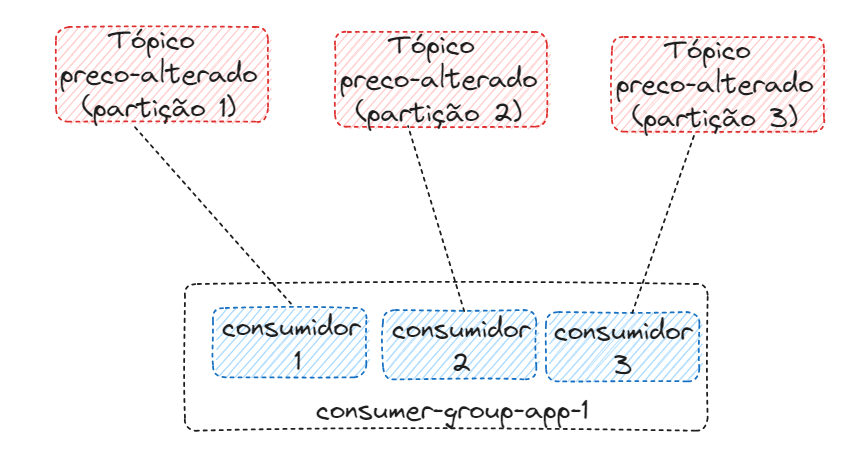

# LAB KAFKA

---
## Disclaimer
> **Esta configuração é puramente para fins de desenvolvimento local e estudos**
> 

## Pré-requisitos
* Docker
* Docker-Compose


## Prática 01
Criando o ambiente Kafka com o docker compose e executando os principais comandos

```
docker compose up -d kafka-broker akhq
```

1. Acesse para validar a execução da interface: AKHQ -  http://localhost:8080/ui
2. Verificando se os containers foram criados com sucesso

```sh
 docker container ls
```
3. Verificando as imagens que foram feitas download do docker-hub
```sh
 docker image ls
```
4. Para o restante do exercício, acesse o Shell do container kafka-broker

```sh
docker exec -it kafka-broker /bin/bash
```

### Criando nosso Primeiro tópico


```sh
kafka-topics --bootstrap-server localhost:9092 --topic alunos --create
```

Listando o tópico criado
```sh
kafka-topics --bootstrap-server localhost:9092 --list 
```

Alguém lembra das partições? Agora o tópico com mais de uma partição

```sh
kafka-topics --bootstrap-server localhost:9092 --topic alunos-novos --create --partitions 3
```
Esqueceu a configuração do tópico?

```sh
kafka-topics --bootstrap-server localhost:9092 --topic alunos-novos --describe
```

... e com fator de replicação

```sh
kafka-topics --bootstrap-server localhost:9092 --topic alunos-novos-factor --create --partitions 3 --replication-factor 2
```
...deu certo, porque ?

Agora vai dar certo...
```sh
kafka-topics --bootstrap-server localhost:9092 --topic alunos-novos-factor --create --partitions 3 --replication-factor 1
```


Criando tópicos com configurações

```sh
kafka-topics --bootstrap-server localhost:9092 --create --topic topico-config --partitions 3 --replication-factor 1

kafka-configs --bootstrap-server localhost:9092 --entity-type topics --entity-name topico-config --alter --add-config retention.ms=259200000

kafka-topics --bootstrap-server localhost:9092 --describe --topic topico-config
```

### Deletando um tópico

```sh
kafka-topics --bootstrap-server localhost:9092 --topic alunos-novos-factor --delete
kafka-topics --bootstrap-server localhost:9092 --topic alunos-novos-factor --describe
```

### Produzinho mensagens

```sh
kafka-console-producer --bootstrap-server localhost:9092 --topic alunos

>Minha primeira mensagem
>Melhor lab do brasil
>Eu sou o Fulano
>^C  (<- Ctrl + C is used to exit the producer)

```

Produzinho mensagens com acks

```sh
kafka-console-producer --bootstrap-server localhost:9092 --topic alunos --producer-property acks=all
```

Criando o tópico no momento de criar a mensagem

```sh
kafka-console-producer --bootstrap-server localhost:9092 --topic professor

kafka-topics --bootstrap-server localhost:9092 --topic professor --describe
```

Produzir mensagens habilitando a Key

```sh
kafka-console-producer --bootstrap-server localhost:9092 --topic alunos --property parse.key=true --property key.separator=:
>key:value
>aluno:fernando
```

### Consumindo mensagens

```sh
kafka-console-consumer --bootstrap-server localhost:9092 --topic alunos
```

Abre outro terminal, entre no container e produza uma mensagem

```sh
//Entrando no containar em outro terminal

docker exec -it kafka-broker /bin/bash

//Produzindo mensagens

kafka-console-producer --bootstrap-server localhost:9092 --topic alunos --property parse.key=true --property key.separator=:

>aluno:fernando
>aluno:felipe

```

Consumindo as mensagens desde o inicio

No primeiro terminal cancele o consumo das mensagens

```sh
>^C  (<- Ctrl + C is used to exit the producer)

kafka-console-consumer --bootstrap-server localhost:9092 --topic alunos --from-beginning

```

Consumindo mensagens mostrando algumas configurações tais como: `Key` e `Value`

```sh
kafka-console-consumer --bootstrap-server localhost:9092 --topic alunos  --property print.timestamp=true --property print.key=true --property print.value=true --property print.partition=true --from-beginning

>^C  (<- Ctrl + C is used to exit the producer)

```

### Consumer group

Criando um consumer group

Consumindo as mensagens com um consumer group

```sh
kafka-console-consumer --bootstrap-server localhost:9092 --topic alunos --group aplicacao-lab
```

Em um outro terminal....

Produzindo as mensagem 

```sh
kafka-console-producer --bootstrap-server localhost:9092  --topic alunos
>nome:fernando
```

Listando os consumer groups em outro terminal

```sh
docker exec -it kafka-broker /bin/bash
kafka-consumer-groups --bootstrap-server localhost:9092 --list
```

As configurações do consume groups são :

```sh
kafka-consumer-groups --bootstrap-server localhost:9092 --describe --group aplicacao-lab

```

Cancelando o consumidor e continuando produzindo mensgens

```sh
//Veja a descrição dos consumidores sem ter consumindo as mensagem
kafka-consumer-groups --bootstrap-server localhost:9092 --describe --group aplicacao-lab

```

Resentado o Offset Para o início (Voltando a posição inicial)

```sh
kafka-consumer-groups --bootstrap-server localhost:9092 --group aplicacao-lab --topic alunos --reset-offsets --to-earliest --execute

kafka-consumer-groups --bootstrap-server localhost:9092 --describe --group aplicacao-lab

```

Resentado o Offset Para o Final (Voltando a posição Final)

```sh
kafka-consumer-groups --bootstrap-server localhost:9092 --group aplicacao-lab --topic alunos --reset-offsets --to-latest --execute

kafka-consumer-groups --bootstrap-server localhost:9092 --describe --group aplicacao-lab

```


Para uma posição Específica

```sh
kafka-consumer-groups --bootstrap-server localhost:9092 --group aplicacao-lab --topic alunos --reset-offsets --to-offset 4 --execute

kafka-consumer-groups --bootstrap-server localhost:9092 --describe --group aplicacao-lab

```


Deletando os consumer groups

```sh
kafka-consumer-groups --bootstrap-server localhost:9092 --delete --group aplicacao-lab
```
## Prática 02 — Consumer Group e Rebalance

### Objetivo

Ver na prática como o Kafka **divide as partições de um tópico entre os consumidores de um mesmo grupo** e o que acontece quando um consumidor **sai** ou **entra** no grupo (o *rebalance*).




### Organização dos terminais

Você vai precisar de **5 terminais**. Em todos eles, entre no container do broker:

```sh
docker exec -it kafka-broker /bin/bash
```

| Terminal | Papel |
|---|---|
| 1 | Producer (envia as mensagens) |
| 2 | Consumidor 1 |
| 3 | Consumidor 2 |
| 4 | Consumidor 3 |
| 5 | Monitoramento do grupo |

---

### Passo 1 — Criar o tópico com 3 partições

**Terminal 1**

```sh
kafka-topics --bootstrap-server localhost:9092 --create --topic preco-alterado --partitions 3 --replication-factor 1

kafka-topics --bootstrap-server localhost:9092 --describe --topic preco-alterado
```

**O que acontece:** o tópico é criado com 3 partições (`Partition: 0`, `1` e `2`). Cada partição poderá ser lida por um consumidor diferente do grupo — ou seja, conseguimos até **3 consumidores trabalhando em paralelo**.

> ⚠️ Crie o tópico **antes** de produzir. Se o producer criar o tópico automaticamente, ele nasce com apenas 1 partição e o exercício não funciona.

### Passo 2 — Subir os 3 consumidores no mesmo grupo

Execute o **mesmo comando** nos **terminais 2, 3 e 4**:

```sh
kafka-console-consumer --bootstrap-server localhost:9092 --topic preco-alterado --group consumer-group-app-1 --property print.partition=true --property print.offset=true
```

**O que acontece:** os três consumidores usam o mesmo `--group`, então o Kafka entende que eles fazem parte da **mesma aplicação** e entrega **uma partição para cada um**. A opção `print.partition=true` mostra de qual partição veio cada mensagem.

**Terminal 5** — confira a distribuição:

```sh
kafka-consumer-groups --bootstrap-server localhost:9092 --describe --group consumer-group-app-1
```

Observe as colunas:

- `PARTITION` — número da partição
- `CONSUMER-ID` — qual consumidor está lendo aquela partição (devem ser **3 IDs diferentes**)
- `CURRENT-OFFSET` / `LOG-END-OFFSET` / `LAG` — até onde o grupo leu, quantas mensagens existem e quantas faltam ler

### Passo 3 — Produzir mensagens distribuídas entre as partições

**Terminal 1**

```sh
kafka-console-producer --bootstrap-server localhost:9092 --topic preco-alterado --producer-property partitioner.class=org.apache.kafka.clients.producer.RoundRobinPartitioner
```

Digite algumas mensagens, uma por linha:

```
>produto-1:10.90
>produto-2:25.00
>produto-3:7.50
>produto-4:99.99
>produto-5:3.20
>produto-6:15.00
```

**O que acontece:** como as mensagens **não têm key**, quem decide a partição é o *partitioner*. Por padrão, o producer tende a mandar várias mensagens seguidas para a mesma partição (*sticky partitioner*). Com o `RoundRobinPartitioner`, cada mensagem vai para uma partição diferente, em rodízio — e assim vemos **os três consumidores recebendo mensagens**.

> 💡 Repare nos terminais 2, 3 e 4: cada consumidor mostra **sempre a mesma partição**. Nenhuma mensagem aparece em dois consumidores ao mesmo tempo.

### Passo 4 — Visualizar no AKHQ (opcional)

Acesse http://localhost:8080/ui → **Consumer Groups** → `consumer-group-app-1` e veja a mesma informação do Passo 2 de forma visual: membros do grupo, partições atribuídas e lag.

### Passo 5 — Derrubar um consumidor (rebalance por saída)

No **terminal 4** (Consumidor 3), pressione `Ctrl + C`.

**Terminal 5** — aguarde alguns segundos e confira de novo:

```sh
kafka-consumer-groups --bootstrap-server localhost:9092 --describe --group consumer-group-app-1
```

**O que acontece:** o Kafka percebe que um membro saiu e dispara um **rebalance**. As 3 partições agora são divididas entre **2 consumidores** — um deles passa a ler **duas partições**.

Volte ao **terminal 1** e produza mais mensagens. Observe que o consumidor que "herdou" a partição **continua a partir do último offset confirmado**: nenhuma mensagem é perdida. Esse é o papel do **offset armazenado pelo grupo**.

### Passo 6 — Reabrir o consumidor (rebalance por entrada)

No **terminal 4**, execute novamente:

```sh
kafka-console-consumer --bootstrap-server localhost:9092 --topic preco-alterado --group consumer-group-app-1 --property print.partition=true --property print.offset=true
```

**Terminal 5**:

```sh
kafka-consumer-groups --bootstrap-server localhost:9092 --describe --group consumer-group-app-1
```

**O que acontece:** um novo membro entrou no grupo, então ocorre **outro rebalance** e a distribuição volta a ser **1 partição por consumidor**. É assim que uma aplicação escala horizontalmente: basta subir mais instâncias com o mesmo `group.id`.
