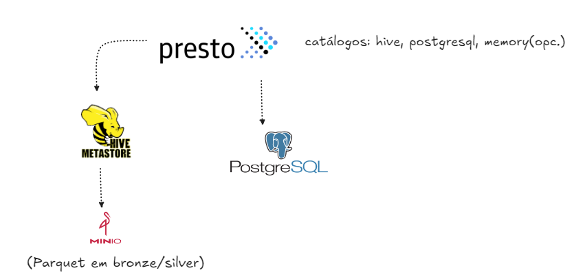
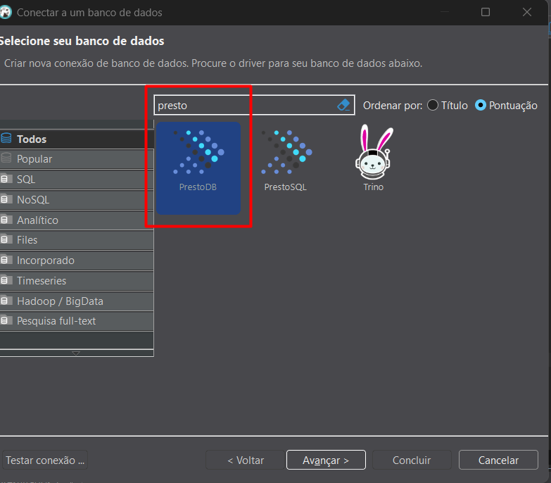
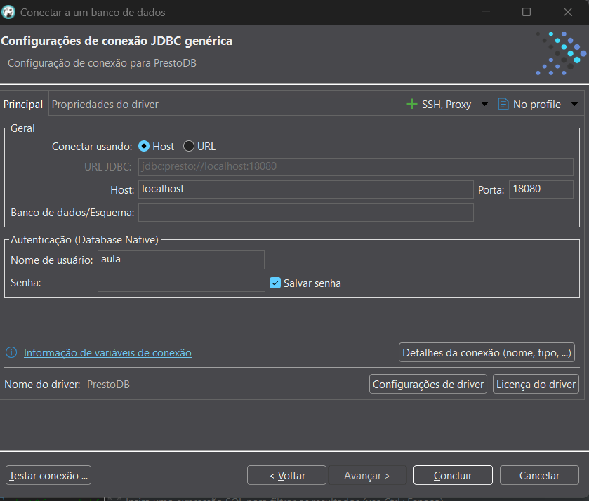

# Lab Prestodb


## Disclaimer
> **As configurações dos Laboratórios é puramente para fins de desenvolvimento local e estudos**


## Pré-requisitos?
* Docker
* Docker-Compose

# Iniciando o ambiente

```sh
docker compose up -d datanode namenode hive metastore minio presto
```

* http://localhost:18080/ui/





Federação de dados: consultar e combinar múltiplas fontes (lake + bancos) com SQL unificado e execução distribuída em memória (Presto). O Hive Metastore funciona como catálogo de metadados: mapeia nome lógico da tabela para arquivos/partições no MinIO, com schema, formato e estatísticas. Sem ele, o Presto não sabe onde/como ler Parquet no S3/MinIO.


## Conectores

Conectores são plugins que implementam o SPI do Presto para falar com uma fonte de dados (data lakes, bancos, streams, etc.).

O Presto tem dezenas de conectores oficiais: Hive, Iceberg, Delta Lake, Hudi, PostgreSQL, MySQL, SQL Server, Oracle, Kafka, Elasticsearch, Cassandra, MongoDB, Druid, Pinot, BigQuery, Redshift, Redis, Google Sheets, ClickHouse e outros.

> https://prestodb.io/docs/current/connector.html


```sh
docker exec -it presto bash

presto-cli

SHOW CATALOGS;  

SHOW SCHEMAS FROM hive;   

```
## Navegação de metadados
SHOW CATALOGS;                      -- catálogos disponíveis (hive, postgresql, system, memory...)
SHOW SCHEMAS FROM hive;             -- schemas do catálogo hive
SHOW TABLES  FROM hive.aula;        -- tabelas no schema aula
DESCRIBE hive.aula.bf;              -- colunas e tipos
SHOW COLUMNS FROM hive.aula.bf;     -- alternativa ao DESCRIBE

## Mudando de catálogo/esquema na sessão

```sh
USE hive.aula;                      -- define catálogo+schema
SELECT * FROM bf LIMIT 5;           -- já encontra a tabela no schema atual
USE postgresql.public;              -- agora usando o catálogo JDBC do Postgres

```


### Coleta de estatísticas (se habilitado no conector)
```sh
ANALYZE hive.aula.bf; 
```

## Configuração pode ser pelo `DBeaver` 





### Configurando e criando estrutura do Hive
```sql
create database aula;

CREATE EXTERNAL TABLE IF NOT EXISTS aula.bf (
  User_ID BIGINT,
  Product_ID STRING,
  Gender STRING,
  Age STRING,
  Occupation INT,
  City_Category STRING,
  Stay_In_Current_City_Years STRING,
  Marital_Status INT,
  Product_Category_1 INT,
  Product_Category_2 INT,
  Product_Category_3 INT,
  Purchase FLOAT
)
ROW FORMAT DELIMITED FIELDS TERMINATED BY ','
STORED AS TEXTFILE
LOCATION 's3a://raw//aula/bf/'
TBLPROPERTIES ("skip.header.line.count"="1");


select * from aula.bf;

```

### Criando uma estrutura para o postgreSql

Na pasta `postgresql` tem um arquivo `01_schema.sql` para configuração do Banco de dados

### Federando as consultas
```sql
SELECT gender, age, city_category, COUNT(*) qtd, ROUND(AVG(purchase),2) ticket
FROM hive.aula.bf
GROUP BY 1,2,3
ORDER BY 5 DESC
LIMIT 20;


SELECT *
FROM hive.aula.bf;

SELECT *
FROM postgresql.public.usuario;

SELECT *
FROM postgresql.public.categoria;


SELECT b.user_id,
       u.gender,
       u.age,
        b.purchase
FROM hive.aula.bf b
LEFT JOIN postgresql.public.usuario u
  ON b.user_id = u.user_id
LIMIT 50;

SELECT b.user_id ,
	   b.purchase ,
	   u.gender 	   
FROM hive.aula.bf b
INNER  JOIN postgresql.public.usuario u
  ON b.user_id = u.user_id
inner join postgresql.public.categoria c 
  on b.product_category_1  = c.product_category 
LIMIT 50;


```
