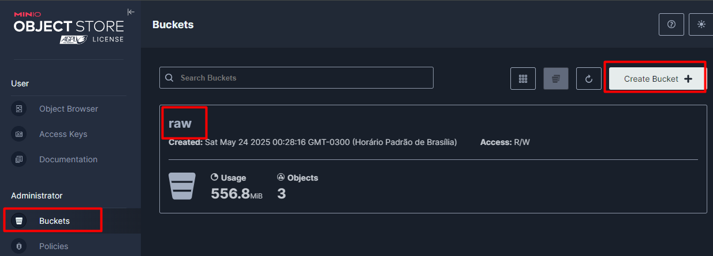
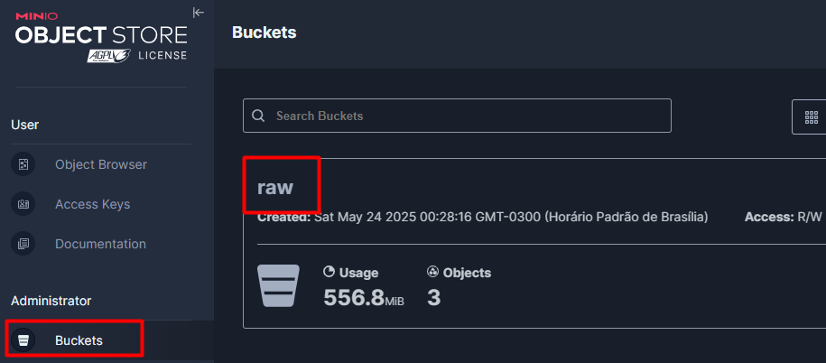
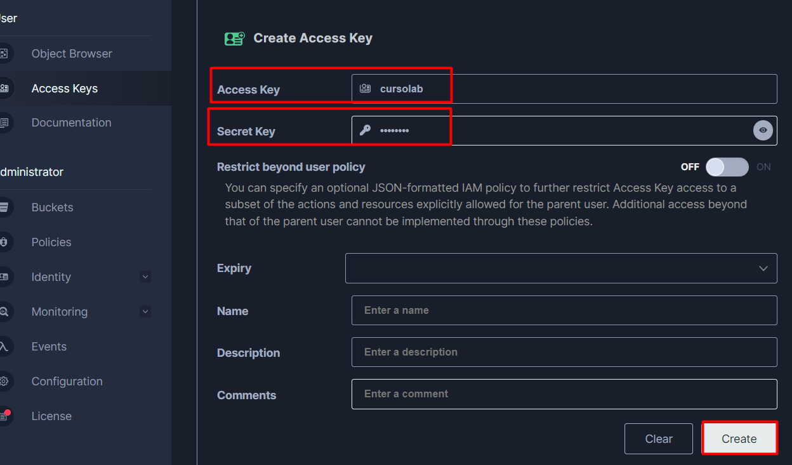
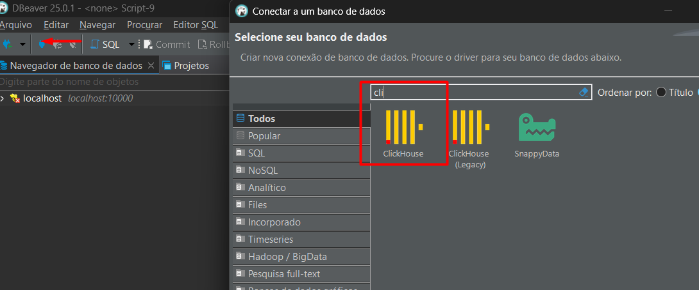
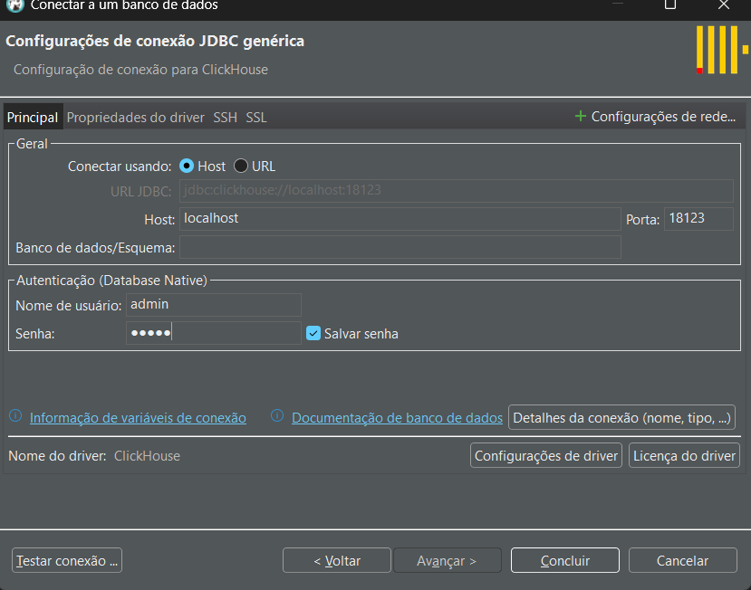
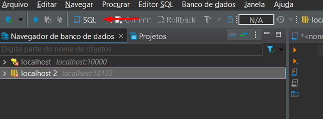

# Lab ClickHouse


## Disclaimer
> **As configurações dos Laboratórios é puramente para fins de desenvolvimento local e estudos**


## Pré-requisitos?
* Docker
* Docker-Compose
* https://storage.googleapis.com/covid19-open-data/v3/epidemiology.csv
* https://raw.githubusercontent.com/plotly/datasets/refs/heads/master/2015_flights.parquet
* https://datasets-documentation.s3.eu-west-3.amazonaws.com/pypi/2023/pypi_0_7_34.snappy.parquet

# Introdução ao OLAP

OLAP (Online Analytical Processing) é uma abordagem para análise de dados multidimensional, permitindo consultas rápidas e eficientes em grandes volumes de dados. Ele é usado principalmente para Business Intelligence (BI), relatórios analíticos e dashboards.

## Vantagens do OLAP:

* Análise multidimensional de dados
* Agregações rápidas
* Suporte a grandes volumes de dados
* Ideal para consultas analíticas complexas

# ClickHouse?

ClickHouse é um banco de dados OLAP de código aberto, projetado para armazenar e processar grandes quantidades de dados de forma rápida e eficiente. Ele é amplamente usado para análise de logs, dados de telemetria e BI.

## Características do ClickHouse:

* Alta velocidade de processamento
* Compactação eficiente de dados
* Suporte a SQL
* Armazenamento em colunas
* Indexação avançada
* Suporte a formatos de arquivos como CSV, Parquet e integração com MinIO (S3)

## Quando usar ClickHouse?

O ClickHouse é ideal para:

* Análises de logs e métricas em tempo real
* BI e relatórios analíticos
* Monitoramento e telemetria de aplicações
* Processamento de grandes volumes de dados de forma eficiente

## Engines no ClickHouse

O ClickHouse utiliza diferentes engines de armazenamento dependendo do caso de uso. Algumas das principais são:

### MergeTree

* A mais utilizada para análise OLAP
* Suporte a particionamento e ordenação
* Permite inserções rápidas e agregações eficientes

### Log

* Simples e eficiente para pequenos volumes de dados
* Não suporta ordenação nem índices
* Útil para tabelas temporárias

### Memory

* Armazena os dados na memória RAM
* Muito rápida, mas os dados são perdidos ao reiniciar o servidor

## Configuração ClickHouse container para MinIO
https://clickhouse.com/docs/integrations/minio

* Login: admin
* password: minioadmin
### Subindo o container MinIO

```sh
docker compose up -d minio
```

### Configurando o MinIO

> http://localhost:9001/browser






* Access Key: cursolab
* Secret Key: cursolab



### Subindo o container clickhouse
```sh
docker compose up -d clickhouse
```

### Configurando a conexão com Clickhouse







### Criando nosso Primeiro banco de dados

```sql
create database if not exists curso;

use curso;

```

### Criando a tabela Aluno

```sql
CREATE TABLE aluno
(
    id_aluno UInt32,
    matricula String,
    timestamp DateTime,
    nome  String
)
ENGINE = MergeTree
PRIMARY KEY (id_aluno, timestamp)

select * from aluno;

SELECT 
    database, 
    name, 
    engine, 
    sorting_key 
FROM system.tables
WHERE name = 'aluno';

SELECT 
    table, 
    count() AS total_partes
FROM system.parts
WHERE 
    database = 'curso' AND
    table = 'aluno' AND
    active
GROUP BY table;

```

### Populando registros

```sql
INSERT INTO aluno (id_aluno, matricula, timestamp, nome) VALUES
    (1, 'M001',  now(),       'Maria Silva'  ),
    (2, 'M002',  yesterday(), 'José Silva'),
    (3, 'M003',  today(),     'Fernando Silva'),
    (4, 'M004',  now() + 5,   'Joana')


```


### Algumas querys

```sql
select * from aluno ;
    
select * from aluno FORMAT TabSeparated;

SELECT *
FROM aluno
ORDER BY timestamp

SELECT *
FROM aluno
ORDER BY timestamp
limit 2

```

## 📄 Formatos de Saída no ClickHouse

| Formato                                | Descrição |
|---------------------------------------- |-----------|
| **TabSeparated**                       | Colunas separadas por tabulação (`\t`), sem cabeçalho. |
| **TabSeparatedWithNames**              | Igual ao TabSeparated, mas inclui os **nomes das colunas** na primeira linha. |
| **TabSeparatedWithNamesAndTypes**      | Inclui **nomes das colunas** e **tipos** nas duas primeiras linhas. |
| **CSV**                                | Dados separados por vírgulas, compatível com ferramentas como Excel e pandas. |
| **CSVWithNames**                       | Igual ao CSV, mas com **nomes das colunas** na primeira linha. |
| **JSON**                               | Exporta o resultado como um **array JSON completo**. |
| **JSONEachRow**                        | Cada linha é um **objeto JSON individual** — ideal para pipelines de dados. |
| **Pretty**                             | Formata os resultados como uma **tabela legível** no terminal. |
| **PrettyCompact**                      | Variante mais **compacta** do Pretty, reduz espaços e bordas. |
| **Parquet**                            | Exporta dados em **formato binário Parquet**, usado em Data Lakes. |
| **ORC**                                | Exporta dados no **formato ORC**, eficiente para sistemas como Hive. |
| **Arrow**                              | Exporta no **formato Apache Arrow**, ideal para integração com pandas e PyArrow. |
| **RowBinary**                          | Formato **binário eficiente**, usado para comunicação entre servidores ClickHouse. |
| **Null**                               | Não gera saída. Usado para **testes de desempenho**. |

✅ Importante: A escolha do formato depende do uso:

* Human-readable: Pretty, TabSeparated.
* Integração com sistemas: JSON, CSV, Parquet.
* Eficiência máxima: RowBinary, Null.

### Alterando registros

```sql
ALTER TABLE aluno
UPDATE nome ='Joana Silva'
WHERE id_aluno =4;

```

### Excluindo registros

```sql
ALTER TABLE aluno DELETE WHERE id_aluno =4;

```


> Baixe os arquivos `epidemiology.csv`, `2015_flights.parquet` e coloque na camada Raw no Minio

### Acessando arquivos que estão no MiniO
```sql
SELECT *
FROM s3('http://minio:9000/raw/epidemiology.csv', 'cursolab', 'cursolab')
LIMIT 100;

DESCRIBE TABLE s3('http://minio:9000/raw/epidemiology.csv', 'cursolab', 'cursolab', 'CSVWithNames');

SELECT *
FROM s3('http://minio:9000/raw/epidemiology.csv', 'cursolab', 'cursolab')
LIMIT 100;


SELECT count(*)
FROM s3('http://minio:9000/raw/epidemiology.csv', 'cursolab', 'cursolab')


```


### Utilizando arquivos no formato Parquet

- Formato binário otimizado para análise de dados.
- Melhor compressão e leitura eficiente.

Exemplo de leitura:

```sql
SELECT *
FROM s3('http://minio:9000/raw/2015_flights.parquet', 'cursolab', 'cursolab', "Parquet")
```

## Carregando os dados do CSV para tabela ClickHouse

```sql

CREATE TABLE covid19 (
    date Date,
    location_key LowCardinality(String),
    new_confirmed Int32,
    new_deceased Int32,
    new_recovered Int32,
    new_tested Int32,
    cumulative_confirmed Int32,
    cumulative_deceased Int32,
    cumulative_recovered Int32,
    cumulative_tested Int32
)
ENGINE = MergeTree
ORDER BY (location_key, date);


INSERT INTO covid19
   SELECT *
   FROM
      s3('http://minio:9000/raw/epidemiology.csv', 'cursolab', 'cursolab',
        CSVWithNames,
        'date Date,
        location_key LowCardinality(String),
        new_confirmed Int32,
        new_deceased Int32,
        new_recovered Int32,
        new_tested Int32,
        cumulative_confirmed Int32,
        cumulative_deceased Int32,
        cumulative_recovered Int32,
        cumulative_tested Int32'
    );


select * from covid19;

SELECT formatReadableQuantity(count())
FROM covid19;

SELECT formatReadableQuantity(sum(new_confirmed))
FROM covid19;


WITH latest_deaths_data AS
   ( SELECT location_key,
            date,
            new_deceased,
            new_confirmed,
            ROW_NUMBER() OVER (PARTITION BY location_key ORDER BY date DESC) as rn
     FROM covid19)
SELECT location_key,
       date,
       new_deceased,
       new_confirmed,
       rn
FROM latest_deaths_data
WHERE rn=1;

```


### Usando o Minio como fonte de dados


```sql
CREATE TABLE s3_table
(
    id UInt32,
    nome String
)
ENGINE = MergeTree
ORDER BY id
SETTINGS storage_policy = 's3_main';

INSERT INTO s3_table (id, nome) VALUES
    (1, 'Maria Silva'  ),
    (2, 'José Silva'),
    (3, 'Fernando Silva'),
    (4, 'Joana')


```