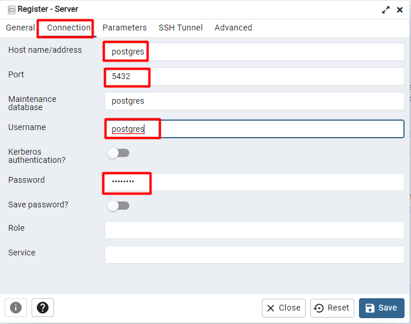
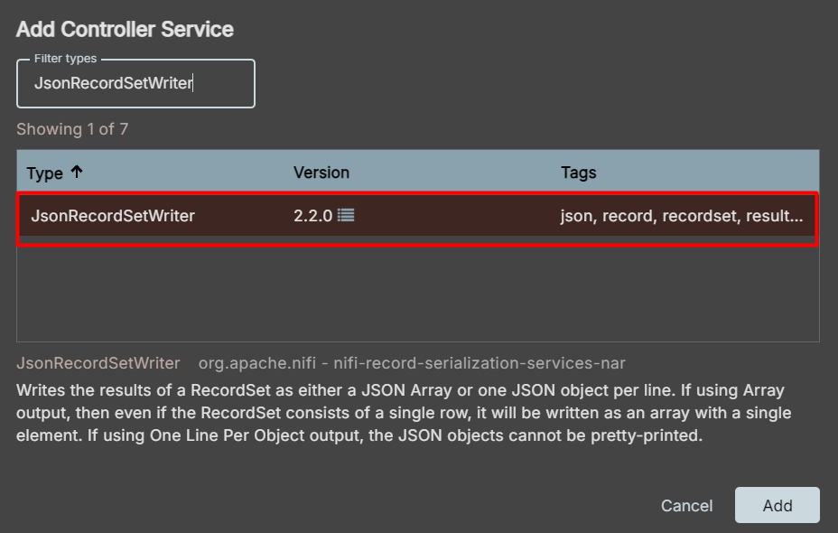
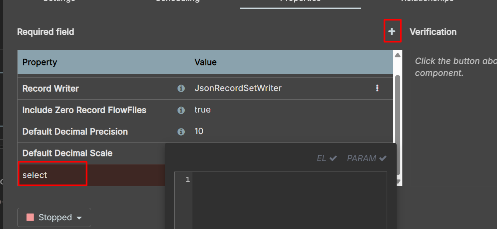
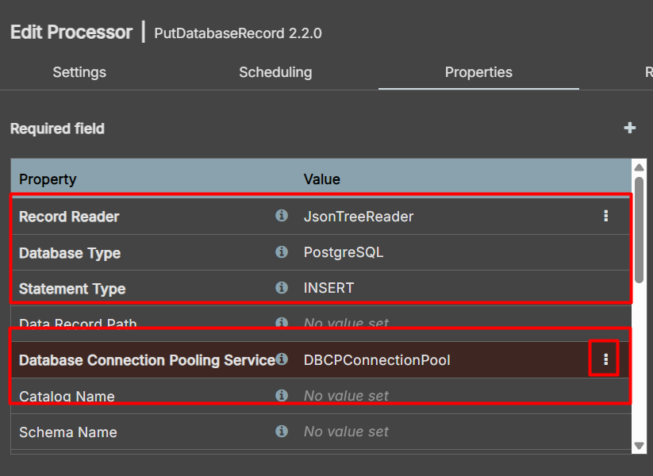

# Lab DuckDB


## Disclaimer
> **As configurações dos Laboratórios é puramente para fins de desenvolvimento local e estudos**


## Pré-requisitos?
* Docker
* Docker-Compose

# Iniciando o ambiente

```sh
docker compose up -d nifi postgres minio pgadmin 
```


## Configuração pode ser pelo `DBeaver` ou `PgAdmin`


### Provisionando Banco de dados Postgres com a ferramenta PgAdmin


Acesso para o PgAdmin http://localhost:5433/


* Login: lab-pgadmin4@pgadmin.org
* Senha : postgres    

* Nome do server: postgres
* Nome do Host Name: postgres
* database: postgres
* Username: postgres
* password: postgres

### Tela de login do PgAdmin


### Inserindo um server


### Configurando o server



## Criando estrutura para o banco de dados

```sql

CREATE database dbdemo;

CREATE TABLE usuarios (
    id SERIAL PRIMARY KEY,
    nome varchar(100),
    sobrenome varchar(100),
    email varchar(100),
    telefone varchar(100),
    username varchar(100),
    rua varchar(100),
    cidade varchar(100),
    estado varchar(100),
    pais varchar(100),
    cep varchar(100),
    latitude float,
    longitude float
);

```


> https://localhost:9443/nifi/#/login


|Usuário|Senha|
|------------------|--------------|
|admin|fia@2024@ladata@laboratorio|


# Criando o Pipeline com Nifi

## Organizando nosso fluxo


## Criando o Processor para fazer requisição


## Configurando o Processor `InvokeHTTP`


|Property|Value|
|------------------|--------------|
|HTTP Method|GET|
|HTTP URL|https://randomuser.me/api/|

## Na aba `Relationships` habilite todos os itens menos o `Response`


Na aba Scheduling mude a propriedade `Run Schedule para 5 sec`


## Tudo funcionando ?

Insira um `Funnel` e crie conexão somente para o `Response` e depois botão direito e no nome suspenso click em `Start`


> Depois pause a execução e limpe toda a fila


## Inserindo o Processor `JoltTransformJSON`


### Suas configurações

|Property|Value|
|------------------|--------------|
|Jolt Transform|Shift|
|Jolt Specification|{
  "results": {
    "0": {
      "*": "&"
    }
  }
}
|


## Vamos testar

Ligue o Processor InvokeHttp com JoltTransformJSON usando o relacionamento `Reponse` e o `Sucess`com o `Funnel` e `failure` com eles mesmo e depois botão direito e no nome suspenso click em `Start`


## Inserindo Processor `QueryRecord`


## Configurando Processor `QueryRecord`

Para o processor vamos criar dois `services` para as seguintes propriedades

|Property|Value|
|------------------|--------------|
|Record Reader|JsonTreeReader|
|Record Writer|JsonRecordSetWriter|


## Crie uma propriedade Select

## Configurando Record Reader como `JsonTreeReader`


## Configurando Record Writer como `JsonRecordSetWriter`



## Eles vão estar com essas propriedades


## Criando a propriedade select




```sql
 SELECT
  RPATH_STRING(name, '/first')       AS nome,
  RPATH_STRING(name, '/last')        AS sobrenome,
  email,
  phone                             AS telefone,
  RPATH_STRING(login, '/username')   AS username,
  RPATH_STRING(location, '/street/name') AS rua,
  RPATH_STRING(location, '/city')    AS cidade,
  RPATH_STRING(location, '/state')   AS estado,
  RPATH_STRING(location, '/country') AS pais,
  RPATH_STRING(location, '/postcode') AS cep,
  RPATH_STRING(location, '/coordinates/latitude') AS latitude,
  RPATH_STRING(location, '/coordinates/longitude') AS longitude
FROM FLOWFILE

```

## Habilitando os services `JsonTreeReader` e `JsonRecordSetWriter`

Com o botão direito na area do Group Process clique em `Controller Services` e depois em `enable` conforme imagem abaixo:


## Ligando os Processor `JoltTransformJSON` com o `QueryRecord` com relacionamento de sucesso.

> Não esqueça de mudar as configurações do Processor `QueryRecord`, aba RelationsShips como terminate, as opções failure e original.


## Nosso Pipeline vai ter esses Processor e relacionamentos


## Inserindo Processor `PutDatabaseRecord`


|Property|Value|
|------------------|--------------|
|Record Reader|JsonTreeReader|
|Database Type|PostgreSQL|
|Statement Type|INSERT|
|Database Connection Pooling Service|DBCPConnectionPool|




> A propriedade Database Connection Pooling Service é um service


## Configurando o  Service `DBCPConnectionPool`


### Editando o  Service `DBCPConnectionPool`


|Property|Value|
|------------------|--------------|
|Database Connection URL    |jdbc:postgresql://postgres:5432/dbdemo|
|Database Driver Class Name|org.postgresql.Driver|
|Database Driver Location(s)|/util|
|Database User|postgres|
|Password|postgres|

> Não esqueça de habilitar o services

### Finalizando as configurações do Processor `PutDatabaseRecord`

|Property|Value|
|------------------|--------------|
|Table Name|jdbc:postgresql://postgres:5432/dbdemo|
|Translate Field Names|false|


### Ligando o relacionamento entre os Processor `QueryRecord` e `PutDatabaseRecord`


### Habilitando os relacionamentos de `failure`, `retry` e `sucsess`

### Se tudo deu certo, vamos encontrar informações na tabela `usuarios`

```sql
select * from usuarios;

```

## Fazendo a ingestão com MinIO, mas antes...

### Configurando MinIO

Acesso para o MinIO http://localhost:9001/login

* Senha : admin
* password: minioadmin

### Configurando o MinIO

> [!IMPORTANT]
> Crie a camada Raw ou Bronze caso não tenha ainda


---

## Controller Services
No Apache NiFi, os Controller Services são componentes compartilháveis que fornecem funcionalidades comuns a vários processadores dentro de um fluxo de dados. Eles permitem centralizar configurações e melhorar a eficiência do processamento.

Exemplos de Controller Services:
* DBCPConnectionPool – Gerencia conexões com bancos de dados.
* SSLContextService – Configura SSL/TLS para comunicação segura.
* AvroSchemaRegistry – Define esquemas de dados Avro para validação.


### Criando Controller Services `AWSCredentialsProviderControllerService` para autenticação do MinIO.

Botão direito, Controller Services.


|Property|Value|
|------------------|--------------|
|Access Key ID|cursolab|
|Secret Access Key|cursolab|


### Criando o Processor `PutS3Object`


|Property|Value|
|------------------|--------------|
|Bucket|raw|
|AWS Credentials Provider Service|AWSCredentialsProviderControllerService|
|Object Key|${filename}|
|Endpoint Override URL|http://minio:9000|


### Nâo esqueça de fazer o relacionamento com os Processor `JoltTransformJSON` e o `PutS3Object`, e os Relacionamentos de `failure` e `success` do `PutS3Object`.


# Introdução ao DuckDB

DuckDB é um banco de dados OLAP embutido, projetado para consultas analíticas de alto desempenho em tabelas de colunas. Ele é eficiente para trabalhar com arquivos de dados locais como CSV, Parquet e JSON, sendo uma ótima alternativa para workloads analíticos em notebooks e pipelines de dados.

## Principais Características


- Permite consultas SQL diretas em arquivos CSV, Parquet e JSON.
- Suporte a operações vetorizadas, aumentando a eficiência de execução.
- Pode ser usado via CLI, Python, R e C++.
- Integração com pandas e Apache Arrow.

## Quando Usar o DuckDB?

- Para análises locais em grandes volumes de dados sem necessidade de um servidor dedicado.
- Para leitura e processamento de arquivos CSV e Parquet de forma rápida.
- Para integração com pandas e processamento analítico em notebooks Jupyter.
- Para workloads OLAP leves em ambientes embarcados.

## Instalação

>https://duckdb.org/docs/installation


## Trabalhando com a CLI do DuckDB

### Criando um banco de dados e uma tabela

```sh

docker compose up -d duckdb

docker exec -it duckdb bash

duckdb
```

Dentro da CLI, crie uma tabela:

```sql
CREATE TABLE clientes (
    id INTEGER,
    nome TEXT,
    idade INTEGER
);
```

### Listando as tabelas
```sql
.tables
```

### Inserindo Dados

```sql
INSERT INTO clientes VALUES (1, 'João', 30), (2, 'Maria', 25);
```

### Consultando Dados

```sql
SELECT * FROM clientes;
```

### Importando dados de um CSV

```sql
CREATE TABLE vendas AS SELECT * FROM read_csv('data/vendas.csv', delim = '|',
    header = true,
    columns = {
        'ID_Venda':'INTEGER',
        'Data_Venda':'DATE',
        'Produto':'VARCHAR',
        'Quantidade':'SMALLINT',
        'Preco_Unitario':'DOUBLE',
        'Total_Venda':'DOUBLE'
    });
SELECT * FROM vendas LIMIT 5;
```

### Exportando para Parquet

```sql
COPY vendas TO 'data/vendas.parquet' (FORMAT 'parquet');

SELECT * FROM read_parquet('vendas.parquet');

SELECT * 
FROM read_parquet('vendas.parquet')
WHERE Data_Venda > '2025-03-01';

```

## Executando Consultas no DuckDB

DuckDB otimiza planos de execução utilizando operações vetorizadas.

Verificando o plano de execução:

```sql
EXPLAIN SELECT * FROM vendas WHERE Total_Venda > 10;
```

### O que são Extensions no DuckDB?
Extensions no DuckDB são pacotes adicionais que expandem as capacidades do banco de dados. Eles permitem ao usuário interagir com fontes de dados externas, como sistemas de arquivos distribuídos, ou ler e escrever em formatos específicos de dados, como Parquet, CSV, JSON, entre outros. O plugin httpfs, por exemplo, permite que o DuckDB acesse dados de arquivos armazenados em servidores HTTP ou S3.

```sql
SELECT * FROM duckdb_extensions();
```


### Utilizando CTE (Common Table Expressions)

As CTEs permitem estruturar consultas complexas de maneira mais legível e organizada.

#### Exemplo 1: Filtrando clientes com mais de 25 anos

```sql
WITH clientes_filtrados AS (
    SELECT * FROM clientes WHERE idade > 25
)
SELECT * FROM clientes_filtrados;
```

## Ingestão de Dados no MinIO e Exportação para Parquet

```sql
INSTALL httpfs;
LOAD httpfs;

CREATE SECRET secret_minio  (
                TYPE S3,
                KEY_ID 'cursolab',
                SECRET 'cursolab',
                REGION 'us-east-1',
                ENDPOINT 'minio:9000',
                URL_STYLE 'path',
                USE_SSL false
                );

FROM duckdb_secrets();

COPY vendas TO 's3://raw/vendas.parquet' (FORMAT 'parquet');
```

## Acesso o Endereço do Jupyter, mas para isso pegue o endereço nos logs do container.
```bash
docker logs duckdb
```

## Exemplo em Python (Jupyter Notebook)

Para exemplos práticos com Python, veja o arquivo `notebook.ipynb` incluído neste material.


## Metabase
```bash
 docker compose up -d metabase
```