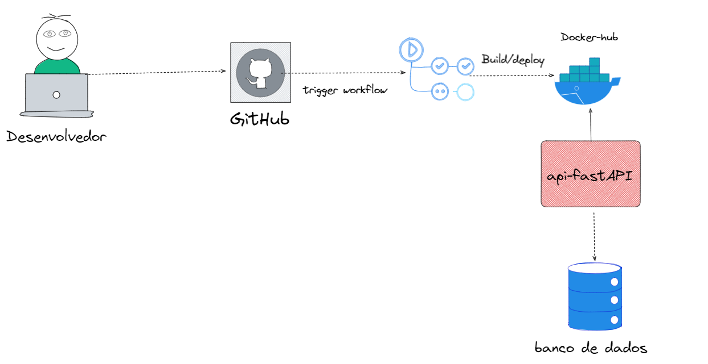
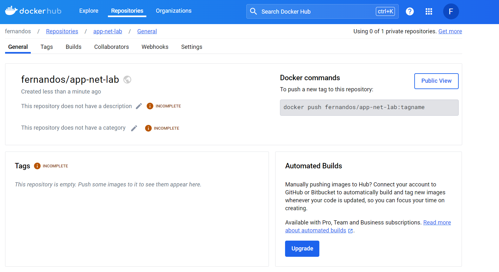
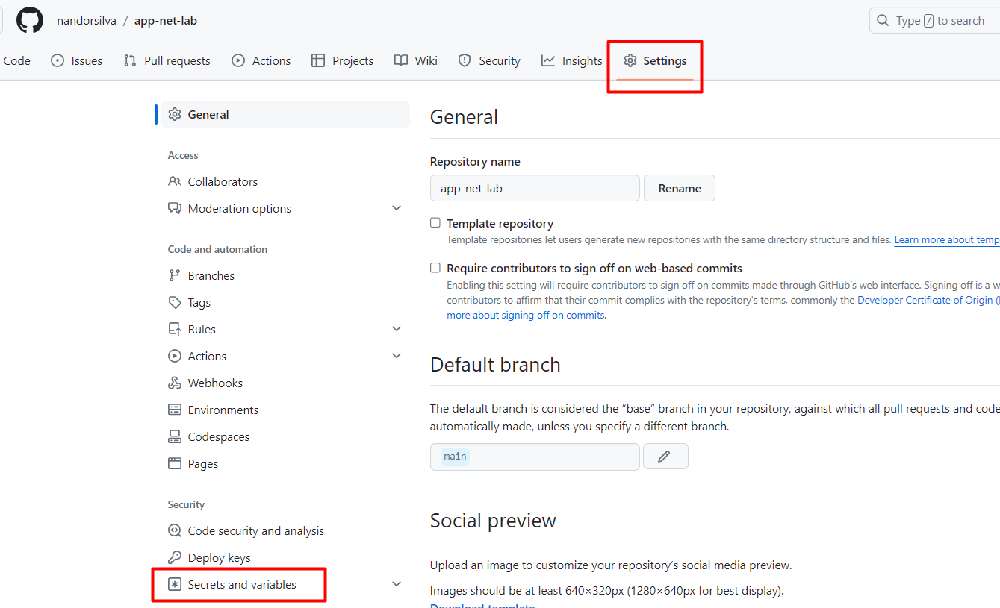

# LAB Fast API
---
## Disclaimer
> **Esta configuração é puramente para fins de desenvolvimento local e estudos**
> 

---

## Pré-requisitos?
* Docker
* Docker-Compose
* Editor de códigos como VSCode, Sublime, Vim
* Python 3.9
---

## Criando sua esteira de Integração Contínua com GitAction




### Criando repositório docker, lembram??





### Criando Secrets para logar no docker hub

> [!IMPORTANT]
> Os dados de `DOCKER_USERNAME ` e `DOCKER_PASSWORD` são informações da conta do DockerHub


* DOCKER_USERNAME
* DOCKER_PASSWORD





### Criando as pastas `.github` e  `workflows`

 ### Terminal do Linux
 
```bash
#Testes
mkdir .github
mkdir .github/workflows
touch .github/workflows/pipeline.yaml
```
 
### Criando nosso pipeline editando o arquivo `pipeline.yaml`


```yaml
name: FastAPI CI/CD

on:
  push:
    branches: main

jobs:
  build:
    name: Build FastAPI
    runs-on: ubuntu-latest
       
    steps:
    
    - name: Copia os arquivos do repositório
      uses: actions/checkout@v4

    - name: Informa versão python - 3.10
      uses: actions/setup-python@v5
      with:
        python-version: '3.10'    
  
    - name: Instalar Depedencias
      run: |
        python -m pip install --upgrade pip
        pip install -r requirements.txt

    - name: Run tests    
      env:
        PYTHONPATH: ${{ github.workspace }}  # Adiciona o diretório do projeto ao PYTHONPATH
      run: |
        pytest tests/

    - name: Login Docker Hub
      uses: docker/login-action@v3
      with:
        username: ${{ secrets.DOCKER_USERNAME }}
        password: ${{ secrets.DOCKER_PASSWORD }}   

    - name: Build e enviar para Docker image     
      uses: docker/build-push-action@v5
      with:
          context: .
          file: ./Dockerfile
          push: true
          tags: fernandos/app-fastapi-demo:latest, fernandos/app-fastapi-demo:${{ github.run_number }}
```


### Vamos fazer um commit para executar nosso pipeline.


> [!IMPORTANT]
> Na própria pagina do git vai ter instruções para conectar o repositório criado.


```bash

git add .
git commit -m "algum comentário"
git push

```


Altere seu arquivo `tests/test_api.py` o conteúdo `response.json()` e vamos commitar para ver o pipeline falhando.

```bash

git add .
git commit -m "algum comentário"
git push

```
---
5. [FastAPI e Postgresql](../app-crud-db/README.md)