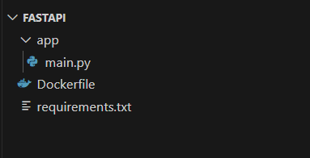

# LAB Fast API
---
## Disclaimer
> **Esta configuração é puramente para fins de desenvolvimento local e estudos**
> 

---

## Pré-requisitos?
* Docker
* Docker-Compose
* Editor de códigos como VSCode, Sublime, Vim
* Python 3.9/
---

## Minha Primeira Aplicação

 ### Terminal do Linux
```bash
mkdir app
touch app/main.py
touch Dockerfile
touch requirements.txt
```
 
> [!IMPORTANT]
>Após a criação da estrutura das pastas o Visual Studio Code deve ficar assim




```
.
├── Dockerfile           #Arquivo que será gerado a imagem docker
├── app                  #Pasta para aplicação FastApi
│   └── main.py          #Arquivo aplicação FastApi 
└── requirements.txt     #Bibliotecas das depedencias das aplicação
```

### Editando o arquivo `requirements.txt` e inserindo


```plain
fastapi[standard]==0.115.4
```

### Editando o arquivo `app/main.py`


```python
from fastapi import FastAPI

app = FastAPI()

@app.get("/")
def read_root():
    return {"Hello": "World"}

```

### Editando o arquivo `Dockerfile`

```docker
FROM python:3.9

WORKDIR /code

COPY ./requirements.txt /code/requirements.txt

RUN pip install --no-cache-dir --upgrade -r /code/requirements.txt

COPY ./app /code/app

CMD ["fastapi", "run", "app/main.py", "--port", "80"]

```

Criando a imagem da nossa aplicação

```bash
docker image build -t app-fastapi-fia .

```


Execute o container para testar

```console

docker container run -d --name fast-api-fia -p 8080:80  app-fastapi-fia

docker logs  fast-api-fia

```

Acesse os endereços:

* http://localhost:8080/docs
* http://localhost:8080/openapi.json
* http://localhost:8080/redoc

---


2. [Um poouco mais sobre RestFull](../app-restfull/README.md)
3. [Vamos melhorar um pouco](../app-restfull-refactor/README.md)
4. [FastAPI e Postgresql](../app-crud-db/README.md)
