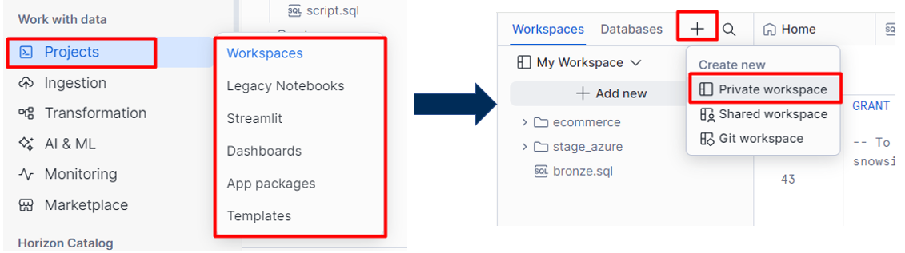
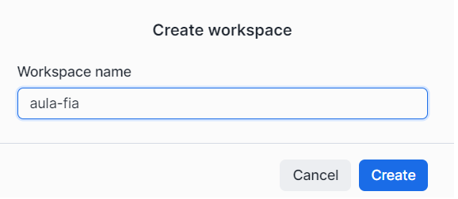
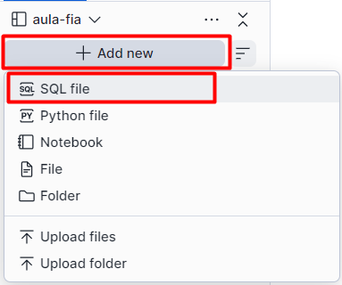
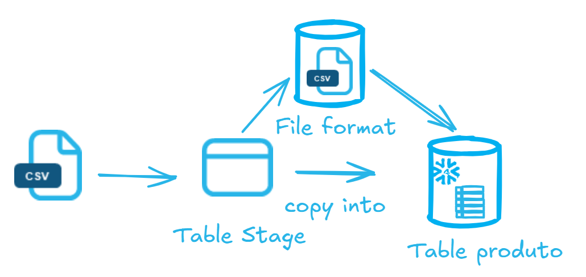
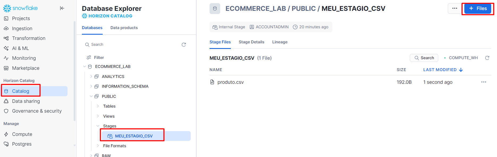
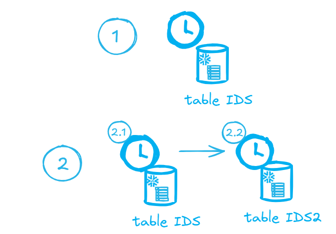
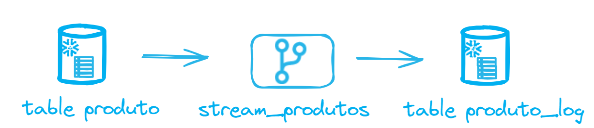

# 🚀 Laboratório Snowflake: E-commerce Data Pipeline

Este repositório contém um conjunto de scripts SQL orquestrados para simular um ambiente real de Engenharia de Dados utilizando o Snowflake. O objetivo é transformar dados brutos em informações prontas para análise através de automação e boas práticas de arquitetura.

---

## Criando o Workspace

## Nome do Workspace

## Criando os Scipts

## 🛠️ Ordem de Execução dos Scripts

Siga a numeração abaixo para garantir a integridade das chaves estrangeiras e o funcionamento das automações:

## 1. [Estrutura de Tabelas (DDL)](estrutura.sql)
**O que faz:** Define a base física do projeto. Cria o banco de dados e as tabelas permanentes.
*   **Destaque:** Tabelas permanentes são contêineres passivos que aguardam a ingestão de dados brutos.

## 2. [Carga de Dados Inicial (DML)](insert.sql)
**O que faz:** Povoa o ambiente com dados realistas (Bebidas, Condimentos, Clientes).

## 3. [Consultas e Análises (Selects)](select.sql)
**O que faz:** Demonstra como extrair valor através de JOINS, filtros e funções de agregação.

## 4. [Camadas de Visualização (Views)](view.sql)
**O que faz:** Cria abstrações lógicas para simplificar relatórios complexos.

## 5. [Ingestão de Arquivos (Copy CSV)](copy_csv.sql)

**O que faz:** Configura a área de estágio (`STAGE`) e carrega dados externos.
*   **Transformação:** Demonstra como aplicar regras de negócio (ex: aumento de 10% no preço) durante a carga.

### Subindo o arquivo csv em Stage

### 6. [Automação com Tasks](task.sql)

**O que faz:** Agenda scripts SQL para rodar em intervalos (ex: a cada 1 minuto)

### 7. [Captura de Mudanças (Stream - CDC)](stream.sql)

**O que faz:** Implementa o monitoramento de alterações em tempo real usando `STREAMS`

---