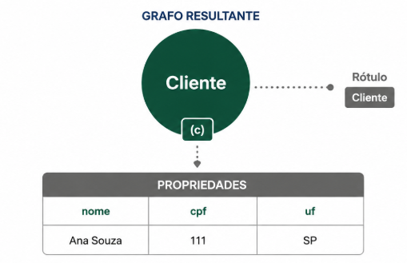
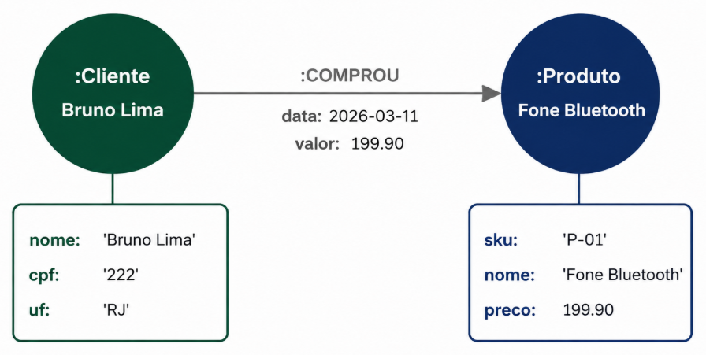
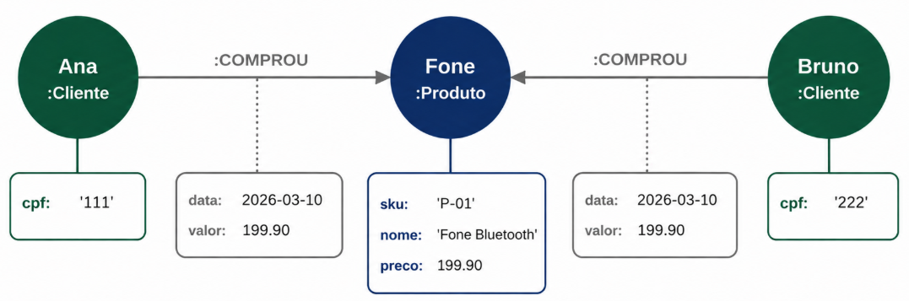
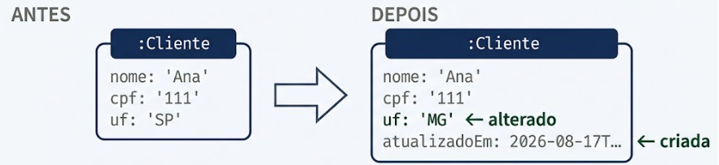
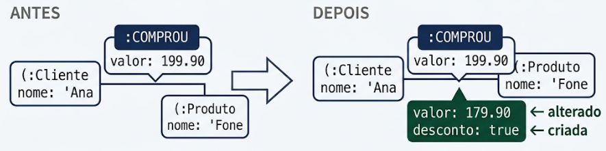
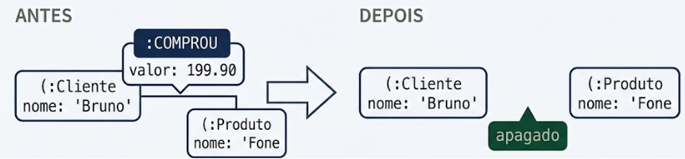
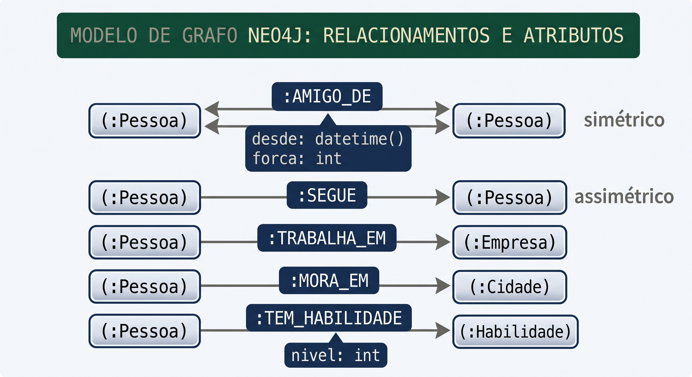

# Laboratório Prático — Neo4j

**FIA Business School · Labdata**
Advanced MBA | Pós-Graduação — Engenharia e Arquitetura de Dados · Big Data

---

## Disclaimer
> **Esta configuração é puramente para fins de desenvolvimento local e estudos**
> 

---


## Pré-requisitos?
* Docker
* Docker-Compose

---


> **Windows:** Se possível, use o Docker Desktop com backend WSL 2 e rode os comandos dentro do
> terminal do WSL, não no PowerShell — isso evita problemas de permissão nos volumes.

---


##  Subir o ambiente 


🔎 **Lendo a configuração**

| Linha | Para que serve |
|---|---|
| `image: neo4j:5.26` | Versão **LTS**, com suporte até 2028. A série corrente usa versionamento por calendário (`neo4j:2026.07`) e exige Java 21 — mas o runtime vem dentro da imagem, então trocar a tag é indolor |
| `7474` | Porta HTTP do Neo4j Browser, a interface web |
| `7687` | Porta do protocolo **Bolt**, binário, usado pelos drivers (Python, Java, JS…) |
| `NEO4J_AUTH` | Usuário e senha iniciais. A senha precisa ter no mínimo 8 caracteres |
| `NEO4J_PLUGINS` | Baixa APOC e GDS automaticamente na primeira subida |
| `..._procedures_unrestricted` | Libera as procedures dessas bibliotecas; sem isso, várias falham por segurança |
| `pagecache_size: 1G` | Memória **fora** do heap, onde ficam as páginas do grafo. É o que dá latência de milissegundos |
| `heap_max__size: 2G` | Memória da JVM, onde rodam as transações e as consultas |
| `volumes` | Sem isso, apagar o contêiner apagaria o banco junto |

> **Sobre o duplo sublinhado.** A regra de tradução das variáveis é: prefixo `NEO4J_`,
> ponto vira sublinhado, e sublinhado vira **duplo** sublinhado. Assim
> `server.memory.heap.max_size` → `NEO4J_server_memory_heap_max__size`.

###  Subir e acompanhar

```bash
docker compose up -d neo4j
docker compose logs -f neo4j     # aguarde a linha "Started."  (Ctrl+C sai do log)
docker compose ps                # STATUS deve ficar "healthy"
```

A primeira subida demora mais porque o Docker baixa os plugins APOC e GDS.

### Acessar

Abra **<http://localhost:7474>** e conecte com:

| Campo | Valor |
|---|---|
| Connect URL | `bolt://localhost:7687` |
| Username | `neo4j` |
| Password | `labdata2026` |

Alternativa por linha de comando:

```bash
docker exec -it neo4j cypher-shell -u neo4j -p labdata2026
```

###  Validar a instalação

```cypher
CALL dbms.components() YIELD name, versions, edition
RETURN name, versions[0] AS versao, edition;
```

🔎 **Lendo a consulta.** `CALL` invoca uma *procedure* embutida — não é uma consulta a
dados, é uma chamada ao sistema. `YIELD` declara quais colunas da procedure você quer
usar adiante; sem ele, não dá para referenciar `versions` no `RETURN`. E `versions[0]`
pega o primeiro item da lista, porque Cypher indexa a partir de zero.

📊 **Resultado esperado**

| name | versao | edition |
|---|---|---|
| Neo4j Kernel | 5.26.x | community |

```cypher
RETURN apoc.version() AS apoc;
```

```cypher
RETURN gds.version() AS gds;
```

🔎 Um `RETURN` sozinho, sem `MATCH`, é válido: devolve uma linha calculada. É o
equivalente ao `SELECT 1` do SQL. Se qualquer uma das duas der
`There is no procedure with the name...`, os plugins não baixaram 
---

## CRUD em Cypher 

As quatro operações fundamentais, aplicadas a nós **e** a relacionamentos. Esta é a
seção de referência que você vai consultar nos outros laboratórios.

### CREATE (criar)

```cypher
CREATE (c:Cliente {nome: 'Ana Souza', cpf: '111', uf: 'SP'});
```

🔎 **Lendo a consulta**

* `( )` — parênteses sempre representam um **nó**. É o desenho de um círculo.
* `c` — a variável, para referenciar o nó adiante na mesma consulta. Pode ser omitida.
* `:Cliente` — o **rótulo**. Classifica o nó e é a âncora dos índices.
* `{ }` — o mapa de **propriedades**, em pares chave-valor.




Agora dois nós e o relacionamento entre eles, de uma vez só:

```cypher
CREATE (b:Cliente {nome: 'Bruno Lima', cpf: '222', uf: 'RJ'})
CREATE (p:Produto {sku: 'P-01', nome: 'Fone Bluetooth', preco: 199.90})
CREATE (b)-[:COMPROU {data: date('2026-03-11'), valor: 199.90}]->(p);
```

🔎 **Lendo a consulta.** O terceiro `CREATE` reutiliza as variáveis `b` e `p` criadas
nas linhas anteriores — por isso não repete rótulos nem propriedades. Os colchetes
`[ ]` representam o **relacionamento**, e `-->` sua direção. Repare que o
relacionamento também carrega propriedades: `data` e `valor` descrevem a *compra*, não
o cliente nem o produto. Isso é o que uma tabela não faz sem criar uma terceira tabela.



Para ligar dois nós que **já existem**, primeiro localize, depois crie:

```cypher
MATCH (c:Cliente {cpf: '111'}), (p:Produto {sku: 'P-01'})
CREATE (c)-[:COMPROU {data: date('2026-03-10'), valor: 199.90}]->(p);
```

🔎 **Lendo a consulta.** A vírgula no `MATCH` separa **dois padrões independentes** —
não há relacionamento entre eles ainda; criá-lo é justamente o objetivo. O `CREATE`
então usa as variáveis encontradas.

> ⚠️ `CREATE` **sempre** cria. Rodar a mesma consulta duas vezes gera duplicata. Para
> criar sem duplicar, use `MERGE`.



Dois clientes distintos apontando para o mesmo produto. É esse compartilhamento que
torna possível a recomendação do Lab 3.

### R — READ (ler)

```cypher
MATCH (c:Cliente) RETURN c.nome, c.uf;
```

🔎 `MATCH` descreve o padrão a encontrar — é o `FROM` + `JOIN` do SQL condensados.
`RETURN` projeta as colunas — é o `SELECT`. Sem propriedade no mapa, casa com **todos**
os nós que tenham o rótulo `:Cliente`.

📊 **Resultado esperado**

| c.nome | c.uf |
|---|---|
| Ana Souza | SP |
| Bruno Lima | RJ |

```cypher
MATCH (c:Cliente {cpf: '111'}) RETURN c;
```

🔎 Retornar a **variável** (`c`), e não uma propriedade, devolve o nó inteiro. No
Browser, isso é renderizado como um círculo clicável na aba *Graph*; na aba *Table*,
como um objeto JSON com todas as propriedades.

```cypher
MATCH (c:Cliente) WHERE c.uf = 'SP' RETURN c.nome;
```

🔎 **Mapa inline × `WHERE`.** Para igualdade simples as duas formas são equivalentes e
geram o mesmo plano — o `WHERE` colado a um `MATCH` não é um filtro posterior, ele é
incorporado ao casamento do padrão. A diferença é de expressividade: o mapa inline só
sabe fazer igualdade, enquanto o `WHERE` aceita `>`, `CONTAINS`, `OR`, `IS NULL` e
comparações entre dois nós. Convenção prática: **mapa inline para a âncora, `WHERE`
para os filtros**.

```cypher
MATCH (c:Cliente)-[r:COMPROU]->(p:Produto)
RETURN c.nome AS cliente, p.nome AS produto, r.valor AS valor
ORDER BY valor DESC;
```

🔎 Este é o "JOIN" do Cypher — só que não há junção alguma: o relacionamento já está
gravado, e percorrê-lo é seguir uma referência. A variável `r` dá acesso às
propriedades **do relacionamento**.


📊 **Resultado esperado**

| cliente | produto | valor |
|---|---|---|
| Ana Souza | Fone Bluetooth | 199.90 |
| Bruno Lima | Fone Bluetooth | 199.90 |

```cypher
MATCH (c:Cliente) RETURN count(c) AS totalClientes;
```

🔎 **Não existe `GROUP BY` em Cypher.** O agrupamento é implícito: tudo que está no
`RETURN` e **não** é função de agregação vira chave de agrupamento automaticamente.
Como aqui só há a agregação, o resultado é uma única linha.

### U — UPDATE (atualizar)

```cypher
MATCH (c:Cliente {cpf: '111'})
SET c.uf = 'MG', c.atualizadoEm = datetime()
RETURN c;
```

🔎 `SET` altera propriedades existentes **ou cria as que não existem** — não há
diferença entre "alterar" e "acrescentar". `datetime()` é uma função temporal nativa:
devolve um tipo de data e hora, não uma string.



Agora a operação que uma tabela não permite sem esforço — alterar o **relacionamento**:

```cypher
MATCH (:Cliente {cpf: '111'})-[r:COMPROU]->(:Produto {sku: 'P-01'})
SET r.valor = 179.90, r.desconto = true
RETURN r;
```

🔎 Os nós das pontas aparecem **sem variável** — `(:Cliente {...})` em vez de
`(c:Cliente {...})` — porque não precisamos deles no resultado. Só `r` interessa.

🖼️ **Antes → depois**



```cypher
MATCH (c:Cliente {cpf: '111'}) SET c:ClienteVIP RETURN labels(c);
```

🔎 `SET` com **dois-pontos** acrescenta um rótulo, em vez de uma propriedade. Um nó
pode ter vários rótulos ao mesmo tempo, e `labels()` devolve a lista deles.

📊 **Resultado esperado**

| labels(c) |
|---|
| ["Cliente", "ClienteVIP"] |

```cypher
MATCH (c:Cliente {cpf: '111'}) REMOVE c.atualizadoEm RETURN c;
```

🔎 `REMOVE` apaga **propriedade ou rótulo**; `DELETE` apaga **nó ou relacionamento**.
São verbos diferentes para coisas diferentes — confundir os dois é o erro mais comum
de quem está começando.

### D — DELETE (apagar)

```cypher
MATCH (:Cliente {cpf: '222'})-[r:COMPROU]->(:Produto {sku: 'P-01'})
DELETE r;
```

🔎 Apaga somente o relacionamento. Os dois nós continuam existindo, agora
desconectados entre si.



```cypher
MATCH (c:Cliente {cpf: '111'}) DELETE c;
```

🔎 **Isto vai falhar de propósito**, com
`Cannot delete node, because it still has relationships`. Não é um defeito: é
integridade referencial. O Neo4j se recusa a deixar um relacionamento apontando para o
vazio — algo que, no modelo relacional, exigiria uma FOREIGN KEY declarada à mão.

```cypher
MATCH (c:Cliente {cpf: '111'}) DETACH DELETE c;
```

🔎 `DETACH` significa "desconecte antes de apagar". Apaga o nó **e** todas as arestas
incidentes a ele, em uma única transação.


### MERGE — o upsert

```cypher
MERGE (c:Cliente {cpf: '222'})
  ON CREATE SET c.criadoEm = datetime(), c.origem = 'lab'
  ON MATCH  SET c.ultimoAcesso = datetime()
RETURN c;
```

🔎 **Lendo a consulta.** `MERGE` é um `if/else`: procura o padrão; se não achar, cria.

Nunca as duas coisas. `ON CREATE` roda apenas no ramo "criei agora"; `ON MATCH`, apenas
no ramo "já existia". Ambas são opcionais.


Nenhum nó novo foi criado. Essa é a prova de que `MERGE` é idempotente.

> ⚠️ **Duas armadilhas do `MERGE`.**
>
> **1. O padrão inteiro é a identidade.** Nunca coloque valor mutável no mapa:
> `MERGE (c:Cliente {cpf:'222', ultimoAcesso: datetime()})` procura um cliente com
> aquele CPF **e** aquele timestamp exato — como o timestamp muda a cada execução,
> ele nunca casa e cria um nó novo toda vez. Só a **chave de negócio** entra no mapa.
>
> **2. Sem constraint, não é seguro.** Duas transações simultâneas podem ambas concluir
> "não existe" e ambas criarem o nó. A constraint de unicidade é o que impede
> isso — e ainda cria o índice que torna o `MERGE` rápido.

### Limpar a base antes do dataset real

```cypher
MATCH (n) DETACH DELETE n;
```

🔎 `MATCH (n)` sem rótulo e sem propriedade casa com **todo nó do banco**. Combinado com `DETACH DELETE`, zera a base.

✅ **Checkpoint 1:** `MATCH (n) RETURN count(n);` retorna `0`.

---

## Caso de Uso — Rede social

> Você entrou no time de dados de uma **rede social profissional** com 20 usuários ativos na base de testes. A diretoria quer três coisas para o próximo trimestre:
>
> 1. Aumentar conexões por usuário → **"Pessoas que você talvez conheça"**.
> 2. Mostrar proximidade entre perfis → **"Grau de separação"**.
> 3. Entender a estrutura da rede → **onde estão os hubs, os grupos e os usuários isolados**.
>
> O time tentou tudo em SQL e travou: a primeira feature exigia três autojunções, a segunda uma CTE recursiva sem limite conhecido, e a terceira ninguém soube nem começar. Seu trabalho é resolver as três em Cypher.

### O modelo



```
   ( :Pessoa ) ──[:AMIGO_DE   {desde, forca}]── ( :Pessoa )   ← simétrico
   ( :Pessoa ) ──[:SEGUE]────────────────────▶ ( :Pessoa )   ← assimétrico
   ( :Pessoa ) ──[:TRABALHA_EM]──────────────▶ ( :Empresa )
   ( :Pessoa ) ──[:MORA_EM]──────────────────▶ ( :Cidade )
   ( :Pessoa ) ──[:TEM_HABILIDADE {nivel}]───▶ ( :Habilidade )
```

🔎 **Duas decisões de modelagem que valem discussão.**

* **`AMIGO_DE` é gravado uma única vez**, em uma direção arbitrária, e as consultas o percorrem com `-[:AMIGO_DE]-` **sem seta**. Criar as duas arestas dobraria o armazenamento e obrigaria a manter as duas em sincronia.
* **`SEGUE` é direcionado de verdade** — seguir não é ser seguido. É o mesmo tipo de dado, com semântica oposta, e serve para mostrar que a direção é uma escolha de modelagem, não um detalhe técnico.

###  Chaves de negócio

```cypher
CREATE CONSTRAINT pessoa_email IF NOT EXISTS
  FOR (p:Pessoa) REQUIRE p.email IS UNIQUE;

CREATE CONSTRAINT empresa_nome IF NOT EXISTS
  FOR (e:Empresa) REQUIRE e.nome IS UNIQUE;

CREATE CONSTRAINT cidade_nome IF NOT EXISTS
  FOR (c:Cidade) REQUIRE c.nome IS UNIQUE;

CREATE CONSTRAINT habilidade_nome IF NOT EXISTS
  FOR (h:Habilidade) REQUIRE h.nome IS UNIQUE;
```

🔎 Criamos as constraints **antes** da carga por dois motivos: elas impedem duplicata de pessoa e de empresa, e criam o índice que faz cada `MERGE` da carga encontrar o nó rapidamente em vez de varrer o rótulo inteiro.

### Pessoas

```cypher
UNWIND [
  {email:'ana@fia.com', nome:'Ana Souza', cargo:'Engenheira de Dados', senioridade:'Senior'},
  {email:'bruno@fia.com', nome:'Bruno Lima', cargo:'Analista de BI', senioridade:'Pleno'},
  {email:'carla@fia.com', nome:'Carla Dias', cargo:'Cientista de Dados', senioridade:'Senior'},
  {email:'diego@fia.com', nome:'Diego Alves', cargo:'Arquiteto de Dados', senioridade:'Especialista'},
  {email:'elisa@fia.com', nome:'Elisa Prado', cargo:'Product Manager', senioridade:'Senior'},
  {email:'fabio@fia.com', nome:'Fabio Rocha', cargo:'DBA', senioridade:'Pleno'},
  {email:'gisele@fia.com', nome:'Gisele Matos', cargo:'Engenheira de ML', senioridade:'Senior'},
  {email:'hugo@fia.com', nome:'Hugo Neves', cargo:'Desenvolvedor', senioridade:'Junior'},
  {email:'iara@fia.com', nome:'Iara Melo', cargo:'Designer', senioridade:'Pleno'},
  {email:'joao@fia.com', nome:'Joao Prado', cargo:'Analista de Dados', senioridade:'Junior'},
  {email:'karen@fia.com', nome:'Karen Souza', cargo:'Engenheira de Dados', senioridade:'Pleno'},
  {email:'lucas@fia.com', nome:'Lucas Farias', cargo:'Cientista de Dados', senioridade:'Pleno'},
  {email:'marina@fia.com', nome:'Marina Reis', cargo:'Product Manager', senioridade:'Especialista'},
  {email:'nelson@fia.com', nome:'Nelson Costa', cargo:'DBA', senioridade:'Senior'},
  {email:'olivia@fia.com', nome:'Olivia Ramos', cargo:'Engenheira de ML', senioridade:'Junior'},
  {email:'paulo@fia.com', nome:'Paulo Tavares', cargo:'Desenvolvedor', senioridade:'Pleno'},
  {email:'quesia@fia.com', nome:'Quesia Nunes', cargo:'Designer', senioridade:'Senior'},
  {email:'rafael@fia.com', nome:'Rafael Bastos', cargo:'Arquiteto de Dados', senioridade:'Especialista'},
  {email:'sofia@fia.com', nome:'Sofia Aguiar', cargo:'Analista de BI', senioridade:'Junior'},
  {email:'tiago@fia.com', nome:'Tiago Moreira', cargo:'Desenvolvedor', senioridade:'Senior'}
] AS p
CREATE (:Pessoa {email:p.email, nome:p.nome, cargo:p.cargo,
                 senioridade:p.senioridade});
```

### Cidades, empresas e habilidades

```cypher
UNWIND [
  ['Sao Paulo','SP'],
  ['Campinas','SP'],
  ['Rio de Janeiro','RJ'],
  ['Belo Horizonte','MG']
] AS c
CREATE (:Cidade {nome:c[0], uf:c[1]});
```

```cypher
UNWIND [
  ['Labdata','Educacao'],
  ['Acme','Varejo'],
  ['Contoso','Financeiro'],
  ['Umbrella','Saude'],
  ['Initech','Tecnologia']
] AS e
CREATE (:Empresa {nome:e[0], setor:e[1]});


```

```cypher
UNWIND ['Cypher', 'Python', 'SQL', 'Docker', 'Machine Learning', 'Kubernetes', 'Figma', 'Spark'] AS h
CREATE (:Habilidade {nome:h});
```

### Onde cada um mora e trabalha

```cypher
UNWIND [
  ['ana','Sao Paulo','Labdata'],
  ['bruno','Sao Paulo','Acme'],
  ['carla','Sao Paulo','Labdata'],
  ['diego','Campinas','Acme'],
  ['elisa','Rio de Janeiro','Contoso'],
  ['fabio','Rio de Janeiro','Contoso'],
  ['gisele','Sao Paulo','Labdata'],
  ['hugo','Campinas','Acme'],
  ['iara','Belo Horizonte','Contoso'],
  ['joao','Sao Paulo','Labdata'],
  ['karen','Campinas','Umbrella'],
  ['lucas','Rio de Janeiro','Contoso'],
  ['marina','Sao Paulo','Acme'],
  ['nelson','Belo Horizonte','Umbrella'],
  ['olivia','Sao Paulo','Labdata'],
  ['paulo','Campinas','Umbrella'],
  ['quesia','Rio de Janeiro','Initech'],
  ['rafael','Sao Paulo','Initech'],
  ['sofia','Belo Horizonte','Umbrella'],
  ['tiago','Sao Paulo','Initech']
] AS v
MATCH (p:Pessoa   {email: v[0] + '@fia.com'})
MATCH (c:Cidade   {nome: v[1]})
MATCH (e:Empresa  {nome: v[2]})
CREATE (p)-[:MORA_EM]->(c)
CREATE (p)-[:TRABALHA_EM]->(e);

MATCH caminho = (p:Pessoa {email:'ana@fia.com'})-[:MORA_EM|TRABALHA_EM]->()
RETURN caminho;

```

> O pipe | significa `ou`: percorre os dois tipos de aresta numa única expressão. Retornando o caminho em vez de propriedades, o Browser desenha o grafo na aba Graph:

🔎 Três `MATCH` seguidos, sem vírgula, equivalem a um `MATCH` com padrões separados por vírgula — mas ficam bem mais legíveis quando são muitos. Cada `MATCH` que não casar **descarta a linha em silêncio**, sem erro. É por isso que a conferência do item 5.8 não é opcional.

### Habilidades de cada pessoa

```cypher
UNWIND [
  ['ana','Cypher',5],
  ['ana','Python',4],
  ['ana','SQL',5],
  ['ana','Docker',4],
  ['ana','Spark',3],
  ['bruno','SQL',5],
  ['bruno','Python',3],
  ['carla','Python',5],
  ['carla','Machine Learning',4],
  ['carla','SQL',4],
  ['carla','Cypher',3],
  ['diego','Cypher',4],
  ['diego','SQL',5],
  ['diego','Docker',5],
  ['diego','Kubernetes',4],
  ['diego','Spark',4],
  ['elisa','SQL',3],
  ['elisa','Figma',3],
  ['fabio','SQL',5],
  ['fabio','Cypher',4],
  ['fabio','Docker',3],
  ['gisele','Python',5],
  ['gisele','Machine Learning',5],
  ['gisele','Spark',4],
  ['gisele','Docker',3],
  ['hugo','Python',3],
  ['hugo','Docker',2],
  ['iara','Figma',5],
  ['joao','SQL',3],
  ['joao','Python',2],
  ['karen','Python',4],
  ['karen','Docker',4],
  ['karen','Kubernetes',3],
  ['karen','Spark',3],
  ['lucas','Python',4],
  ['lucas','Machine Learning',3],
  ['lucas','SQL',3],
  ['marina','SQL',2],
  ['marina','Figma',4],
  ['nelson','SQL',5],
  ['nelson','Docker',4],
  ['nelson','Cypher',3],
  ['olivia','Python',3],
  ['olivia','Machine Learning',3],
  ['paulo','Python',4],
  ['paulo','Docker',3],
  ['paulo','Kubernetes',4],
  ['quesia','Figma',5],
  ['quesia','Python',2],
  ['rafael','Cypher',5],
  ['rafael','SQL',5],
  ['rafael','Kubernetes',5],
  ['rafael','Docker',4],
  ['rafael','Spark',3],
  ['sofia','SQL',3],
  ['tiago','Python',4],
  ['tiago','Kubernetes',3],
  ['tiago','Docker',4]
] AS v
MATCH (p:Pessoa {email: v[0] + '@fia.com'}), (h:Habilidade {nome: v[1]})
CREATE (p)-[:TEM_HABILIDADE {nivel: v[2]}]->(h);
```

🔎 O `nivel` fica **na aresta**, não na pessoa nem na habilidade — porque descreve a relação entre as duas. É o mesmo raciocínio do `valor` em uma compra: o dado pertence à ligação.

###  Amizades e quem segue quem

```cypher
UNWIND [
  ['ana','bruno',2019,4],
  ['ana','carla',2018,5],
  ['ana','joao',2023,3],
  ['ana','gisele',2020,5],
  ['bruno','diego',2021,3],
  ['bruno','marina',2022,2],
  ['carla','diego',2019,4],
  ['carla','elisa',2021,3],
  ['carla','gisele',2018,5],
  ['carla','joao',2024,2],
  ['diego','elisa',2020,2],
  ['diego','hugo',2023,4],
  ['elisa','fabio',2019,5],
  ['elisa','lucas',2022,3],
  ['fabio','gisele',2021,2],
  ['fabio','lucas',2020,4],
  ['gisele','olivia',2024,4],
  ['gisele','hugo',2022,3],
  ['hugo','paulo',2023,5],
  ['iara','nelson',2019,3],
  ['iara','sofia',2022,4],
  ['joao','olivia',2024,5],
  ['karen','paulo',2021,4],
  ['karen','nelson',2020,3],
  ['lucas','marina',2023,2],
  ['marina','rafael',2018,5],
  ['nelson','sofia',2023,5],
  ['paulo','rafael',2022,3],
  ['rafael','tiago',2019,4],
  ['tiago','marina',2021,3]
] AS v
MATCH (a:Pessoa {email: v[0] + '@fia.com'}), (b:Pessoa {email: v[1] + '@fia.com'})
CREATE (a)-[:AMIGO_DE {desde: v[2], forca: v[3]}]->(b);
```

🔎 `forca` de 1 a 5 é a intensidade da amizade — uma **aresta valorada**.

```cypher
UNWIND [
  ['joao','ana'],
  ['joao','carla'],
  ['olivia','gisele'],
  ['olivia','carla'],
  ['hugo','diego'],
  ['sofia','nelson'],
  ['sofia','iara'],
  ['quesia','iara'],
  ['quesia','marina'],
  ['quesia','rafael'],
  ['karen','ana'],
  ['paulo','rafael'],
  ['lucas','elisa'],
  ['bruno','marina'],
  ['tiago','rafael'],
  ['iara','quesia'],
  ['nelson','rafael'],
  ['fabio','carla'],
  ['marina','ana'],
  ['diego','rafael']
] AS v
MATCH (a:Pessoa {email: v[0] + '@fia.com'}), (b:Pessoa {email: v[1] + '@fia.com'})
CREATE (a)-[:SEGUE]->(b);
```

###  Conferindo a carga

```cypher
MATCH (n) UNWIND labels(n) AS rotulo
RETURN rotulo, count(*) AS total ORDER BY total DESC;
```

🔎 `UNWIND labels(n)` em vez de `labels(n)[0]`: se um nó tiver mais de um rótulo, ele é contado em todos os grupos — e a contagem por rótulo fica correta.

📊 **Resultado esperado**

| rotulo | total |
|---|---|
| Pessoa | 20 |
| Habilidade | 8 |
| Empresa | 5 |
| Cidade | 4 |

```cypher
MATCH ()-[r]->() RETURN type(r) AS tipo, count(*) AS total ORDER BY total DESC;
```

📊 **Resultado esperado**

| tipo | total |
|---|---|
| TEM_HABILIDADE | 58 |
| AMIGO_DE | 30 |
| MORA_EM | 20 |
| TRABALHA_EM | 20 |
| SEGUE | 20 |

```cypher
CALL db.schema.visualization();
```

🔎 Desenha o **modelo**, não os dados: um círculo por rótulo, uma aresta por tipo de relacionamento. Com 20 pessoas você vê **um** círculo `Pessoa`. É a forma mais rápida de flagrar rótulo escrito de duas maneiras.

✅ **Checkpoint 2:** 20 pessoas, 8 habilidades, 5 empresas, 4 cidades, 30 amizades, 20 relações de seguir.

---
## Extraindo insights da fia

Cada item responde uma pergunta de negócio real e apresenta um recurso novo de Cypher. Rode na ordem: os insights vão se acumulando.

### Grau: quem são os hubs e quem está isolado

> **Pergunta de negócio:** quem sustenta a rede, e quem corre risco de abandonar o produto por falta de conexões?

```cypher
MATCH (p:Pessoa)
OPTIONAL MATCH (p)-[r:AMIGO_DE]-()
RETURN p.nome AS pessoa, p.cargo AS cargo, count(r) AS grau
ORDER BY grau DESC, pessoa;
```

🔎 **Por que `OPTIONAL MATCH`?** Com um `MATCH` comum, quem não tem nenhuma amizade seria eliminado do resultado — e é justamente essa pessoa que o produto precisa encontrar. O `OPTIONAL MATCH` a preserva com `r` valendo nulo, e `count()` ignora nulos, devolvendo **grau zero**. É o `LEFT JOIN` do Cypher.

📊 **Resultado esperado**

| pessoa | cargo | grau |
|---|---|---|
| Carla Dias | Cientista de Dados | 5 |
| Gisele Matos | Engenheira de ML | 5 |
| Ana Souza | Engenheira de Dados | 4 |
| Diego Alves | Arquiteto de Dados | 4 |
| Elisa Prado | Product Manager | 4 |
| Marina Reis | Product Manager | 4 |
| Bruno Lima | Analista de BI | 3 |
| Fabio Rocha | DBA | 3 |
| Hugo Neves | Desenvolvedor | 3 |
| Joao Prado | Analista de Dados | 3 |
| Lucas Farias | Cientista de Dados | 3 |
| Nelson Costa | DBA | 3 |
| Paulo Tavares | Desenvolvedor | 3 |
| Rafael Bastos | Arquiteto de Dados | 3 |
| Iara Melo | Designer | 2 |
| Karen Souza | Engenheira de Dados | 2 |
| Olivia Ramos | Engenheira de ML | 2 |
| Sofia Aguiar | Analista de BI | 2 |
| Tiago Moreira | Desenvolvedor | 2 |
| Quesia Nunes | Designer | 0 |

🖼️ **A leitura de produto**

```
   Carla e Gisele (grau 5)  ◀── os hubs. É por elas que a maior parte
                                das sugestões da fia vai passar.

   Quesia Nunes (grau 0)    ◀── está na base, tem habilidades e segue
                                gente, mas não tem UMA amizade.
                                É a usuária mais urgente do produto.
```

Confira a propriedade do slide sobre grau — a soma de todos os graus é **60**, exatamente o dobro das 30 amizades, porque cada aresta é contada nas duas pontas:

### "Pessoas que você talvez conheça"

> **Pergunta de negócio:** que perfis sugerir para a Ana, e com que justificativa na tela?

```cypher
MATCH (eu:Pessoa {email:'ana@fia.com'})-[:AMIGO_DE]-(amigo)-[:AMIGO_DE]-(sugestao)
WHERE eu <> sugestao
  AND NOT (eu)-[:AMIGO_DE]-(sugestao)
RETURN sugestao.nome  AS sugestao,
       sugestao.cargo AS cargo,
       count(DISTINCT amigo)      AS amigosEmComum,
       collect(DISTINCT amigo.nome) AS via
ORDER BY amigosEmComum DESC, sugestao;
```

🔎 **Lendo o padrão**

```
   (eu) ──[:AMIGO_DE]── (amigo) ──[:AMIGO_DE]── (sugestao)
    │                      │                        │
  a Ana              amigo direto            amigo do amigo
                                          (candidato a sugestão)
```

* `eu <> sugestao` impede que a Ana se sugira a si mesma — voltando pelo mesmo caminho, ela reapareceria na ponta.
* `NOT (eu)-[:AMIGO_DE]-(sugestao)` descarta quem já é amigo. É um **padrão usado como condição booleana**: "não exista este caminho".
* `count(DISTINCT amigo)` é o ranking. O `DISTINCT` é obrigatório: a mesma pessoa pode alcançar a mesma sugestão por caminhos diferentes.
* `collect()` devolve a lista de quem intermediou — é o "vocês têm X e Y em comum" que aparece na interface.

📊 **Resultado esperado**

| sugestao | cargo | amigosEmComum | via |
|---|---|---|---|
| Diego Alves | Arquiteto de Dados | 2 | ["Bruno Lima", "Carla Dias"] |
| Olivia Ramos | Engenheira de ML | 2 | ["Gisele Matos", "Joao Prado"] |
| Elisa Prado | Product Manager | 1 | ["Carla Dias"] |
| Fabio Rocha | DBA | 1 | ["Gisele Matos"] |
| Hugo Neves | Desenvolvedor | 1 | ["Gisele Matos"] |
| Marina Reis | Product Manager | 1 | ["Bruno Lima"] |

Diego e Olivia lideram porque são alcançados por **dois** caminhos distintos. Esse é, literalmente, o algoritmo por trás da funcionalidade em qualquer rede social.

### Triângulos: grupos que realmente existem

> **Pergunta de negócio:** onde estão os grupos fechados, que valem convite para comunidade ou evento?

```cypher
MATCH (a:Pessoa)-[:AMIGO_DE]-(b:Pessoa)-[:AMIGO_DE]-(c:Pessoa)-[:AMIGO_DE]-(a)
WHERE a.email < b.email AND b.email < c.email
RETURN a.nome, b.nome, c.nome
ORDER BY a.nome, b.nome;
```

🔎 O padrão **fecha em si mesmo**: começa em `a` e termina em `a`. Isso é um **ciclo de comprimento 3** — o mesmo objeto matemático que Euler analisou em Königsberg, aqui usado para achar comunidade. A dupla comparação `a.email < b.email < c.email` evita que o mesmo trio apareça **seis vezes**, uma por permutação.

📊 **Resultado esperado** — 6 triângulos

| a.nome | b.nome | c.nome |
|---|---|---|
| Ana Souza | Carla Dias | Gisele Matos |
| Ana Souza | Carla Dias | Joao Prado |
| Carla Dias | Diego Alves | Elisa Prado |
| Elisa Prado | Fabio Rocha | Lucas Farias |
| Iara Melo | Nelson Costa | Sofia Aguiar |
| Marina Reis | Rafael Bastos | Tiago Moreira |

Repare que os triângulos coincidem com cidade e empresa — não é coincidência: proximidade física e convívio profissional geram grupos fechados. É exatamente o sinal que o produto quer detectar.

Se quiser zerar tudo e recomeçar:

```cypher
MATCH (n) DETACH DELETE n;
```
